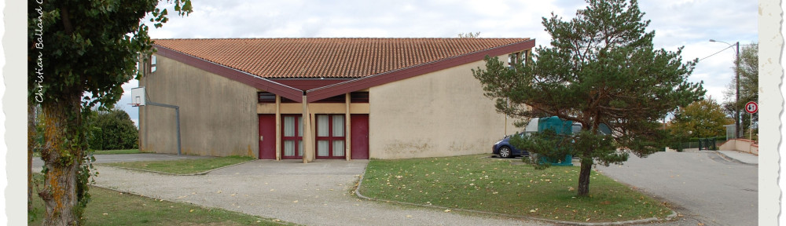
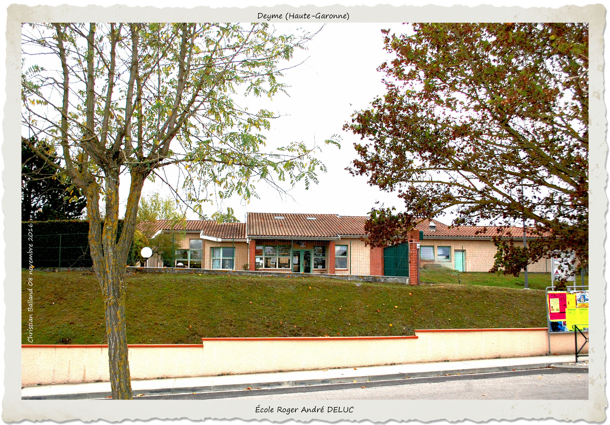
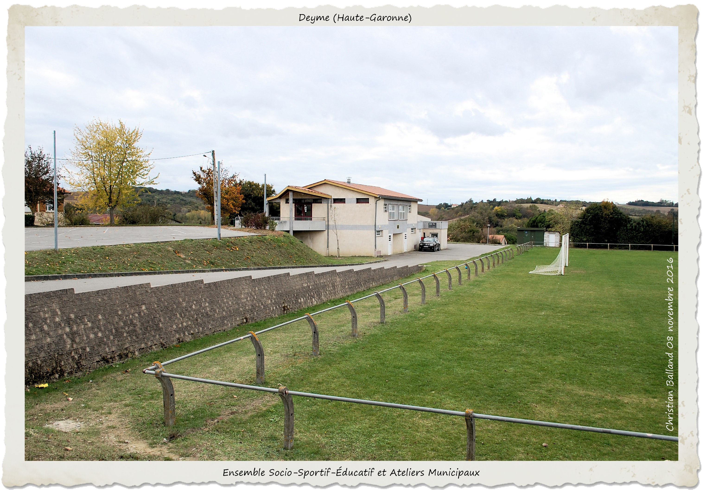

---
---  

<link rel="stylesheet" href="styles.css" type="text/css">

   

## Aménagement d’une réserve foncière de 3 hectares 

#### Joseph GALY  

 

---  

 

Arrivé sur la commune en 1968 (année héroïque s’il en est une) et témoin aujourd’hui de la révolte des « gilets jaunes », dont on peut comprendre les motivations, exceptées les violences, la commune(193 habitants), était essentiellement rurale, le nombre de fermes réhabilites en témoigne: Bellevue, Courtinade, Samadal, Sames, Fayard, Lassalle, Lacroix, Gautis, Pélégri, Menjou, La Bordasse, Trébons, La Juncasse, Cambelevat, Malard, Bordeneuve…

Dans la couronne toulousaine, sa démographie n’a cessé de croître:

 + 1975 : 260 habitants  
 + 1979 : 384 habitants  
 + 1985 : 575 habitants  
 + 1990 : 725 habitants  
 + 2017 : + de 1000 habitants en attendant le prochain recensement  
 
Divers programmes témoignent de l’urbanisation : Lotissements Canto Coucut, Fayard, Via Decima, alors que le patrimoine communal en 1977 (année de mon élection au poste d’adjoint, sous le mandat de Roger DELUC, maire) comprenait:

 + La Mairie / Ecole composée d'une seule classe  
 + Le logement de fonction de l’instituteur  
 + L’église  
 + L’ ancien presbytère  
 + Le « Foyer Communal » de la rue de La Croix de Talou (dit Petit Foyer)  
 
Il ne faut pas ignorer l’acquisition par la municipalité précédente, dont monsieur MONFRAIX était Maire, d’une réserve foncière de trois hectares occupée aujourd’hui  par le complexe socio-éducatif et sportif que bien des communes nous envient.

Pour réaliser le but désiré, il fallait fixer des priorités. Notre première action s’est tournée vers l’école, « le creuset où se fondent les générations futures ».

 

Après des travaux de génie civil considérables, le premier bâtiment qui devait remplacer les préfabriqués prêtés par le Département à été l’école, immédiatement suivie par la Mairie, les deux inaugurés par Lionel JOSPIN.

La tâche n’a pas été facile, les finances publiques n’étant pas extensibles, mais grace à l’effort de tous, nous y sommes arrivés en « gelant » un terrain attenant en vue d’une extension future ou d’une école maternelle composée de plusieurs salles: classe, salle de jour, salle de repos, salle de repos, réfectoire adapté, cour aménagée.

Aujourd’hui peut-être regrettons-nous une utilisation de ce terrain autre, si les effectifs, ce que tend à démontrer une étude prospective, augmentent.

Soyons optimistes et croyons à l’avenir « Wait and see », pour reprendre une expression connue et pas seulement de l’autre coté de la Manche.

L’école d’aujourd’hui répond aux besoins des enfants qui la fréquentent: des locaux adaptés, un restaurant scolaire, des activités périscolaires. On est loin de la première cantine créée dans une salle de l’ancienne Mairie-Ecole en 1977, après étude par une commission extra-municipale et réalisée par les mêmes acteurs: économie oblige!

 

La réserve foncière a vu son aménagement se continuer par la construction de la salle des fêtes (Image de mise en avant), du terrain de sport, du court de tennis, des locaux techniques et de la salle de danse aujourd’hui affectée à la gymnastique et sports martiaux .

Ces structures disposent d’un grand parking nécessaire.

Les municipalités qui se sont succédées de 1977 à 2004, ont ainsi oeuvrées pour profiter de toutes ces infrastructures devenues nécessaires afin que l’accueil de ses nouveaux habitants se fasse dans les meilleures conditions.

Gageons que nos édiles poursuivent avec succès le chemin tracé par leurs prédécesseurs.

L’amélioration du cadre de vie nous concerne tous.

  

 
Deyme, 3 février 2019 

 

