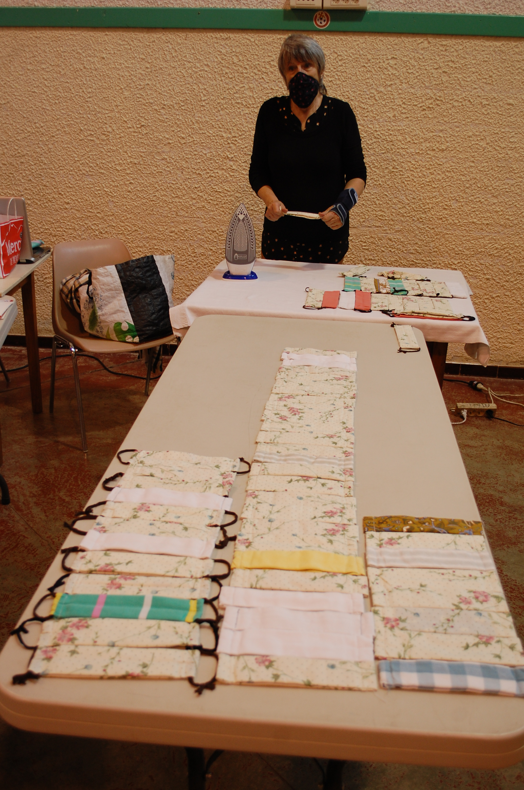
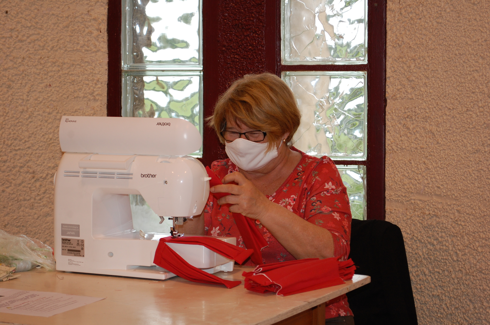
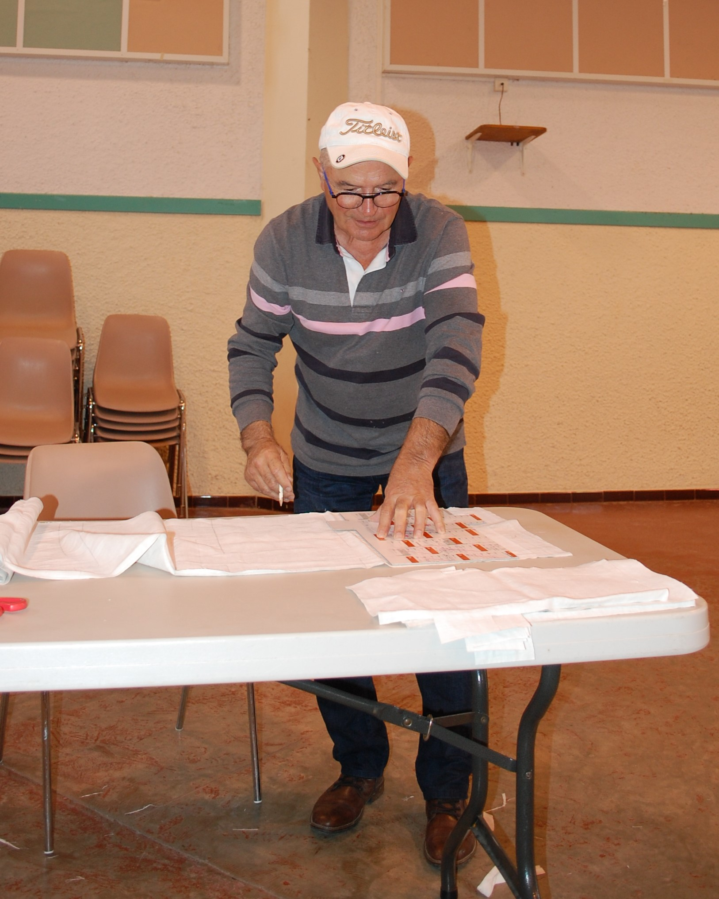
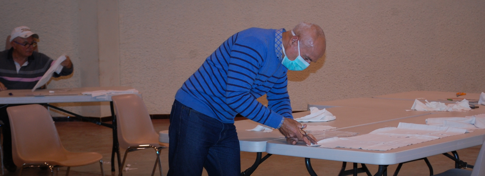

---
---  

<link rel="stylesheet" href="styles.css" type="text/css">

   

## COVID-19 « Aidons-nous à nous protéger »  

#### Nadine GARDELLE  

 

---  

 

Une Belle initiative et une belle solidarité, dans cette période délicate pour tout le monde !

Au vu de la situation sanitaire de notre pays il était difficile, au sein de notre charmant village de rester passif et à l’écart de toutes les actions de solidarité qui voient le jour un peu partout en France.

Les dernières déclarations présidentielles furent le facteur déclenchant de l’opération « masques »  à Deyme !

 

C’est ainsi que le bureau de l’ ASCD a impulsé une mobilisation des Associations de Deyme, de la Mairie et des Deymoises et Deymois pour fabriquer  et offrir des masques de protection dits « alternatifs » à destination des habitants pour un usage non-professionnel sous le slogan:  
« **Aidons-nous à nous protéger**»

 

Depuis une semaine on assiste à  Deyme  à un bel élan de solidarité et de partage et à une mobilisation de tous !!

Un atelier découpe et préparation des kits a été improvisé dans la salle des fêtes, et c’est dans une ambiance chaleureuse que les petites mains Deymoises se sont activées, traçage des gabarits, découpe, démonstration de piquage aux couturières volontaires…

Ce qui fit chaud au cœur est la spontanéité et la générosité avec laquelle il a été répondu à nos appels de demande de fournitures (tissu, fils…) !

  
**SPONTANEITE, SOLIDARITE et GENEROSITE sont les maîtres mots de cette opération** 

 

  
 
**Deyme est un village animé de vraies valeurs !**

  

 

 

 
Deyme, 29 avril 2020

