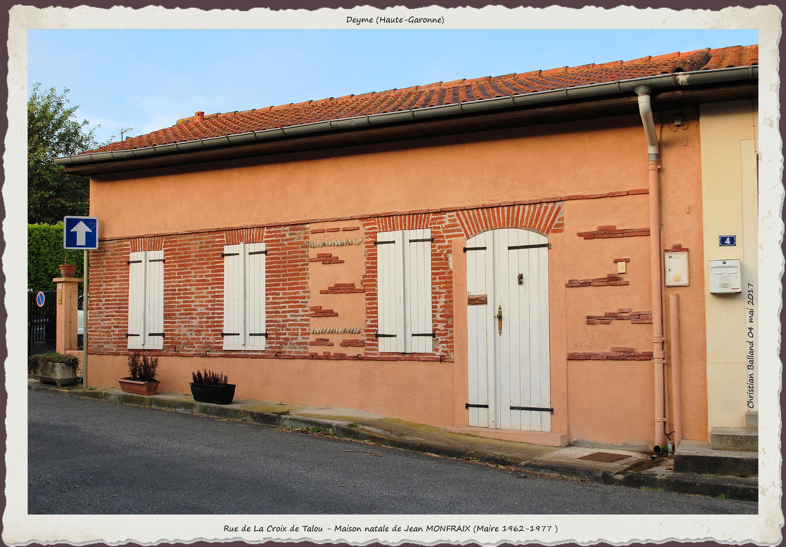
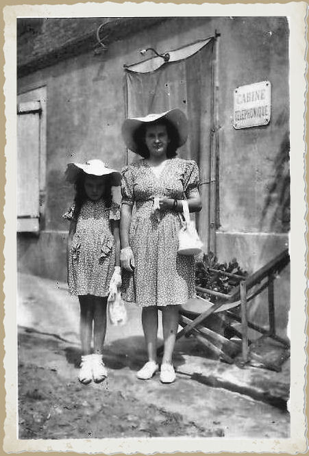
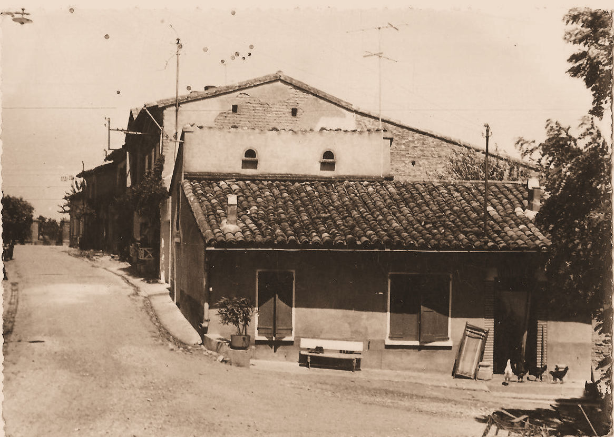
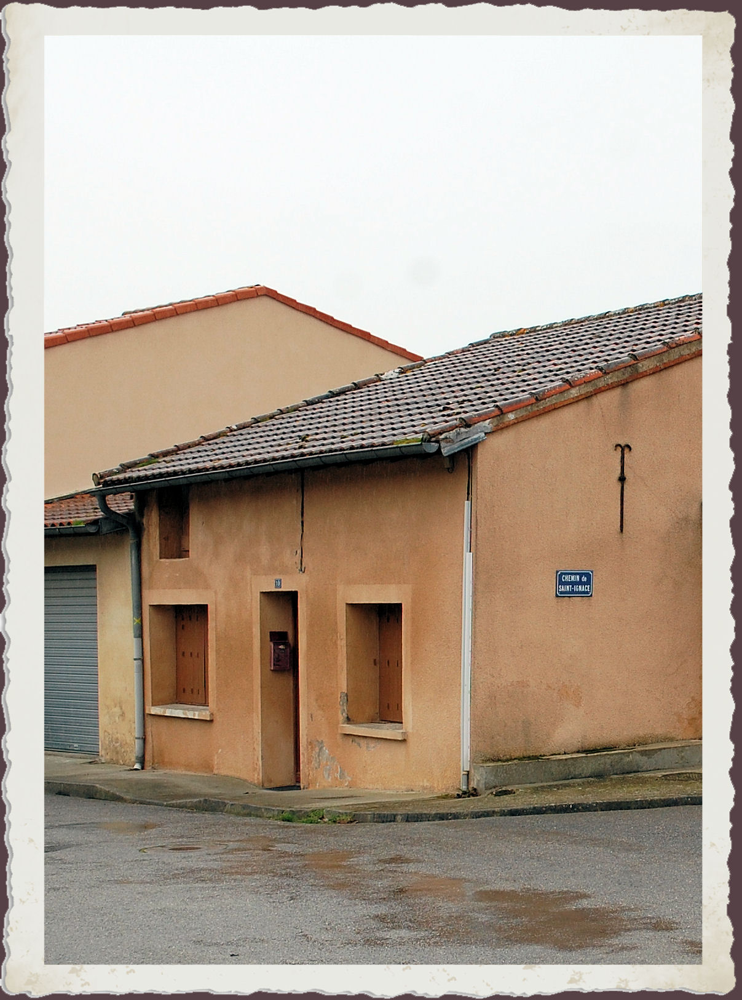

---
---  

<link rel="stylesheet" href="styles.css" type="text/css">

   

## Cabine téléphonique 

#### Pierre Denis ROCHATTEL 

 

---  
En séance du 1er avril 1900, le conseil municipal refuse d’adhérer au projet téléphonique pour des raisons de coût. Le Conseil Général de la Haute-Garonne vote quatre ans plus tard les mesures nécessaires à la construction d’un réseau téléphoniques comprenant toutes les communes du département. La cabine fonctionnerait de deux manières, au choix. Premièrement, le service pourrait se limiter à l’échange des conversations. Dans ce cas il suffirait de fournir un local et d’employer un gérant recruté parmi les personnes honorables de la localité. Il percevrait la somme de 0,04 fr par conversation échangée. Ou bien, en plus des conversations téléphoniques, la transmission et la réception des télégrammes devra être assurée. Dans le second cas, le gérant recevra de l’administration une allocation de 0,15 fr par télégramme de départ, 0,10 fr par télégramme reçu et 0,04 fr par conversation passée. La mairie devra payer les frais de remise des télégrammes sur toute l’étendue de la commune. Le conseil municipal, dans l’impossibilité de trouver un local et un gérant pour assurer le service, décide de ne pas donner suite à la circulaire du directeur des Postes. Le conseil donne un avis favorable en 1911. En 1912, les conditions sont réunies et la première communication est passée le 1er novembre.

   
 

Monsieur Louis MONFRAIX, forgeron, est choisi comme gérant , rue de la Croix de Talou. Employé municipal, le gérant percevait un traitement annuel. Il était de 292 francs pour l’année 1961.  

  

Assumeront par la suite cette fonction disparue avec la généralisation du téléphone chez le particulier:

 
 
  
  
 
  
 
  
 
  
Madame Henriette FABRE (1943), chez madame Denise BONAVENTURE, 7 rue du Crucifix  
Sur la photo: Sylvette (g.) et Pierrette BONAVENTURE (dr.)  
  
 
  
 
  
 

 

 
 
 

Madame SICILIA (1953-56) 1 chemin du Rival 

Madame Denise BONAVENTURE (1960), 7 rue du Crucifix. N°: “9 à Donneville” 
 
 
 
 
 

 
 
  

 
 
 
 
 
 

Madame ZANATTA (1971), rue de la Croix de Talou 

 

