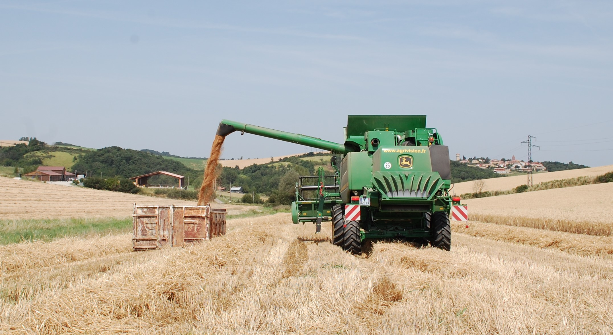
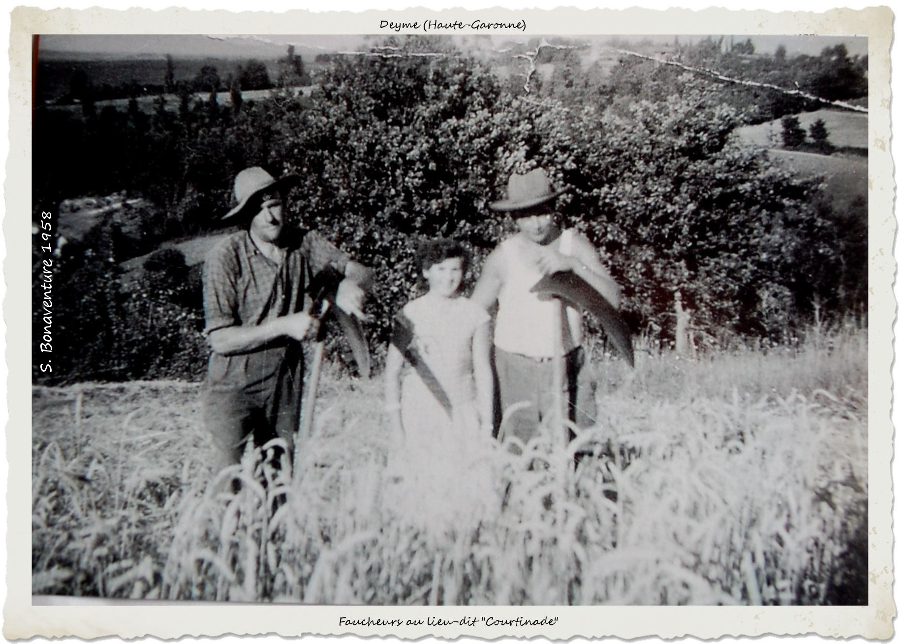
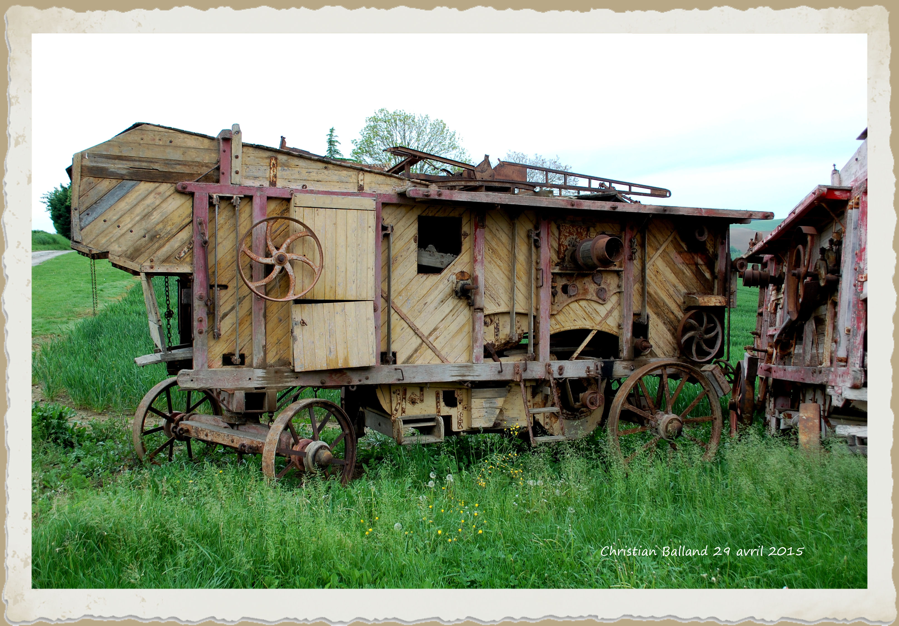
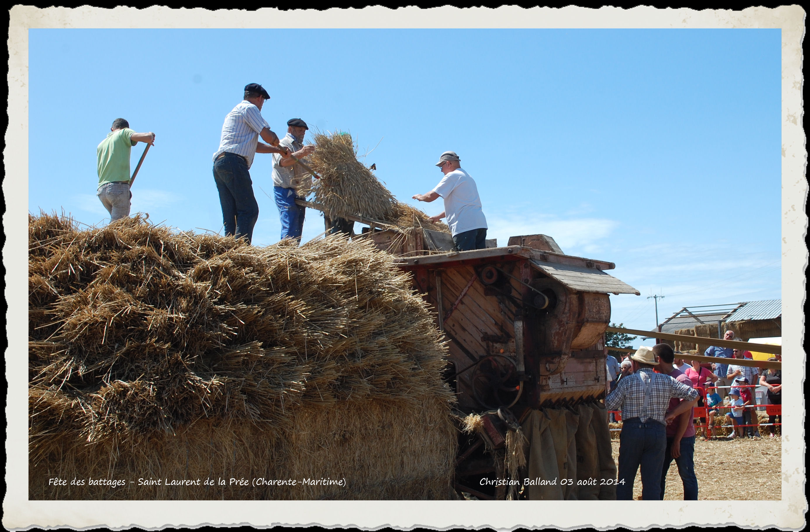
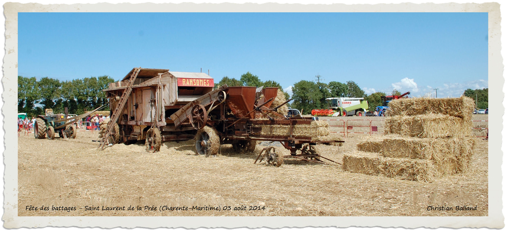
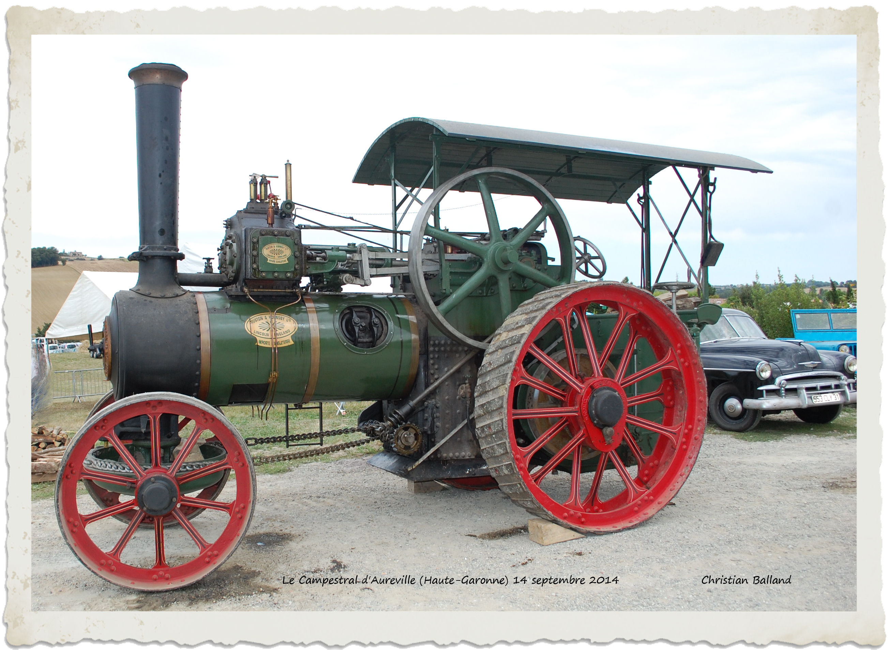
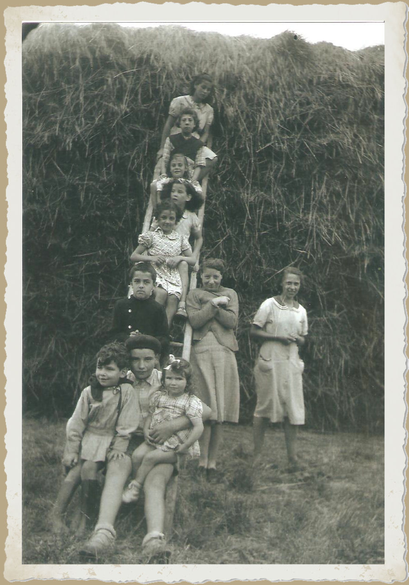
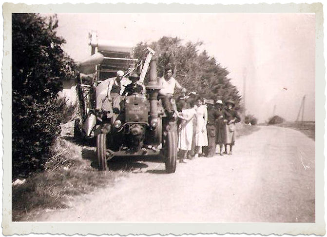
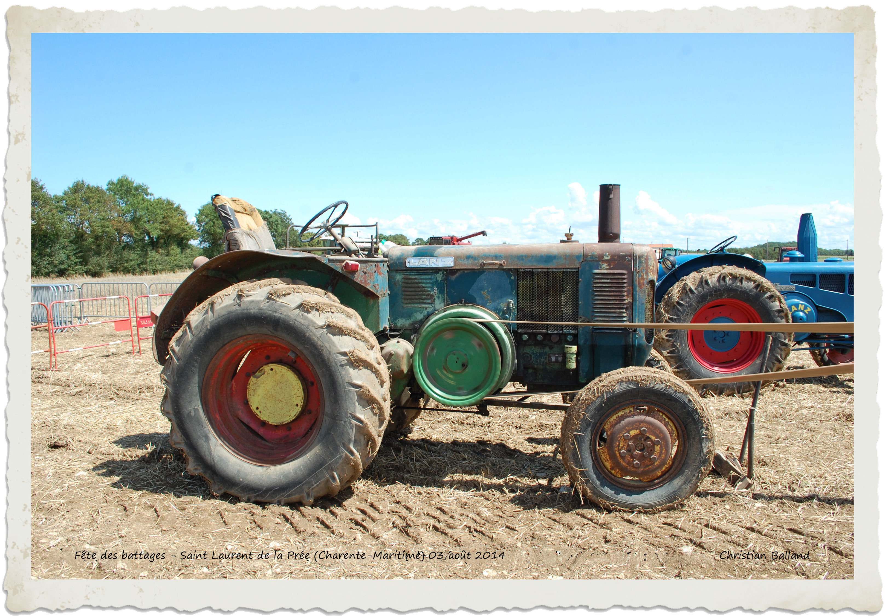
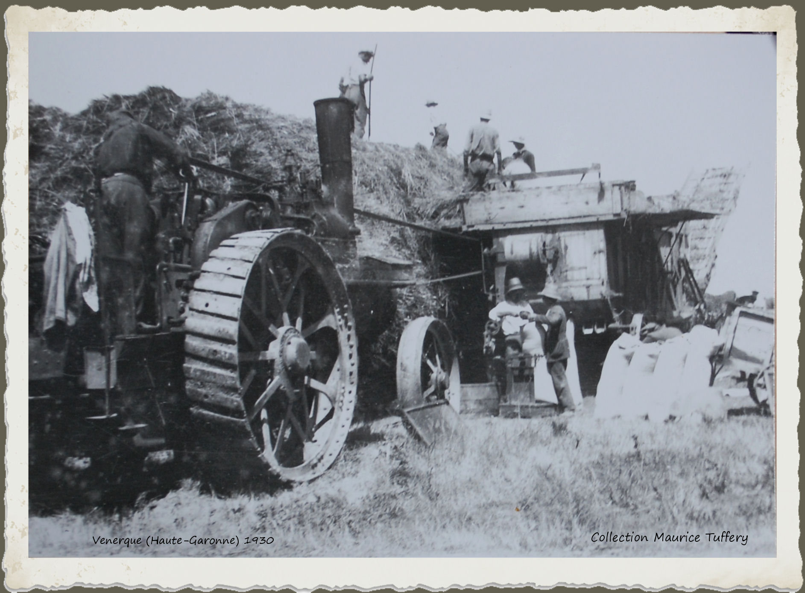

---
---  

<link rel="stylesheet" href="styles.css" type="text/css">

   

## Statistiques agricoles  

#### Jean MONFRAIX  

 

---  

  

Lorsqu’on voit, de nos jours, les majestueuses moissonneuses-batteuses évoluer dans les grands champs de céréales, on est impressionné par la rapidité, voire la facilité avec laquelle le travail de la moisson et du dépiquage pourtant réputé délicat, est effectué.  

En quelques secondes l’épi est fauché et égrené ; le grain ventilé et trié est aussitôt propulsé dans des bennes amovibles, que des camions acheminent vers les imposants silos de stockage des coopératives.  

 

Que de chemin parcouru depuis l’époque pas tellement lointaine finalement, où l’on utilisait la faucille et la faux pour la moisson, le rouleau de granit, le fléau, et en dernier lieu la batteuse mécanique pour le dépiquage !!!

S’il faut se féliciter de ce progrès du point de vue de la rapidité, et de la pénibilité du travail de l’agriculteur, on ne peut que regretter le caractère folklorique et combien attachant des besognes imposées jadis, disparues aujourd’hui. Le battage – ou le dépiquage, était l’une des plus animées.

  

Le dépiquage à la batteuse mécanique, qui apparut au début du siècle, était certainement de tous les travaux de la ferme le plus important et le plus spectaculaire.

La batteuse était actionnée par une locomobile à vapeur. L’ensemble, conduit par deux ouvriers permanents, le mécanicien pour la locomobile, le « bourreur » pour la batteuse, se déplaçait d’un « sol » de ferme à l’autre, tracté par des boeufs. Deux paires de boeufs, parfois trois, lorsque le profil du parcours l’exigeait, étaient nécessaires pour tirer chacun de ces lourds engins. Ceux-ci étaient installés avec précaution à proximité du « gerbier », au moyen de cales spéciales bloquées après vérification de l’alignement du volant moteur et de la poulie maîtresse de la batteuse ainsi que de la parfaite horizontalité de l’ensemble. La courroie de transmission (en poil de chameau), pouvait alors être mise en place.

La batteuse comportait essentiellement :

 + Le batteur proprement dit, cylindre de 1,20 m à 1,60 m de longueur pour un diamètre de 70 cm environ, constitué de lames dentées (les « battes »), disposées suivant les génératrices, monté sur l’arbre d’entraînement de la poulie maî  
 + L’ébarbeur qui séparait le grain des « barbes » de l’é  
 + Le trieur, cylindre qui répartissait le grain, suivant sa grosseur, donc suivant sa qualité dans les goulottes d’ensachage disposées sur la face arrière de la batteuse.  
 + Le monte-paille, sorte de tapis roulant qui recueillait la paille à la sortie des « demoiselles » et l’acheminait vers le pailler ou le hangar de stockage.  
 

  

Le « bourreur », ouvrier cité plus haut, assurait l’alimentation de la batteuse en introduisant les gerbes dans la « gueule » du batteur. Deux femmes, placées de part et d’autre du poste de bourrage, coupaient les liens au moyen d’une serpe, et présentaient les gerbes au bourreur. Le travail du bourreur était parmi les plus pénibles: outre les inconvénients de la chaleur de Juillet et Août, de la poussière et du grondement lancinant du batteur, c’était la manipulation de milliers de gerbes, dans la journée, présentées invariablement dans la position verticale, pour assurer l’égrenage des épis sur toute la longueur.

Un travail très pénible, du fait aussi de la chaleur et de la poussière, et qui incombait traditionnellement aux femmes, consistait à enlever les balles, et autres détritus de paille qui s’amoncelaient sous la batteuse. Ces produits, que l’on désignait sous le nom de « abèts » et « tréjados », tombaient sur de grandes toiles, lesquelles une fois chargées, étaient traînées hors de l’aire de battage.

Le stockage de la paille en hangar ne présentait pas de difficulté ; mais il n’en était pas de même pour l’érection du pailler. Déterminer les dimensions en fonction du volume à traiter, la forme adéquate pour assurer sa stabilité sous les effets des coups de vent d’autan à venir, n’était certes pas à la portée de quiconque !

Aussi confiait-on cette tâche à des « spécialistes », souvent très fiers de leur art !

  

  

Vers les années 1925-1930, apparurent les presses mécaniques, lesquelles, accouplées à la batteuse à la place du monte-paille, prenaient la paille pour en faire des balles d’une trentaine de kilos… ce qui entraîna la disparition du pailler. Les batteuses, comme les locomobiles, provenaient de différents constructeurs: anglais, français, américains.

Pour si prenant que fut le spectacle d’une batteuse en plein travail, sous le soleil de l’été, dans le grondement syncopé du batteur engloutissant les gerbes, celui de la locomobile crachant la fumée par sa haute cheminée et la vapeur par la « purge » du cylindre, le mouvement soutenu de ses énormes volants, le va-et-vient chuintant de la bielle, le tout parfois ponctué d’un strident coup de sifflet était plus spectaculaire, comme s’il s’agissait en somme d’un être vivant.

La locomobile comportait essentiellement deux parties:  

 + La chaudière (générateur de vapeur)  
 + Le mouvement.  
 

 

Certains engins étaient conçus pour se déplacer à la manière d’une locomotive. C’étaient les locomotives routières, peu utilisées dans le Lauragais, mais relativement nombreuses dans le Gers et le Tarn et Garonne. Elles permettaient le déplacement du matériel.

La chaudière de la locomobile comportait un foyer au corps horizontal renfermant le faisceau tubulaire composé, comme le nom l’indique, d’un certain nombre de tubes en cuivre ou laiton (une trentaine en moyenne), de 60 à 75 mm de diamètre parcourus intérieurement par les flammes et les gaz chauds et les fumées -et entourés d’eau – quand il s’agit de « tubes de fumée » ou léchés extérieurement par les flammes gaz et fumées, et remplis d’eau, pour les « tubes d’eau »

Les chaudières exigeaient un entretien suivi, même pendant les périodes d’inactivité.On devait veiller particulièrement à la neutralisation de la corrosion des tôles, les zones les plus vulnérables étant la base du foyer au voisinage des coutures du rivetage et la plaque tubulaire. La chaudière était soumise périodiquement, (tous les 5 ans), à l’épreuve hydraulique réglementaire effectuée par l’Ingénieur des Mines, afin de limiter les explosions. En effet, une explosion de générateur de vapeur est toujours très dangereuse (une explosion survenue dans le Lot, en 1931, fit 4 morts et des blessés en cours de dépiquage.

La cérémonie se terminait traditionnellement par un excellent repas.

Comme combustible, on utilisait le charbon, principalement des agglomérés, livrés en « briquettes » de 10 kg par les Houillères de Carmaux. Réduit en menus morceaux, à coups de marteau, ce charbon était introduit dans le foyer à l’aide d’une pelle, par le trou du «gueulard». Ce travail, apparemment très simple, demandait certaines précautions. Il fallait  laisser la porte du foyer ouverte le moins longtemps possible afin d’éviter les « coups d’air » au foyer, qui causeraient à la longue des fissures.

Une autre contrainte, était l’alimentation en eau. Une charrette chargée de «barriques» faisait continuellement la navette entre le puits, la fontaine ou la mare pour assurer l’approvisionnement. Une locomobile de moyenne puissance vaporisait de 800 l à 1 m3 d’eau par heure !

La «montée en pression» demandait au moins une heure et demie.  
Le mécanicien était tenu de commencer sa journée vers les 3 h du matin ; le travail commençait régulièrement au lever du soleil,le soir la journée se terminait vers 4h30- 5 h (on ne connaissait pas l’heure d’été).  
La journée était divisée en quarts et demi-quarts:
 
 + Le 1^er^ quart : 4h30/5h à 8 heures  
 + Le 1^er^  ½ quart : 6h30 → pause café de 30 minutes 
 + Le 2^ème^ quart : 9 h à 12 h
 + coupé par le 2^ème^ ½ quart → repos de 15 minutes  
 + 3^ème^ quart :13 h à 16 h  
 + coupé par le 3^ème^ ½ quart → repos de 15 minutesrafraîchissements (vin et eau)  
 + 16h à 17 h → souper ou goûter  
 + 4^ème^ quart : 17 h au crépuscule  
 + dernier ½ quart → rafraîchissements.  
 

  

La reprise du travail, ainsi que l’arrêt des «quarts» et «demi-quarts», était annoncée par les coups de sifflet de la locomobile. Les enfants étaient fiers, lorsque le mécanicien les autorisait à manoeuvrer eux-mêmes ce magnifique instrument. D’aucuns que nous avons bien connus, insistaient tellement qu’ils se faisaient rabrouer, le mécanicien craignant, à juste titre, qu’on lui «mangeât» toute la vapeur comme pour le ferry boat d’Escarteffigue dans le célèbre «Marius» de l’immortel Marcel Pagnol.

 

 

Voilà donc de bien longues journées pour la vingtaine de personnes occupées à ces travaux de dépiquage! Cependant, personne ne se plaignait, tous travaillaient dans la joie et la bonne humeur! C’étaient des appels joyeux, des cris, des rires, quelques jurons sonores! Lors des pauses ou des repas, on racontait des histoires plus ou moins édulcorées; on entendait les chansons à la mode, des choeurs. Dans l’équipe se trouvait toujours quelque farceur, parfois plusieurs, souvent une tête de turc, toute désignée pour faire les frais d’une bonne blague. Souvent on dansait au son d’un phonographe enroué. Les «abets» remplaçaient abondamment les confettis. Aussi, pourquoi ne pas le dire, maints baisers durent être échangés dans la paille et furent le déclic de certains mariages.

Heureux temps, où le travail, du moins celui du dépiquage, était considéré comme une fête! Il faut dire que ce point de vue était justifié, si l’on considère les plantureux repas qui étaient servis par la fermière. Combien de poulets sont passés de vie à trépas, ensuite au four, plus souvent à la broche ou sur le feu, à l’occasion de ces festivités. Et quels poulets! Ils n’ont jamais connu l’aliment complet!

  

Autour des années 1925, les locomobiles furent progressivement remplacées par les tracteurs, d’abord par traction animale, la «mise en pression» du matin et l’alimentation constante en combustible, etc… Quant au dépiquage lui-même, il n’y eut pas de changement jusque vers 1945, époque à laquelle les moissonneuses-batteuses américaines entrèrent en lice : Le dépiquage d’autrefois était bien condamné.  

 

Ce n’est certainement pas sans une pointe de mélancolie que ceux qui l’ont connu revivent, par la pensée, les moments si agréables si riches en émotions, parfois exaltants qu’il leur a généreusement permis de vivre…”

---

Jean MONFRAIX, *Battages– Dépiquages d’autrefois* in *Les Amis du Vieux Deyme* n° 2, Nov. 1983