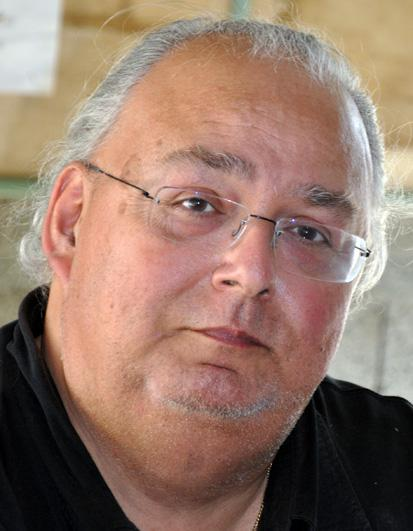

---
---  

<link rel="stylesheet" href="styles.css" type="text/css">

   

## Ecole, la rentrée 1998

#### Albert VICENS  

 

---  

 

Toutes les conditions étaient réunies, encore une fois, pour que la rentrée se déroule pour le mieux, dans notre école, le jeudi 3 septembre. Il est vrai que depuis plusieurs jours déjà, les enseignants et le personnel municipal s’affairaient, chacun dans son domaine, dans sa classe, dedans, partout, à tout préparer, tout réviser, remettre en ordre, prévoir, organiser et faire en sorte que rien ne puisse venir troubler la sérénité d’un moment qui, pour les plus petits en particulier, revêt sans doute plus d’importance que leur apparente assurance ne le laisse supposer.

L’entrée à la grande école, comme on disait autrefois, c’est quand même un événement : le changement de lieux, la découverte d’une nouvelle maîtresse, la rencontre avec d’autres camarades, y compris des « grands », un rythme de vie assez différent, une semaine plus longue, des contraintes de groupe plus nombreuses et structurées, un programme plus complexe… voilà des bouleversements que beaucoup d’adultes, toutes proportions gardées, vivraient bien plus mal que nos chers petits.

C’est sans doute pour cela que le plupart des parents les accompagnent ce jour là au moins, jusque dans leur classe, qu’ils les assistent jusqu’à la dernière seconde, jusqu’à ce que le porte se referme… et qu’ils s’en vont, à défaut de pouvoir rester, avec visiblement une pointe d’angoisse et un petit pincement au cœur !!!

Pour la plupart, fort heureusement, ils s’en vont vite rassurés ; parfois dès les premiers jours : la faculté d’adaptation des enfants en milieu scolaire passée, la crainte bien compréhensible des « premiers pas » est une évidence de notre époque. Comme l’est aussi le fait que l’école d’ aujourd’hui est un lieu de vie plus agréable que celui que nous avons connu il y a moins longtemps, même si nous en avons gardé de bons souvenirs.

Evènement important pour la commune aussi. Le retour des enfants à l’école, c’est le signal de la fin d’une longue période un peu trop calme, où le village s’est vidé de la moitié de ses habitants…c’est à nouveau les cris de joie dans la cour, les rires, les chants, le bruit, le mouvement, le va et vient des gens qui se croisent, qui se rencontrent, se parlent, se lient d’amitié…c’est comme un départ chaque fois renouvelé pour une étape de plus, un autre pas en avant, c’est un peu le retour à la vie…

La vie de l’école, c’est aussi l’ensemble des projets que les maîtres organisent pour leurs élèves et qui viennent en cours d’année, soit pour préparer, soit pour compléter, exploiter, agrémenter « l’ordinaire » des classes déjà si difficile à réussir jour après jour.

Bien que tout ne soit pas encore décidé, l’année qui commence à peine s’annonce aussi riche, aussi fertile que les précédentes en activités que nous avons voulues bien ciblées, répondant aux motivations des enfants ainsi qu’à leurs besoins. La lecture sera privilégiée, la bibliothèque sera encore développée… Nous accueillerons des auteurs de documentaires, romans, des illustrateurs, des journalistes ou rédacteurs.

Des expositions seront organisées sur des thèmes tels que : le livre, l’imprimerie, l’histoire de la bande dessinée…Des « comités de lecture » seront mis en place au sein des classes, constitués d’enfants qui porteront un regard critique sur de romans, sur l’information.

Parallèlement, l’utilisation de l’outil informatique sera développé autant que possible. Elle favorisera en particulier la maîtrise des recherches documentaires en liaison avec la bibliothèque. Elle apportera des progrès nouveaux dans la pratique de l’écrit par l’emploi approprié des traitements de textes. Un « petit livre de l’année 98-99 » pourrait même voir le jour en fin d’année, réalisé par l’ensemble des élèves.

Un autre moment fort consistera à mettre en place une correspondance scolaire, sous forme d’échange culturel avec une école primaire du Québec, dans la banlieue de Montréal. Le contenu de nos envois comportera entre autres choses, des enquêtes sur les particularités ou curiosités de notre région, telles que le vieux Toulouse, l’Aérospatiale, la Cité de Carcassonne, le Canal du Midi… que nous essaierons de faire connaître à nos correspondants (ou de mieux connaître nous-mêmes, pourquoi pas ?). Bien sûr pour certaines d’entre elles, ces études s’accompagneront de sorties sur les lieux, comme à Carcassonne, à Toulouse…

Les langues vivantes ont également vu le jour dans notre école et l’expérience se poursuivra car l’enthousiasme des enfants à les découvrir est la meilleure récompense pour les enseignants, même si pour eux, cette initiation est l’un des aspects les moins faciles de leurs multiples préoccupations.

Ajoutez encore la participation des 70 élèves de l’école à l’animation de la fête de Noël avec un petit spectacle…d’autres projets encore à l’étude, et malgré vous n’aurez qu’un modeste aperçu de la vie intense qui anime notre petite école. Non, on n’a pas vraiment le temps de s’ennuyer.

  
*L’Echo de Deyme* n° 38, octobre 1998