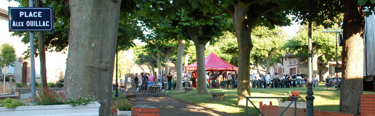

---
---  

<link rel="stylesheet" href="styles.css" type="text/css">

   

## Hommage à Alex OUILLAC    

#### Roger André DELUC    

 

---  

 

« Il est mort dans son lit, auprès des siens, tout d’un coup, sans souffrances inutiles comme souhaitent mourir les hommes de sa trempe.

La nouvelle de la mort d’Alex OUILLAC est tombée, brutale presque inhumaine, surprenant tout la monde ce 10 juin 1978.

Tout le village a été bouleversé brutale qui a créé un vide immense dans notre commune et surtout dans nos cœurs.

Cet enfant de Deyme, petit-fils du meunier élevé à Toulouse par des parents commerçants, venait dès son jeune âge tous les samedis se retremper dans l’ambiance de son village, partageant les jeux de ses camarades.

A cette époque déjà, sa volonté inébranlable de réussir tout ce qu’il entreprenait, lui assuraient autorité et personnalité.

Foi en l’avenir, un avenir qu’il devait toujours préparer au service des autres.

Il avait choisi sa voie, fils d’artisan, il serait artisan.

Ses études brillamment terminées à l’Ecole des Beaux-Arts, rêvant sans doute du prolongement d’une méthode d’enseignement technique et philosophique remonte sans doute à la nuit des temps et à l’histoire de l’homme, il avait traduit en langage moderne cette formule : pas de science sans conscience.

Une des constantes de cette philosophie est de hiérarchiser les métiers par la compétence et par un déroulement harmonieux aboutissant à la création d’un objet ou simplement d’un produit.

Son choix s’était tout naturellement porté vers un métier d’Art, il était Maître Verrier. Ce métier lui a permis toute sa vie professionnelle de faire la démonstration que la joie de vivre naît de savoir créer avec ses mains.

Une loi humaine qui demeure encore, c’est la sacralisation du monde qui vous entoure, de ses formes, de ses objets, du particularisme de son travail.

Cette méthode permet de recevoir une influence spirituelle qui pousse l’homme vers les réalisations nécessaires à la survie matérielle et devient un facteur d’équilibre social par la découverte et la véritable expression des possibilités culturelles.

C’est cette philosophie de l’existence qu’Alex a pleinement réalisée toute sa vie.

Au-delà et parallèlement à sa vie professionnelle, il a donné le maximum et le meilleur de lui-même en créant et animant bon nombre de groupes artistiques, liturgiques, philanthropiques, partageant ses loisirs avec les autres, dans l’amitié, sans contrainte mais avec joie.

Depuis 1965, il était membre du Conseil Municipal et participait en tan que tel à tous les travaux d’administration communale où plus particulièrement était chargé des problèmes de la jeunesse qui se cherche dans notre société évolutive.

Pendant plus de dix ans, sans relâche, avec une foi profonde, il a animé après les avoir créés : le Foyer des jeunes et le Comité des fêtes. Toutes ces institutions qui le rapprochait toujours plus de ces jeunes dont il disait qu’ils représentaient l’avenir de notre village.

En mars 1976, lorsque je lui ai demandé de continuer à servir au sein de l’équipe municipale, il a répondu oui sachant qu’il pouvait encore rendre service à la collectivité communale en pleine mutation.

La vie est un éternel recommencement, la route est longue ne cessait-il de nous dire car il était notre conseiller privilégié.

L’immense vide laissé par sa disparition brutale sera difficile à combler mais nous devons nous y employer tous.

Le 12 juin, les amis d’Alex étaient venus l’accompagner pour son dernier voyage et apporter à sa famille le témoignage de toute leur sympathie ; l’église était trop petite pour les contenir.

La tristesse que j’ai pu lire dans les yeux de tous traduisait la reconnaissance et le désarroi.

Pour tous, dans ce village, la vie continue. Je souhaite que le chemin qu’il a tracé soit suivi.

En mon nom personnel et au nom de toute l’équipe de rédaction de l’Echo de Deyme, je renouvelle à Madame OUILLAC et à ses enfants l’expression de notre tristesse et l’espoir qui est le nôtre de croire qu’il a atteint le véritable bonheur, objet de ses recherches.
Le Conseil Municipal, dans une séance extraordinaire, a décidé à l’unanimité de baptiser la place du village, lieu privilégié de son action : Place Alex OUILLAC ».