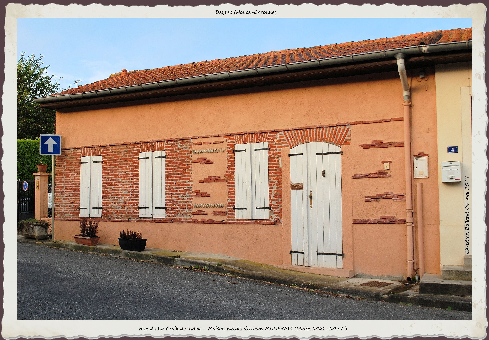

---
---  

<link rel="stylesheet" href="styles.css" type="text/css">

   

## La boucle de Saint Ignace    

#### Christian BALLAND  

 

---  

 
 

Nombreux sont les randonneurs à se fixer rendez-vous au point de départ de la boucle de Saint-Ignace, sur le parking municipal en surplomb de l’ancienne tuilerie au lieu-dit «Le Coustelet». Ce chemin de randonnée empiète sur la périphérie  de Donneville et de Montbrun-Lauragais, mais la majorité du parcours se trouve sur la commune de Deyme.  

 

 

 
 Dans la direction du Levant, la boucle s’étire dans la première moitié de la Rue de la Croix de Talou, entre le quartier «Les Vignes» et le Fort du Rodoul, et suit pas à pas le talus à la rencontre de sa charmante moitié épousée seulement en 1965 lors du projet d’aménagement de la circulade. Depuis, de superbes villas sont venues pénétrer les lisses anciennes et redonner vie à la motte féodale. La plongée sur le Chemin de Donneville, indique aux marcheurs la route à prendre.

 
 

 
Si l’on choisi d’emprunter un autre itinéraire, la courbe de la rue de La Croix de Talou, par église-forge-ancien foyer communal-vieille école, est la plus riche sur le plan historique. « La Capelainie  » sera le point de départ, qualificatif immémorial de la réunion de l’église, du presbytère et du terrain sur lequel Notre Dame des champs s’élève, bienveillante envers l’agriculture et conservée avec cette charge supplémentaire, depuis la Grande Guerre, de veiller sur les âmes des soldats disparus, aidée en cela par une « Patrie » qui pleure ses enfants disparus…

 
 

Sainte Marie Madeleine ouvre ses portes aux flâneurs, couverte de peintures murales conservées au prix de mille difficultés et ouvre son choeur aux trésors de Jean Baptiste DESPAX. Les grandes huiles sur toiles du maître toulousain représentent cinq épisodes bibliques majeurs en rapport avec le Christ, Madeleine et Philippe, saint autrefois mentionné dans les inventaires. L’orgue, installé et offert par Bernard THOUREL, suscite l’étonnement et en quelques occasions trop rares, raisonne sous ses doigts comme autrefois Alex OUILLAC faisait vibrer l’harmonium autour duquel se rassemblait la chorale dans la chapelle de la Vierge. Animateur de vie locale, créateur d’associations, maître-verrier de renom et conseiller municipal, ce dernier   son nom à la place publique en 1978, année de sa disparition.

 

 

 
Les premières maisons de la rue de la Croix de Talou, restaurées avec soin conservent tintement des forges et cris des enfants de l’école proche. La joie traverse les murs du Foyer Communal attenant, témoin de lotos, d’inaugurations et de bien d’autres fêtes, actuellement occupée par le Club des Vétérans. La maison natale de Jean MONFRAIX, maire qui a marqué le village par ces décisions d’avenir, lui fait face.

 
 

 
Quelques pas de plus à droite et la nature immédiatement tend ses bras Chemin de Saint Ignace. Ne soyez pas étonné de voir sur une cabane de jardin en bordure de voie, une plaque affichant le nom de Rue des noisetiers. Un deymois amoureux de son quartier, a voulu rappeler l’alignement de ces arbres jusqu’aux Trois canelles à l’origine du lieu-dit. C’est alors l’immersion dans une campagne où le fond sonore n’est que vent dans les buissons du touffu bois de Serres et les hôtes la libellule, le geai et mille abeilles en plein ballet. Le bruissement du gibier aux aguets et « les fleurs des champs, le bord du ruisseau, les nuages blancs et les grands arbres » légués jadis par Maurice de Vlaminck aux jeunes peintres se trouvent là, à chaque foulée.

Passé le lieu-dit « La pointe », une maison s’élevait autrefois dans ce qui était probablement une clairière. Il n’en reste plus rien sinon les vestiges d’un puits, heureusement comblé. La famille SERRES, présente à Deyme pendant tout le XIXème siècle et mentionnée encore vers 1935, a laissé son nom au bois longé par le sentier.

 
Le balisage nous fait éviter « Tucol » et l’on flirte déjà avec Monbrun Lauragais et le ruisseau Nagoussié (aujourd’hui Rival) franchi, direction la ferme de « Patras ».

 

 

  Il n’y a pas si longtemps encore, tous les enfants d’une même famille connaissaient les bancs de l’école de Deyme, celle de leur commune étant beaucoup plus éloignée. Neuf heures du matin en sonnait l’ouverture, douze la « mi-temps ». L’après-midi, la reprise se faisait à quatorze heures pour une fin de journée fixée à dix-sept. Une récréation entrecoupait ces périodes. Point de ramassage scolaire en bus, ni de parents en mesure de conduire leurs petits faute de temps et d’automobiles, rares en campagne dans ces années 1950. Ils représentaient la moitié de l’effectif scolaire, venus de La Juncasse, les Monges, La plaine, La Bordasse,  le Rival, Cante cocut, Same, Trébons, Pélégry, Gottis, Lacroix, Tourié, Glaudet, Bellevue, Labatut et Courtinade pour les plus éloignés, Fayard et Lassalle sont proches, le Major intégré à l’agglomération.

Pour venir de Patras, il fallait une demi-heure de marche à Pierre, à ses frères et à ses soeurs. Malgrè les intempéries et la distance, ni la pluie, ni la neige ou le sol gelé ne les ont empêché de répondre présent au premier cours du jour, en général celui de morale. Seule barrière infranchissable, le ruisseau Nagoussié en période de crue les obligeait à rebrousser chemin, comme leurs amis de Gottis. Quand le temps était trop mauvais, il déjeunaient chez une tante qui habitait la maison anciennement louée à l’effet de salle de classe rue Croux Talou. Ce changement avait un air de vacances. Le chemin du retour était plus rapide. Couper par une vigne en pente forte faisait gagner de précieuses minutes.

La classe finie, la journée n’était pas pour autant terminée au son de la cloche libératrice. Sur un coin de table de la cuisine, les devoirs s’étalaient comme une corvée, adoucie par l’odeur du bouillon de légumes et le crépitement des côtes de porc dans la grande poêle en fonte. Souvent, les tâches ménagères ou agricoles selon le sexe, bien que les filles aient souvent fait les deux, les attendaient et pas question de déroger. Ils étaient tous une pièce du système familial des « travailleurs de terre », tôt en mesure, comme des adultes, de rentrer le bois, travailler le potager, garder ou traire les vaches, les canards ou les dindons et, dès dix à douze ans, conduire le tracteur et accomplir mille autres corvées dont les en croire capable ou non était une question qui ne se posait même pas. Et ils obéissaient, conscients du rôle qu’ils tenaient aux côtés du père et qu’un jour, peut être, ils remplaceraient. En ce temps là les enfants étaient des « bras », et nombre de parents étaient partagés entre le devoir de les envoyer à l’école et celui de rentrer la récolte avec un jeune et robuste allié endurci par la vie aux champs. Après avoir rendu ce petit hommage à ces courageux enfants et avoir salué dans ce lieu toute une basse cour comme si rien n’avait changé en un demi-siècle, laissons à notre droite le centre équestre « Hippo’thèse », installée sur les terres d »En Gautier ». La présence de cavaliers dans les environs nous en laissait deviner la proximité.

 
 

C’est un bien sympathique arrêt qui attend le marcheur. Une table d’orientation à découvrir sur la commune de Donneville dans la quartier du « Moulin de Lamothe », à quelques mètres du panneau d’orientation qui affiche fièrement ce nom magique du lieu-dit « L’Orfèvre ». C’est en lui-même une pièce d’orfèvrerie, mais le nom tiendrait-il à un propriétaire dont c’était le métier?… Tout proche, un habitant de Toulouse était bientenant à Deyme de terres ignorant les limites des « consulats ». Il figure dans la Compoix sous le nom de Jean Martin, « maître Orphèbre »

On aperçoit sur la commune de Montbrun-Lauragais, dans la vallon de Prestin, au lieu-dit l’Orme, les ruines d’un château, construit au XVIème siècle. Dans « Histoire de la Baronnie et du Consulat de Montbrun-Lauragais », une description soignée des lieux redonne vie aux façades endommagées par le temps de l’habitation de la famille de Sénaux dont les armes, nous disent les auteurs, ont partout « été cruellement effacées ».

Propriété d’un meunier nommé Jean-Claude, le moulin dit Lamothe, fut en 1935, l’objet d’une polémique rapportée par les enfants de l’école primaire (CM1-CM2) dans l’ouvrage « Entre plaine et coteaux ». La destruction envisagée et entamée du moulin au profit d’une minoterie par le maire de la commune , provoqua une telle émeute de mécontents, « Jean-Claude » à leur tête, que le magistrat stoppa la démolition. Le meunier profita du répit pour reconstruire mais, plus tard, le maire entouré de des gardes armés mit à bien son projet. L’ordre revint, Le « moulineux » comme l’on disait alors, s’inclina et quitta Donneville pour ne pas voir la fin de son moulin.

La poursuite de la boucle par le chemin de Donneville est une rude montée adoucie par un point de vue remarquable sur le vallon et les fermes « Gottis’ et « Pélégri’. 

Les randonneurs retrouvent la rue de la Croix de Talou et, dernier souvenir, emportent l’image du château de La Peirouse, occupé par la famille De Caussin, seigneurs de Deyme, puis par Marc-Antoine Trébons  qui est à l’origine du nom actuel.
  

