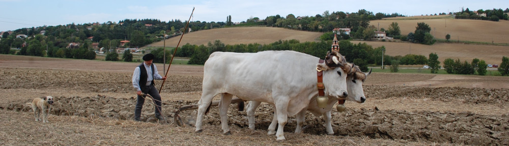

---
---  

<link rel="stylesheet" href="styles.css" type="text/css">

   

## La vie à la ferme en 1950

#### Robert CYPRIEN 

 

---  

 

L’image que l’on retient de nos campagnes avant l’arrivée massive du machinisme, ne figure plus aujourd’hui que dans les tableaux de peintres naturalistes ou sur le calendrier des Postes destiné à une rare clientèle nostalgique: des ouvriers s’affairent autour d’une charrue de foin tirée par des boeufs nonchalants, un paysan guide son puissant cheval dans un labour immense et un troupeau de « rousses » gardé par une jeune fermière broute paisiblement une herbe grasse. Seules les « laitières », de la Bretagne à la Savoie et de la Normandie au Limousin, continuent à donner à nos routes et autoroutes un air de campagne authentique. Pour combien de temps encore…? L’ère du tracteur a fait oublier très vite le rôle essentiel des animaux de trait, serviteurs fidèles et laborieux d’une agriculture désormais en recherche croissante de rendement. Quelques fêtes il est vrai, reproduisent le temps d’un week-end les gestes d’antan et raniment de vieilles machines maintenues en parfait état d’entretien. Mais comment vivait vraiment le paysan « avant »…?

En cette année 1946, en âge d’intégrer activement la ferme, je vis et travaille à « Bourges », un lieu-dit de la plaine d’Auterive en bordure de « Mouillonne », à quelques centaines de mètres de la Route de Capens, bordé par sa parallèle la route de Mauressac et clos à l’opposé par le ruisseau « Lichonne ». Je fais partie de ces 35 % d’actifs liés au monde rural, dans les conditions d’une France au plus bas niveau des capacités de production et où les petites exploitations, bien qu’à l’aube d’une révolution, n’ont qu’une préoccupation: survivre. Celle de mon père est de nourrir sa famille et nous sommes six, trente hectares de terre céréalière autour de nous et un cheptel de trois paires de boeufs, deux juments et de dix vaches laitières à notre disposition.

L’unique force motrice est animale. Mignonne et Sultane en sont les pièces maîtresses. Deux noms charmants qui pourraient s’appliquer à de fragiles animaux de compagnie par leur beauté et leur douceur s’il ne s’agissait d’une Ardennaise rouanne de plus d’une tonne et d’une solide Percheronne de trait lourd pommelée.

Achetée par mon père avant ses deux ans, cette dernière, d’un grand calme, obéissante et facile à mener possède des traits de caractère surprenant mais indissociables: Dissipée et poète. Parfois, devant un oiseau posé près d’elle ou pour écouter leur sifflement dans les branches, elle stoppe net… Un petit « *Allez Sultane, en avant* » … Et elle repart d’un jet régulier, bien droit… jusqu’au prochain oiseau… Mais ne s’arrête jamais sans raison, comme ces animaux mal dressés qui gardent en mémoire les trop nombreux arrêts pendant leur dressage pour ne pas les fatiguer et s’arrêtent tous les dix mètres. C’est un bijou! Sa valeur est l’équivalent d’un petit tracteur à pétrole, soit environ dix-mille francs. Pour leur conduite en solo les affinités ont vite formé les équipages: mon frère mène « Mignonne » et je m’entends parfaitement avec « Sultane ». Accouplées, c’est l’un ou l’autre, indifféremment. Mais dans ce type d’attelage, le meilleur guide est notre père. L’amour de ses bêtes est d’autant plus fort qu’il n’envisage pas, comme nous, l’aide du tracteur. Il est lié à elles jusqu’au terme. N’est-ce pas lui, qui, une bonne heure avant le jour et sans même prendre le temps de boire son café, se rend à l’écurie pour remplir les mangeoires et préparer les attelages à peine visible entre chien et loup sur le chemin des champs…? Et bien au-delà des soins nécessaires pour conserver un précieux outil de travail, son affection est naturelle et vivement ressentie par l’animal dans ces moments non plus obligatoires mais privilégiés du pansage. Le résultat est saisissant, au labeur, bêtes et homme ne font plus qu’un…

Les boeufs jouissent du même attachement. Évalués d’un coup d’oeil, soumis à un examen des dents, des cornes et un toucher de la masse musculaire, il les achète jeunes et par paires sur le foirail de la Madeleine, à la foire qui a lieu tous les troisièmes vendredis de chaque mois. Ce n’est pas la seule foire de la région, mais la plus proche pour les ramener à pied. D’une robe claire gris argenté, robustes et vaillants, les « gascons » aux caractéristiques muqueuses noires sont d’abord familiarisés avec le joug, puis, attelés à de petites charges et tirent des outils légers tel que la canadienne pour ne pas les épuiser. Vient enfin, âgés d’environ trois ans, le labourage où chacun a sa tâche et n’en change plus. Celui de gauche, dit « à la raie », avance dans le sillon fraîchement creusé, tandis que l’autre, dit « à la souche », évolue sur le sol ferme à retourner. Dans certaines régions, le « Mascaret » est celui de gauche et le « Mulet » celui de droite. Pour nous, le « Mascaret » est le plus foncé et le « Mulet » est le plus clair. Leur docilité permet une adaptation rapide bientôt démontrée par des journées de sept à huit heures, suivant la saison, entrecoupées par le repas de midi et des pauses régulières. Si le maintien du rythme mérite un rappel à l’ordre, l’aiguillon, toujours en main, peut être remplacé par la voix. Pourtant, en aiguillons, le père s’y connait pour en fabriquer les soirées d’hiver, en bois de châtaignier, bien droits et pointus. Il en donne, en vend à l’occasion et c’est fait dans ce domaine une forte réputation… lui qui ne les utilise jamais. Là ne s’arrête pas son talent pour le travail du bois. A son actif entre autres, une brouette et une voiture à cheval en chêne et châtaignier. Caisse et brancards de sa main, les roues en orme et en chêne laissées aux bons soins du charron. Une réussite qui force l’admiration.

Leur vie de labeur accomplie, entre cinq et dix ans, les boeufs sont vendus au boucher. D’autres fermiers préfèrent des rotations plus courtes, presque chaque hiver pour éviter de les nourrir en période d’inactivité. Il est pourtant reconnu que, comparé au cheval, le boeuf est plus économique. Une semaine après l’abattage, la coutumier est de recevoir un morceau de viande de l’animal. Beaucoup attendent plus longtemps. Ma grand-mère a souvent raconté l’histoire de ses boeufs retournés à la ferme. Le boucher, revenu en camionnette ne cessait de clamer leur folie. « Ils ne sont pas fous du tout… » répondit-elle vivement. Et de prendre chacun au bout d’un licol et de grimper avec eux la rampe fatale du véhicule. Auterive-Mauressac… Ils avaient fait sept kilomètres…

Depuis l’enfance, les vaches nous sont familières. Je me revois partir au pré le livre d’histoire ou de grammaire sous le bras…? L’école passait d’abord et il n’était pas question de la manquer. Le kilomètre et demi qui nous en séparait se faisait à pied et les intempéries, sauf extrêmes, ne sont pas une excuse à un éventuel retard. Pas de ramassage scolaire en bus, ni de parents en mesure de conduire leurs petits faute de temps et d’automobiles, rares, surtout en campagne. La classe commençait à neuf heures du matin, pas à neuf heures dix et se terminait à douze. Le repas, préparé par notre mère, est pris sur place. Et l’hiver, quelle joie d’approcher du poêle pour savourer une gamelle logée dans une musette entre le pain et un fruit… La reprise se faisait à quatorze heures, la une fin de journée à dix-sept. Une récréation entrecoupait ces périodes. Mais pour la plupart de ceux qui n’habitaient pas le bourg, la journée ne s’achevait pas au son de la cloche libératrice, racontaient mes camarades. Sur un coin de table de la cuisine, les devoirs s’étalaient comme une corvée, adoucie par l’odeur du bouillon de légumes et le crépitement des côtes de porc dans la grande poële en fonte. Tâches ménagères ou agricoles selon le sexe, bien que les filles fassent souvent fait les deux, les attendaient et pas question de déroger. Ils étaient une pièce du système familial des « travailleurs de terre », tôt en mesure d’accomplir mille autres corvées dont les en croire capable ou non est une question qui ne se posait même pas. Et ils obéissaient, conscients du rôle qu’ils tenaient aux côtés de leur père ou de leur grand frère et qu’un jour, peut être, ils remplaceraient. En ce temps là les enfants étaient des « bras », et nombre de parents oscillaient entre le les envoyer à l’école ou rentrer les utiliser en cas de besoin. Ce n’était pas notre cas. Nos parents, pour employer une expression à la mode, étaient plutôt « cools ». Notre rôle essentiel se cantonnait à garder les vaches ou les oies. Parfois, le jour de repos scolaire ou pendant les grandes vacances, je retrouvais les enfants du voisinage et pour quelques heures « La prise de la Bastille » et « Le complément d’objet direct » étaient mis en attente. Commençait alors la quête des châtaignes, des champignons ou des pommes. Ah! Les pommes…! Une vieille borde proche ravagée par un incendie offrait tous les atouts d’un quartier général: isolement, poste de guet, mare où les grenouilles abondaient et un four archaïque mais efficace fabrication maison. Un trou dans la terre, du bois récupéré ça et là et le foyer dégageait cette odeur irrésistible qui resserrait le cercle des grapilleurs que l’on aurait pu croire affamés. Et les vaches….? Abandonnées…? Non…! Sans même lui en donner l’ordre, notre chien, qui aurait mérité de s’appeler Argos, assurait « l’astreinte » et branchait ses cent yeux. L’une s’écartait furtivement du troupeau, un rappel discret, sans aboiement ni morsure, mettait fin à son escapade. Une autre, nonchalamment broutait-t-elle de plus en plus loin…. elle était rattrapée par un éclair plus efficace qu’une clôture électrifiée. Merci à toi, gardien d’une fiabilité sans pareille, les « apprentis vacher » du jeudi te doivent des moments parmi les meilleurs de leur jeune âge.

Dans l’étable, contiguë à l’habitation, les tâches sont convenablement réparties. Mon père remplit les râteliers, mon frère se charge de l’entretien et des litières. L’hygiène est essentielle. Une bête malade ne produit pas et diminue de valeur. Livrée à elle-même devient défiante, rétive et dangereusement maigre. Les bons traitements et leur régularité offrent un meilleur résultat. La traite m’incombe. Deux, à heures régulières, à la main, assis sur le fameux petit tabouret à trois pieds et un seau en fer blanc à ma portée, la première à six heures, l’autre à dix huit heures, fournissent quinze litres de lait par jour et par individu. Tous les matins, le camion de ramassage de la laiterie d’Oust, dans l’Ariège, dont une fromagerie est bien connu pour son « Camembert de l’Ours », passe enlever les bidons.

Originaire des Pays-Bas (plus exactement de Frise), et d’Allemagne, la race, à robe blanche et noire connue sous le nom de « Française Frisonne Pie-noir », de « Frisonne », « Pie noir », « Prim Holstein » et plus généralement « Holstein », est communément appelée chez nous « Hollandaise ». Réputée parmi les meilleures en quantité de lait produite, les sélections, alors à leur début, en on fait un animal mixte, à la fois producteurs de lait et de viande. Ses mamelles volumineuses et la conformation du pis, parfaitement adapté à la traite mécanique, la positionne à l’une des meilleures places au monde, à tel point que le docteur Raboisson dans sa thèse de doctorat vétérinaire n’hésite pas à la qualifier de « Reine Holstein ».

Au retour tardif des champs, accompagnés du jour en été et généralement en appétit, nous rejoignons ma mère, autre maillon solide de la famille et de l’entreprise. Elle prend en main non seulement la maison, mais aussi une basse-cour des plus variées. De basse-cour n’existe que le nom. Comme dans la plupart des exploitations du Midi-Toulousain, les oiseaux qui la composent vivent en liberté dans les champs alentour, seulement abrités la nuit des renards et des belettes. Le jour, autre prédateur, la buse guette les mulots mais n’hésite pas à fondre sur les plus jeunes volatiles. Poules blanches, rousses, noires, ou « cou-pelé », « cou-nu » est plus exact, « élevées en plein air et nourries au grain », donnent des oeufs couleur maïs au goût incomparable. Pour les préserver des poux, puces et autre vermine qui vivent sur les perchoirs, les nichoirs et s’abritent sous leur plumage, les nettoyages sont fréquents et le badigeonnage total au lait de chaux du poulailler se fait deux fois par an. Malgré ces précautions, des fléaux sournois s’abattent. Le choléra a frappé plusieurs fois. Les victimes chancelantes semblent être en proie à un profond sommeil, leur crête noirci, elles rehaussent leurs ailes dans un geste de mise en boule, inutile mouvement de protection, et meurent sur place après quelques soubresauts. Hautement contagieuse, cette affection fatale non transmissible à l’homme nous coûte des pertes jusqu’à 75% des sujets atteints.

Autre ressource, les porcs, issus de notre élevage, occupent une place de choix. Placés dans des soues indépendantes des autres bâtiments, ils sont abattus l’hiver. Ni boucher, ni tueur chez nous. Là encore, le père se charge de la besogne et surprend par sa dextérité. Saucisse sèche suspendue, jambons mis au saloir et bocaux de pâtés résultent de deux bêtes et nous assurent la charcuterie pour une année. Un peu de calme en cette saison pour entretenir les fossés et les rigoles et entretenir les outils. La coupe du bois de chênes et de châtaigniers trentenaires issus de rejets alimente une cheminée avare de chaleur auprès de laquelle il faut parfois garder sa veste pour manger. Quand arrive Noël, pas de repos ni de réveillon. Le vingt-cinq seulement, le repas de midi est amélioré. Pendant notre enfance, dans la ferme précédente, nous allions à la messe de minuit. Mais à Auterive, l’église est plus éloignée et rentrer tard, à pied, n’est pas toujours possible. Les soins des animaux et la traite ne souffrent aucun changement ni retard dans les horaires du lendemain.

De même, la nature impose son emploi du temps au fil des saisons. Aux premiers beaux jours de février-mars, confiants dans la douceur d’avril annoncée par la floraison des pêchers et des cerisiers, les attelages hersent les blés et labourent. Semis d’avoine, des céréales d’hiver, du trèfle, de la luzerne, du sainfoin, du maïs et de l’orge paumelle (à deux rangs) s’enchaînent avec la plantation des pommes de terre et des betteraves fourragères. Le printemps est aussi la saison des premiers travaux de la vigne: taille, déchaussage, badigeonnage des souches. Les boeufs à la paille passent à une alimentation augmentée en vert et les vaches laitières plus richement soignées retrouvent vers-mai juin le chemin des pacages. La luzerne le trèfle et le sainfoin succombent à la faucheuse. Dès la deuxième année la luzerne, qui regroupe plusieurs espèces de plantes fourragères, fournit deux à trois coupes par saison et pendant cinq ou six ans.

Les dépiquages et les battages sont l’occasion de mobiliser la « communauté », tantôt chez l’un, demain chez l’autre, en juillet et août. En toute occasion, compter sur l’entraide est l’assurance de rentrer sa récolte, poursuivre le labourage quand un boeuf boîte et de charger à la hâte les gerbes sous la menace d’un orage. La moisson terminée, le grain est mis en sacs de toile de jute fournis par la Coopérative d’Auterive qui se charge de la collecte. Et les vendanges arrivent, preuve supplémentaire de l’entraide. Le grand jour, coupeurs et porteurs suivent à pied la charrette chargée de paniers, de sécateurs et de comportes étanchéifiées la semaine avant. Première étape, primordiale pour se mettre en condition, le petit-déjeuner, froid: pâté, sardines, fromage et vin du terroir. Deux coupeurs par rang, un de chaque côté, prennent place pendant que les comportes sont disposées régulièrement dans la vigne pour éviter aux coupeurs des pas inutiles, la position accroupie est suffisamment fatigante. Ramenées en bout de rangs par les porteurs munis de « pals », ces longs bâtons passés sous les poignées, elles sont rechargées sur les charrettes ou les remorques en direction de la maison où la vendange est vidée dans le fouloir, recueillie et mise en cuve. Peaux, pulpe, pépins, grains et rafles fournissent un moût guetté par les vendangeurs comme une récompense. Un copieux repas les attend le midi et le soir. Nous ne faisons pas de grandes soirées, comme dans l’Aude ou dans les grands domaines pour ponctuer la fin de la journée ou de la saison, ni de rendement demandé et pas davantage de temps perdu. L’organisation est parfaite. Destinée à la consommation personnelle et malgré les mélanges de cépages, français et américains, la récolte avoisinait les 30 hectolitres sur un demi hectare et d’un taux d’alcool généralement de 7 à 8°, certaines années de 12 °.

À la mi-octobre voisins et amis, déjà conviés entre le 14 juillet et le 15 août à l’écrêtage du maïs, reviennent pour son ramassage. La main-d’oeuvre nombreuse est synonyme de labeur, mais aussi de rires et de plaisanteries. Pas de problème de personnel si l’on en manque. Une majorité, des femmes, se louent à la journée pour… un panier d’épis…! Le salaire peut paraitre dérisoire, mais il n’en est rien. La quantié nourrit un petit élevage volatile dans un petit espace grillagé tenu par des piquets de fortune dans un jardin du bourg pendant une semaine. Au même titre que glaner les grains et la paille tombés au sol après la moisson, correspond aux même besoins. Le glanage légal, pratique moyenâgeuse, est soumis à des règles qui le distingue du glanage illicite. Vieilles habitudes de ne rien perdre. A tel point que l’épi de maïs dégagé de ses grains laisse une carouille, dite charbon blanc, conservée pour ses vertus d’allume-feu de cheminée.

Semis d’avoine et d’orge d’hiver à six rangs d’épillets proéminents (orge hexastique), rustique et productive, ponctuent octobre et précèdent les labours, l’épandage du fumier et des amendements.

Plusieurs types de contrats s’offrent à l’exploitant d’une terre dont il n’est pas propriétaire. Dans le « bail à ferme », un loyer, dépendant de nombreux critères (Durée du bail, état de l’exploitation, importance des bâtiments, qualité des sols…) est versé au propriétaire. Mon père a préféré le contrat de métayage. Sans en connaitre tous les détails, les discussions entre nous sont libres et il nous tient au courant de certaines conditions, pour nous former, comme il le fait pour l’achat des bêtes ou les variétés de céréales. Dans ce cas le bailleur et le preneur partagent les revenus de certains produits ou les produits eux-mêmes en nature. Le contrat se réfère au Code Rural, sans oublier une notion qui n’est pas écrite, la confiance, qui peut, sans en changer les grandes lignes, s’adapter à la situation. Chez nous, la coupe de bois hivernale se répartit d’un tiers pour le patron et de deux tiers pour le coupeur, calculée sur la base du bûcher d’une valeur de 4 m3. Trois des six cochons élevés chaque année lui sont donnés. Il en garde un et en vend deux, ou inversement, alors que nous, invariablement, nous en gardons deux pour notre consommation et en vendons un. Le revenu du lait est partagé selon les règles, de même que le vin et les céréales. Pour les volailles, quatre-vingts, par exemple, nous en gardons soixante, tous les oeufs de l’année en sus. Dans les cas extrêmes de scepticémie ou de choléra évoqués, la question ne se pose pas, les deux parties sont pénalisées. Aucune répartition n’a jamais engrendré de désaccord.

Mais en 1956, nos conditions de travail appartiennent déjà au passé. Davantage de terres et des outils adaptés, un tracteur en premier, s’imposent rapidement partout. Dans le même esprit que la génération passée, mon but est fonder une famille et « Bourges » ne prend pas le tournant assez tôt pour me retenir. Je quitte la grande famille paysanne pour me marier, riche d’expériences et les mains marquées à jamais de la couleur du raisin, du blé et des pommes de mon enfance.

Encore aujourd’hui, le superbe tracteur souvent aperçu dans le bas-fond du Rival me renvoie à mes vingt ans. Une roue sur le guéret et l’autre en fond de raie, il attaque le dernier sillon. La longue charrue portée retourne le sol humide et découvre les dessous de la terre assoupie. Tout à coup, le bruit du moteur s’estompe, la silhouette d’un bouvier se dessine… Les mains fermement posées sur les poignées d’un brabant, il sculpte avec adresse chaque motte où s’enfouira bientôt le grain nourricier. « Hue Mascaret…! Hue Mulet…! ». Dans un silence d’église, ce merveilleux nuage imaginaire m’enivre un court instant de ses odeurs animales, de senteurs fourragères et de bois humides où le champignon tapisse de blanc les souches de piboules aux pieds dans l’eau…

 

  

 
Deyme, 29 décembre 2014  

