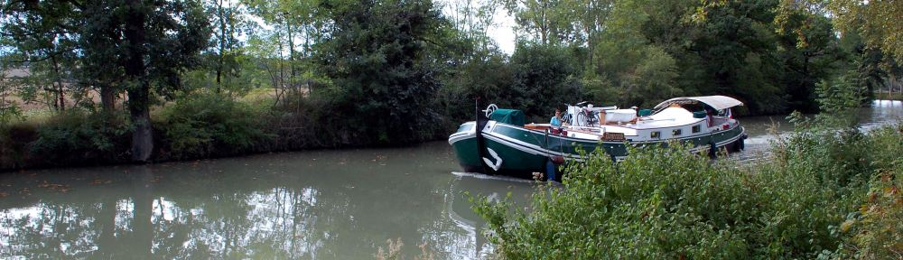

---
---  

<link rel="stylesheet" href="styles.css" type="text/css">

   

## Le Canal du Midi 

#### Classe C.E1-C.E2 - Madame PALIN

 

---  

 

  

  

#### **Les canaux**

Un canal est un cours d’eau artificiel, fait par l’homme pour permettre la navigation.

On creuse un canal :  

 + quand les rivières ne sont pas navigables  
 + quand on veut joindre deux rivières ou quand on veut joindre deux mers ou deux océans  
 
Le Canal de Panama (1914) et le Canal de Suez (1869) sont deux canaux très célèbres.  
Ils sont utiles à la navigation mondiale.  
C’est Ferdinand de Lesseps qui a dirigé leurs travaux.  
Le Canal de Panama sert à relier l’Océan Atlantique à l’Océan Pacifique.  
Le Canal de Suez sert à faire communiquer la mer Méditerranée avec la mer Rouge et sépare le continent africain et le continent asiatique.  

 

#### **Le Canal du Midi**

Le Canal du Midi se situe dans le Sud-Ouest de la France.  
Il commence à Toulouse et se termine au port des Onglous (Commune de Marseillan) au bord de l’étang de Thau.  
Sa longueur est de 254 km.  

 

#### **Son eau**

Riquet a détourné les eaux d’une série de ruisseaux et rivières (Le Sor, le Lampy, l’Alzeau) et a construit un barrage, celui de Saint-Ferréol, pour recevoir et retenir les eaux pendant l’hiver et les restituer pendant l’été.

L’eau du barrage de Saint-Ferréol part vers le seuil de Naurouze. Cet endroit s’appelle la ligne de partage des eaux, car une partie des eaux est dirigée vers l’Ouest en direction de Toulouse et l’autre vers l’Est en direction de Sète.  

 
*Marc et Robin*  

  

  

#### **Le Canal du Midi et le Canal latéral à la Garonne**

Un autre canal prolonge le Canal du Midi, c’est le Canal latéral à la Garonne. Il s’appelle comme cela parce qu’il a été construit à côté de la Garonne qui n’est pas tout le temps navigable.

Le Canal du Midi et le Canal latéral à la Garonne permettre de joindre l’Océan Atlantique et la mer Méditerranée et d’éviter le détour par la détroit de Gibraltar.  

 
*Robin et Clément*  

  

  

#### **Un vieux projet**

Depuis longtemps, on voulait construire un canal pour joindre l’Océan Atlantique à la mer Méditerranée et éviter le détour par la détroit de Gibraltar.  
Avant Pierre Paul RIQUET, les Romains, Charlemagne, François 1er et Henri IV avaient déjà voulu réaliser ce projet.  

 
*Sylvain et Vincent*  

  

  

#### **Pierre-Paul RIQUET**

Pierre-Paul RIQUET naît en 1601 à Béziers.

Son père François-Guillaume RIQUET est notaire (être notaire rapporte beaucoup d’argent). Il est aussi procureur, affairiste et spéculateur, c’est-à-dire il achète des choses à prix bas et les revend à prix haut. Donc, la famille RIQUET est très riche.

P.P. RIQUET vit à Revel avec sa femme. Il est percepteur des impôts à la ferme des Gabelles. Il commence à penser au projet du Canal du Midi en 1651.

P.P. RIQUET parle de son projet à Jean-Baptiste COLBERT qui en parle au roi.

Pour COLBERT, la réalisation du canal est :

 + la création d’un nouveau port sur la Méditerranée  
 + la possibilité pour les navires marchands d’éviter le détroit de Gibraltar et d’utiliser le canal à des fins militaires  
 
le roi est séduit par l’affaire et par le rayonnement qui pourrait en découler.

Les travaux du Canal du Midi commencent précisément le 13 avril 1667 sur les hauteurs qui dominent Revel. Mais le chantier avait commencé quelques mois auparavant avec le début de la captation des eaux des rivières et ruisseaux comme le Laudot, l’Alzeau, le Sor, la Bernassonne qui dévalent l’un ou l’autre versant de la Montagne Noire. En tout, il y a 12000 employés qui travaillent sur le chantier. C’est P.P. RIQUET qui finance le canal et ses travaux. RIQUET est un homme moderne car parfois, il surpaie les ouvriers pour les heures supplémentaires, les travaux du dimanche.

Le Canal peut être ouvert en mai 1681, mais RIQUET ne peut pas le voir terminé car il est déjà mort. Quand RIQUET meurt, sa famille est au bord de la faillite, alors tous les membres travaillent aux écluses du Canal.  

 
*Quentin et Eliot* 

  

  

#### **Les ouvrages d’art**

Le canal possède 350 ouvrages.

Les écluses : il y a 63 écluses sur le canal dont dix doubles, quatre triples, une quadruple et une octuple. Les écluses sont des constructions sur un cours d’eau qui permettent aux bateaux de franchir une dénivellation. Les écluses permettent le passage de bateaux d’un maximum de 150 tonnes. Les sas des écluses sont en forme de poissons ou d’olive, ainsi ils résistent mieux à la pression du terrain et la contenance du sas est supérieure.  

  

#### **Les ponts-canaux**

Les ponts-canaux et les aqueduc permettent de faire passer sous le canal, les ruisseaux et les rivières qu’il rencontre. Et ils n’avaient pas l’habitude de construire ce genre ce genre de ponts. On a construit le premier pont-canal en Italie au XVème siècle. Pour le Canal du Midi, P.-P. RIQUET a construit 1 pont canal et VAUBAN les 49 autres.  

 
*Meritxell et Pauline*  

  

#### **Les ponts**

Il y a plus de 130 ponts sur la longueur du Canal. Les plus anciens se reconnaissent à leur arche en « plein cintre » ou légèrement surbaissée. Ils datent de la construction du canal.  

 
*Noémie et Sylvain*  

  

#### **Le tunnel de Malpas**

Pierre-Paul RIQUET a creusé un tunnel qui se trouve près de Béziers. Il a été commencé en 1679. Ce tunnel qui s’appelle le tunnel de Malpas, n’a pas été facile à creuser parce qu’il a été creusé dans un tuf sablonneux et qu’il s’effondrait régulièrement.

RIQUET avait des ennemis qui pensaient qu’ils n’allaient pas réussir à creuser le tunnel de Malpas et qui informèrent COLBERT. Le projet risquait d’être confié à un autre entrepreneur. Mais RIQUET, mis au courant, passa un marché avec un maçon ensemble ils réussirent à percer le tunnel. Pour que rien ne soit su, ils réalisèrent les travaux en secret. Le tunnel de Malpas fut alors creusé en huit jours.

Il est long de 173 m et on peut marcher dedans grâce à un trottoir en roche. Pierre-Paul RIQUET a installé des épanchoirs et des réservoirs pour évacuer les eaux qui risquent d’élever le niveau du canal.  

  

#### **Les hommes et le canal**  

Autrefois, on trouvait comme bâtiments le long du canal l’hôtellerie, l’écurie, la chapelle, les glacières et les maisons éclusières:

→ La chapelle servait à marier les mariniers qui pouvaient aussi aller à la messe.

→ L’hôtellerie permettait aux voyageurs de se loger et de se nourrir.

→ Les glacières servaient à conserver la glace.

→ Les maisons éclusières étaient celles des éclusiers.

Des professions profitaient du canal, comme les meuniers, les négociants qui transportaient les marbres de Caunes-Minervois, les vins, les soies du Languedoc et les céréales.  

  

#### **Les navires**

Autrefois on voyait naviguer sur le canal :  

 + des barques de poste qui transportaient des voyageurs (4 jours pour faire Toulouse-Sète)  
 + des gabares qui transportaient des marchandises  
 + des pinardiers qui transportaient le vin  
 
Aujourd’hui, le canal sert à l’irrigation des cultures et au tourisme.

Des bateaux de plaisance naviguent sur le canal (beaucoup de personnes anglaises qui empruntent le canal comme raccourci pour arriver à la mer Méditerranée).

Un bateau navigue en permanence sur le canal : une péniche-ruche, le Phalène qui transporte des abeilles.  

 
*Meritxell et Pauline*

  

  

#### **La faune**

les poissons: dans le canal vivent de nombreux poissons, des brochets, des perches, des anguilles, des sandres, des black-bass (perches noires), des poissons-chats.
On voit aussi sur le canal barboter des canards, des cygnes.  

 
*Benjamin*

  

  

#### **Les ragondins**

Importé d’Amérique, les ragondins sont des rongeurs qui creusent leurs terriers dans les berges. Les ragondins sont très nombreux car ils n’ont pas de prédateur dans notre région. Les hommes chassent ces animaux car ils font écrouler les berges du canal.

 
*Simon et Audric*

  

----

L’Echo de Deyme – Informations scolaires pp 34-37. Septembre 2002  

