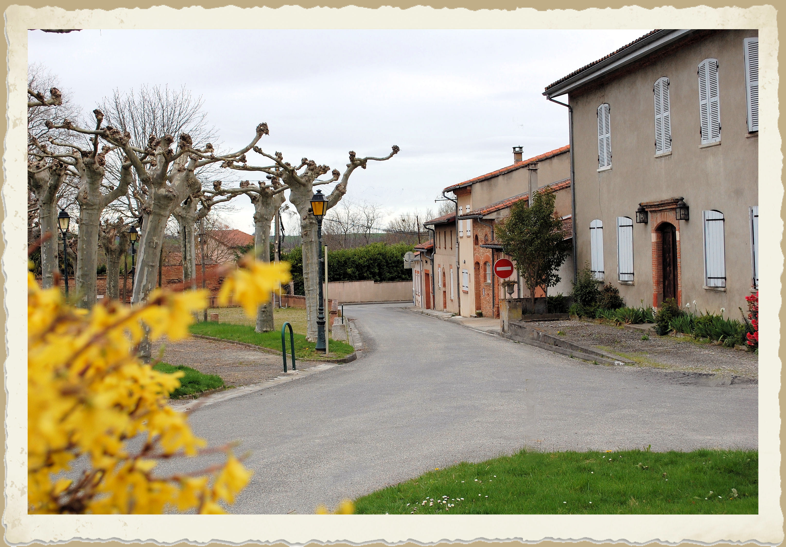
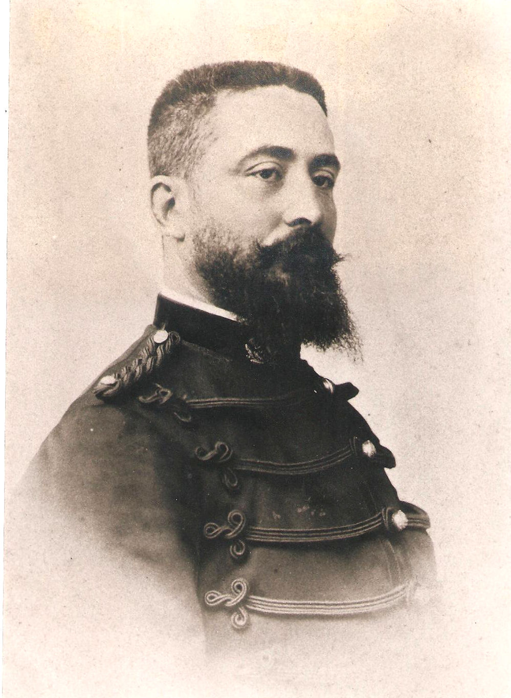

---
---  

<link rel="stylesheet" href="styles.css" type="text/css">

   

## Le docteur Henri PAGUE

#### Jeannette DENAT et Christian BALLAND  

 

---  

 

Bordée côté impair par un alignement de maisons d’habitation et de l’autre par la place Alexandre Ouillac, la rue du docteur Henri PAGUE, entre la Route de Montbrun et la rue de l’église, se termine par le bâtiment connu à Deyme sous le nom de « Maison PAGUE ». Le docteur Jules Henri Théodule PAGUE, dit Henri PAGUE, y naît le 10 août 1865, de Marie Jacques Zéphyrin PAGUE, médecin du village et maire de 1881 à 1887, et de Marie CAUSSÉ. Par sa grand-mère, Jeanne Marie TRIADOU, seconde épouse de Jean Guillaume Jules PAGUE (homme de loi toulousain, père de Zéphyrin, maire avant lui de 1855 à 1857), Henri descend d’une vieille famille de souche Deymoise mentionnée au XVIIIe siècle. Sa soeur, Maria Bernardine Célestine naîtra deux ans plus tard.

 

Pendant sa scolarité au lycée Pierre de Fermat (Toulouse), il côtoie Charles César BRU qui deviendra plus tard doyen de la faculté de droit, RAMBERT et BARCOUDA, gros propriétaire terrien de Grenade sur Garonne, sous la surveillance du futur député Jean JAURÉS. Henri PAGUE, comme RAMBERT, s’oriente vers la médecine.

Son âge ne permet pas au patriote qu’il est, d’aller au front lors de la déclaration de la première Guerre Mondiale, mais il apportera sa contribution en accueillant sous le toit de sa maison de Cugnaux et à titre gratuit, aussi bien les officiers que les soldats blessés en se dépensant pour eux sans compter pendant quatre années. Généreux, il distribue quelques louis d’économie de sa fortune personnelle aux plus nécessiteux. Pour la petite histoire, à l’occasion d’un don qu’il fit, deux louis tombent à terre. Ceux-là, il les garde et la famille les possède encore en souvenir de l’homme au grand coeur.

Après la guerre, il cède son cabinet de Cugnaux et s’installe dans une vie calme partagée entre Toulouse et Deyme où il va à la chasse avec ses amis. Devant leur insistance, il pose sa candidature aux élections municipales en 1925 et s’éteint à Toulouse le 9 mars 1930, au cours de son second mandat.

Le Docteur Henri PAGUE repose dans le cimetière communal.
