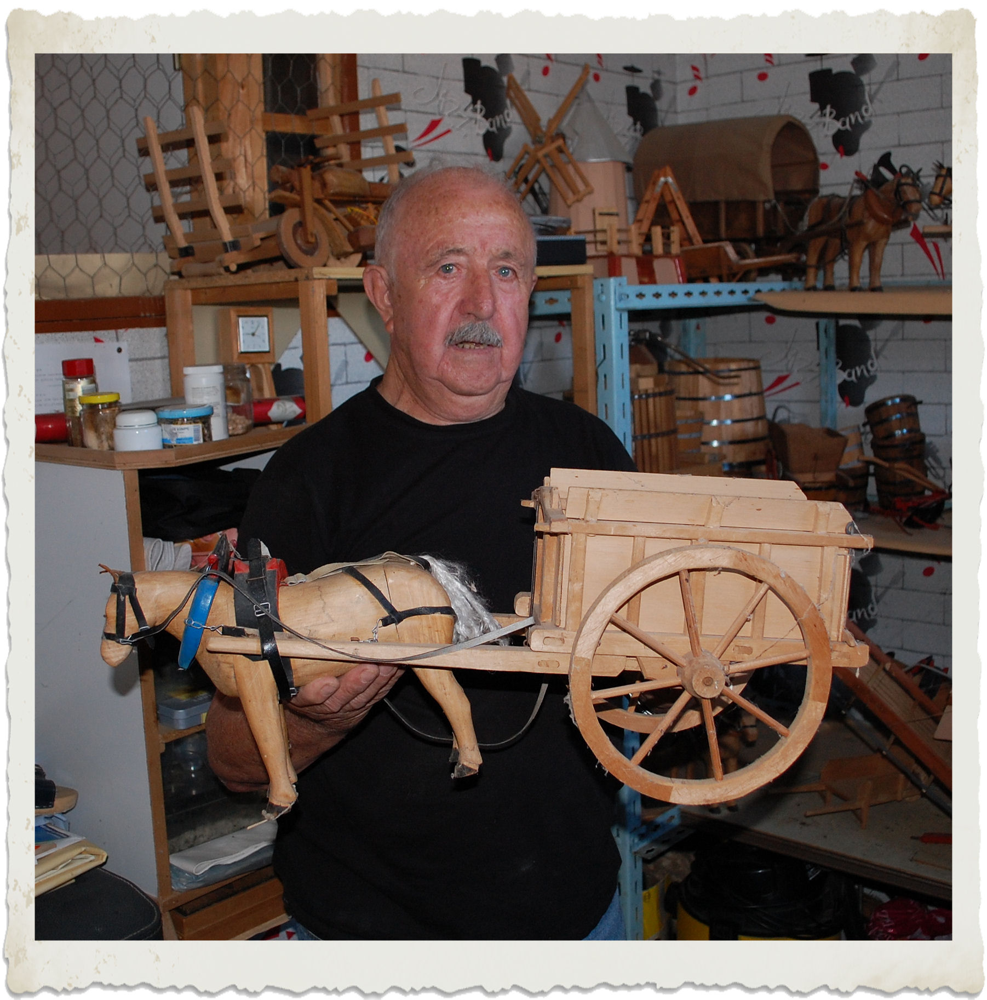

---
---  

<link rel="stylesheet" href="styles.css" type="text/css">

<style>
body {
text-align: justify; font-size:12pt}
</style>

<br>  

## L’agriculture en modèles réduits

#### Christian BALLAND    

<br>

---  

<div style= "float:left;position: relative; width:30%; top: 10px;margin-right: 20px">

 
</div>  

Pendant toute une vie professionnelle consacrée au bâtiment, Robert CYPRIEN a su organiser admirablement son temps, consacré en premier lieu à sa famille, impliquant  pendant quelques années la construction d’une maison sise au pied de l’ancienne tuilerie. La vie locale n’a pas été oubliée, nombre d’associations s’en félicitent: membre actif de la boule deymoise, membre de Commissions municipales et du Foyer des Jeunes et d’Education Populaire. Mais ce sympathique Deymois, oeuvre depuis toujours, dans une pièce transformée en atelier, à la fabrication de modèles réduits de machines agricoles et d’animaux de trait. Là sont nées, faites de bois ou de métal,  charrues, charrettes et faucheuses, sous l’oeil inquiet de boeufs sous le joug et de paisibles chevaux.

Sollicité par les organisateurs de manifestations culturelles régionales, ses expositions, assorties de commentaires, ont rencontré un succès jamais démenti.

Observateur attentif du monde agricole, il a logé dans sa mémoire les détails qui rappellent à tous les amoureux de la terre, les formes et les fonctions des outils de nos aïeux, pour beaucoup de notre enfance, si bien rendus par un indéniable sens artistique mais aussi, dans un autre domaine, un chariot du Far-West ou une  roulotte bohémienne, synonymes de rêve et de voyage, celui que Robert construit pour notre plus grand plaisir dans son univers magique…  

<br>


```{r, echo = F, out.width="40%"}
library(knitr)
myimages<-list.files("C:/Chris-Balland.github.io/images L’agriculture en modèles réduits", pattern = ".jpg", full.names = TRUE)
include_graphics(myimages)  
```

