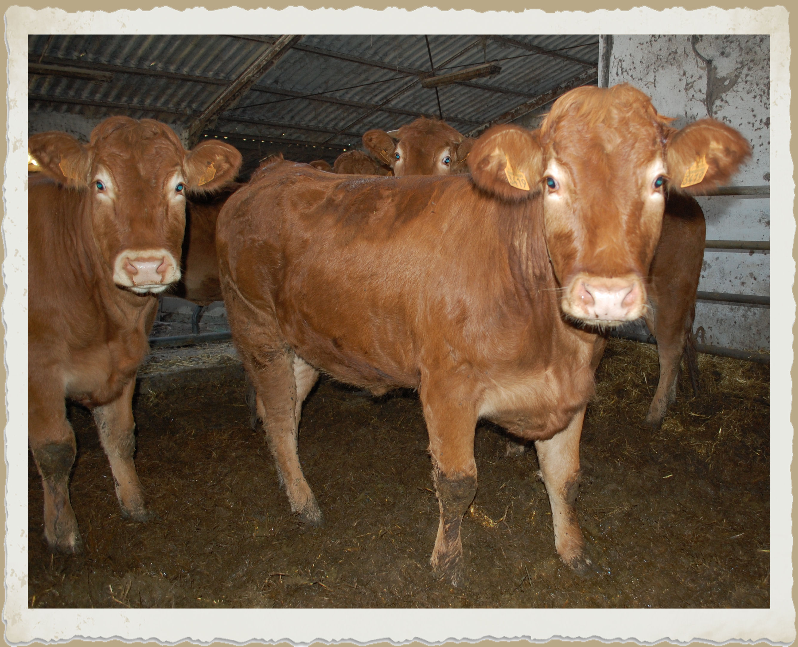
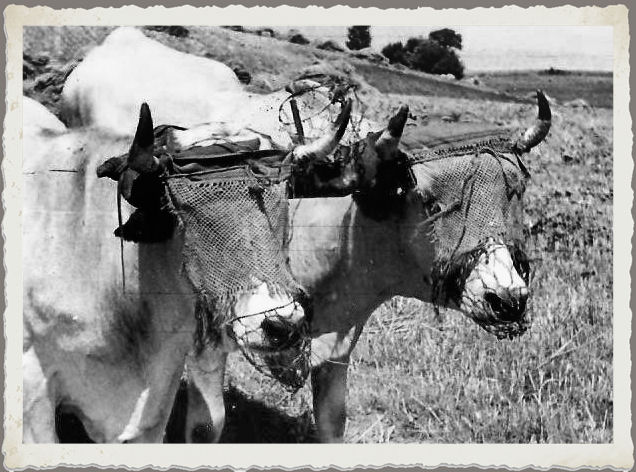
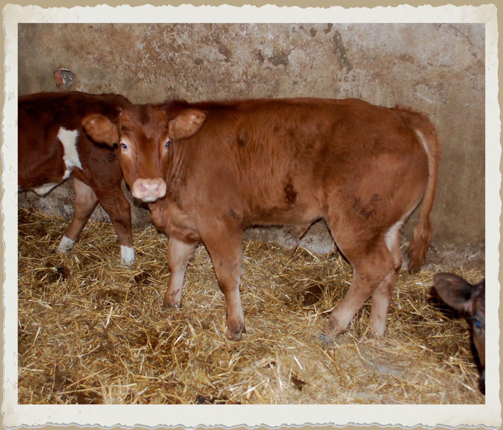
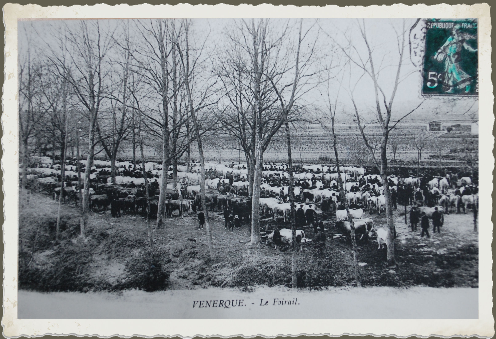
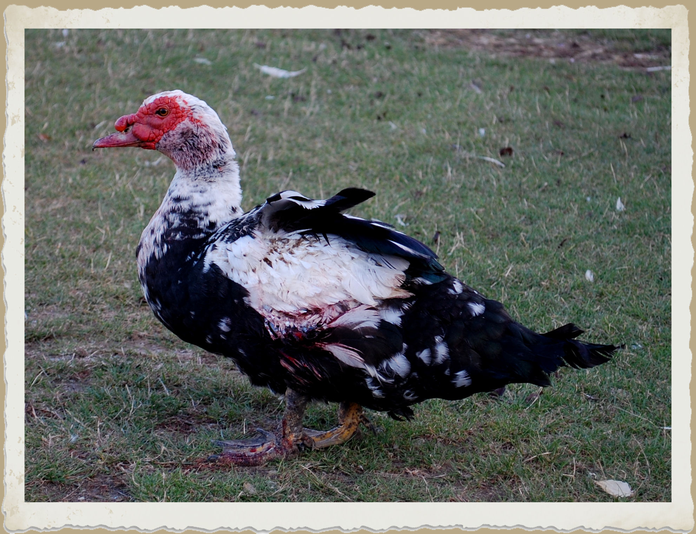

---
---  

<link rel="stylesheet" href="styles.css" type="text/css">

   

## Prix des produits fermiers 1929-1970  

#### Jean HEBRARD et Christian BALLAND

  

---  

  

C’est jour de fête à Deyme en ce 23 avril 1929. Un jeune homme de Pompertuzat, un de ces « travailleurs de terre », comme disaient les anciens, « marie » une jeune fille du village. Il est dix heures trente, l’église Sainte Marie-Madeleine fait entendre ses cloches, portes grandes ouvertes pour accueillir parents et amis des familles attestées dans le canton depuis deux siècles. Le père de la mariée figure sur le marbre du Monument aux Morts de la Grande Guerre… Françoise avait deux ans… Face à l’église, de l’autre du vallon, le couple achète une fermette en ligne de crête dix années plus tard, à l’aube d’un autre grand conflit.

Marius, le courageux époux, agrandit en premier les hangars et l’étable, puis l’habitation. User d’échange permet de poursuivre les travaux: volaille contre des matériaux, sacs de grains contre un service rendu par le forgeron. Le fameux « Système D » français, « D » comme débrouillardise, n’a pas attendu les périodes sombres pour éclore, surtout à la campagne. Conjointement, remarqué pour ses compétences, il devient en 1940 régisseur d’une propriété située dans une commune limitrophe. Près de 200 hectares de champs, de prairies, de bois et de vignes répartis sur cinq métairies et le travail de quatorze à seize personnes (1941), de deux domestiques et des journaliers sont à gérer. Il fait des métayers ses coéquipiers: les outils et animaux s’échangent entre bordes, semis et traitements se discutent et certains travaux se font en commun.

La veille des jours de marché s'organise une tournée des métairies. On charge les bêtes à vendre, auparavant apprêtées. Vaches, boeufs, breaux sont étrillés et brossés, la queue des vaches tondue et le toupillon shampouiné aussi bien gonflé qu’une chevelure. La « quête des oeufs » remplit une comporte à vendanges, poulets et les canards. Si Montgiscard, Baziège et Castanet sont les plus proches, Venerque, Caraman, Villefranche-de-Lauragais au foirail réputé, sont concurrencés par Cadours et Saint-Gaudens. Ces jours là, on vend on achète et au retour le point est fait selon les modalités portées aux contrats.

Le régisseur achète à la Coopérative de Baziège ou de Toulouse (Rue Alexandre FOURTANIER), ou chez un tout autre fournisseur les quantités de semences ou d’engrais nécessaires. Les chemins des métairies sont difficilement praticables, aussi, grand est le service rendu au métayer de se voir livrer. Les avances d’argent sont fréquentes, les requêtes entendues. L’usage de verser au fils ou à la fille d’un « bordier » qui se marie une somme en guise de cadeau vient renforcer l’idée de rassembler et de maintenir l’image d’une « famille de la terre ». En avril 1948, « La petite F. a reçu 2000 fr », la même somme est versée en octobre à la « petite M. » En 1951 la somme était de 3000 fr et l’on note en mars 1956: « Versé au fils F. la somme de 10000 fr ». Cette année là, il neigeait. Peint à même le mur d’un chai transformé pour un jour en salle des fêtes, un cœur entouré de fleurs rappelle le souvenir. On imagine sans peine la grand table, les produits de la ferme cuisinés par des dames spécialement embauchées à cette occasion. Pas de repas au restaurant à cette époque, et les mères, tantes ou sœurs, méritaient bien ce jour là de lâcher les fourneaux. Un orchestre de musiciens à la réputation bien établie animait et des quatre-vingt personnes invitées, presque tous, enfants compris, repoussaient tables et chaises pour se jeter dans une grisante valse musette.

La propriété participe également à la vie communautaire: le 20 décembre 1949, un versement de 5000 fr est fait à monsieur le curé de Deyme pour participation aux frais de restauration de l’église Saint Michel de Montbrun-Lauragais où il officie.

Le paiement en nature fait partie des moyens d’équilibrer le budget. Il est noté en mars 1953: « *Payé pour le fermage d’un terrain à monsieur B., 3 hectolitres de blé à 940 fr l’hectolitre soit 8820 fr* » puis en novembre 1956: « *Payé le fermage d’un terrain à Montbrun-Lauragais la somme de 8880 fr représentant 240 kg de blé à 37 fr le kg* » et, la même année: « *Paiement du fermage d’un terrain à Donneville pour la somme de 5920 fr représentant 160 kg de blé au même prix de 37 fr le kg* ».

Recettes et dépenses, portées au début sur des cahiers d’écoliers, figurent sur des livres de comptes tenus avec rigueur pour être présentés chaque fin d’année au propriétaire. Ils nous sont parvenus intacts. Dans les extraits choisis, on retrouve les variétés de céréales, les races de boeufs de labour et de vaches laitières, les espèces de canards domestiques, leur prix, les quantités vendues ou achetées, les livraisons de bois, du fameux « charbon blanc » et du vin, tout le cadre de vie de nos parents et grands parents à la campagne entre 1930 et 1970, et plus particulièrement dans le canton de Montgiscard.

Le 1er janvier 1960, le « nouveau franc », ou « franc lourd », entre en vigueur. A partir de cette date il équivaut à 100 anciens francs sous le symbole officiel de NF. Un produit de 180 francs vaut désormais 1,80 NF. Le 1er janvier 1963, le terme « Nouveau franc » est officiellement abandonné pour retrouver son appellation de « franc » et sont admis les symboles F, Fr ou fr.

---  

  
 
### Bois de chauffage

Coupés à la hache et ébranchés, les arbres sont ensuite débités au passe-partout et stockés en bûchers dans la forêt. En 1931, sur l’une des exploitations, deux frères métayers coupent une parcelle de bois et sont rémunérés par le régisseur à la quantité produite. En octobre, ils forment 43 bûchers payés à 35 francs l’un. Des acomptes sont versés sur la coupe en cours et par la suite sur le bois coupé. Plus tard, vers 1950, la réunion en équipe des métayers, du régisseur et de ses fils, a permis un meilleur rendement et une amélioration des conditions de travail. En dédommagement, un volume est accordé à ceux qui ont peu ou pas de bois sur leurs terres. Pour ceux qui laissent leur part (leurs talus sont boisés où leurs parcelles sont suffisantes à leurs besoins), d’autres avantages leur sont procurés. Vers la fin des années 1950, la propriété se dote d’une première tronçonneuse, une Mc Culloch de 90 centimètres de longueur de coupe à tenir à deux. Rapidement, deux tronçonneuses plus petites la remplacent. Pour 30 hectares de forêt et 250 à 300 stères annuels, une équipe de six hommes travaille pendant tout un mois de la période hivernale.

Le départ de la ferme où le rendez-vous est donné se fait au lever du jour. Après une demie-heure de marche, petit casse-croûte arrivé en forêt. Le travail est parfaitement organisé, le régisseur en tête, outils en main. Un groupe lie les fagots, un autre empile et forme les bûchers. Vers midi trente, abrité sous une bâche tendue entre les arbres où rien ne manquait, c’est la pause déjeuner. Dans le week-end, l’un ou l’autre des métayers tue un cochon et ramène le lundi des côtelettes à griller sur un feu soigneusement préparé. Les gamelles mijotent sur un réchaud, le vin de la propriété, bien que léger, est très apprécié. Une odeur apaisante se dégage du thermos de café, mettant tout le monde en condition pour un laborieux après-midi.

Six heures sonnent au clocher, la journée ordinaire se termine, sauf au coeur de l’hiver où le temps de travail est réduit. Le rangement des outils et le retour se font alors dès les premiers signes de la nuit tombante.

Un soir, le nonchalant équipage de boeufs chargé de bûches et de fagots pénètre une dernière fois dans le brouillard du bas fond… Quelques jours plus tard, dans le sillage des ornières laissées par la charrette, un tracteur conduit les ouvriers sur le chantier…

**1935** – Le bûcher vaut 40 francs livré – Pour lier les fagots de pique du bois acheté 10 kg de fil de fer à 2,50 fr le kg (Février).

**1936** – Payé la coupe de bois rond façon et transport de 10 bûchers à 40 fr l’un (11 février).

**1939** – Le fagot vaut 1,15 fr l’unité (3 novembre) – Vendu à Montgiscard 200 fagots branquettes (branchettes) à 1,50 fr pièce (6 décembre).

**1940** – Reçu la somme de 120 fr pour vente de 500 kg de bois (Août) – Vendu à Deyme 4 bûchers de bois à 450 fr le bûcher ou 20 fr les 100 kg (Décembre). 1 bûcher = 2250 kg

**1941** – Vendu à Mme L., de Deyme, 900 kg à 25 fr les 100 kg plus 30 fagots à 2 fr l’un – Vendu à monsieur T., laitier, 4000 kg à 20 fr les 100 kg – Vendu à monsieur H. 4700 kg à 20 fr (Février) – Vendu 22500 kg à 22 fr les 100 kg – Reçu de monsieur H., boulanger à Montgiscard, la somme de 4000 fr pour la vente de 8 bûchers (Mars) – Vendu 200 fagots à 2,25 fr, à madame B. de Montgiscard – Payé la somme de 160 fr pour achat de fil de fer pour faire les liens des fagots – Vendu à monsieur D., à Deyme, 100 fagots de bois à 2 fr le fagot et 20 quintaux de bois blanc à 22 fr le quintal – Vendu à monsieur B., à Castanet, 100 fagots de bois à 2 fr – Vendu 200 fagots à 2,25 fr, à madame B. de Montgiscard – Payé la somme de 160 fr pour achat de fil de fer pour faire les liens des fagots (Avril) – Vendu 200 fagots à 2,25 fr à monsieur S. à Montgiscard (Juillet) – Vendu à monsieur B. à Montgiscard 300 fagots à 2,25 fr le fagot et 1 bûcher à 500 fr – Vendu à l’école de Montbrun 1 bûcher et 20 fagots pour la somme totale de 545 fr – Vendu à monsieur V. à Donneville 100 fagots à 2,25 le fagot (Août) – Vendu à monsieur D. à Montlaur 1 bûcher 500 fr – Payé 240 fr pour coupe de 3 bûchers à 80 fr l’un (Septembre)

L’essentiel du bois était destiné au chauffage, à l’exception, dit une note en date du mois d’octobre, de 3 bûchers livrés à monsieur VIDAL, sabotier d’Issus. Entre parenthèse: » Bois pour sabots ». L’essence n’est pas précisée, mais celles de bouleau, de peuplier noir et de hêtre étaient les plus utilisées.

**1942** – Vendu 1 poulet pour avoir du fil de fer pour les liens des fagots, reçu 45 fr (Janvier) – Reçu de monsieur B. à Deyme la somme de 2400 fr pour la vente de 3 bûchers (Ce mois de mars 1942, le régisseur a livré du bois au même tarif de 800 fr le bûcher à deux clients toulousains, rue Arlaud et rue de Belfort, et à des clients de Baziège, Saint Léon, Villefranche de Lauragais et Montgiscard – En avril, 2 bûchers sont livrés pour la somme de 600 fr « En compensation de 2000 tuiles canal » – Vendu à monsieur P. 1000 kg de bois à 45 fr les 100 kg soit 450 fr la tonne (Juillet) – Payé à monsieur B. à Corronsac la somme de 240 fr pour façon de 3 bûchers à 80 fr l’un (Août).

**1943** – Payé 15 fr au Comptoir Forestier pour frais d’autorisation de transport de bois, lettre recommandée et timbres pour réponse (Mars) – Payé monsieur G. pour façon 8 bûchers à 140 fr l’un (Avril) – Vendu à monsieur A. chauffeur de l’autobus 2000 kg de bois à 60 f les 100 kg.(600 fr la tonne) – Vendu à monsieur B. à Montgiscard 15805 kg à 45 fr les 100 kg (Prix accordé pour quantité prise) – Vendu à Deyme à monsieur M. 1 bûcher à 1300 fr (Mai) – Reçu de monsieur B. Rue de Belfort à Toulouse la somme de 1200 fr pour vente de 1000 kg de bois (Octobre) – Payé à monsieur R. pour façon 7 bûchers à 130 fr – Reçu de madame B. La somme de 600 fr pour vente de 100 fagots (Décembre).

**1944** – Reçu la somme de 4160 fr pour vente de 10400 kg de bois à 40 fr les 100 kg au Syndicat du Bois de Boulange – Reçu de monsieur S. à Donneville la somme de 400 fr pour vente de 50 fagots (Janvier) – Payé la somme de 59 fr pour déclaration trimestrielle de bois au Comptoir Forestier (Avril) – Reçu de monsieur C. boulanger de Baziège la somme de 1178 fr pour la vente de 1900 kg de bois (Juin) – Payé à monsieur R. à Corronsac la somme de 2700 fr pour coupe de 18 bûchers à 150 fr l’un (Juillet) – Vendu 100 fagots à monsieur R. à Montgiscard reçu 1000 fr – Reçu de monsieur R. de Montgiscard la somme de 1400 fr pour 1 bûcher (Novembre).

**1945** – Payé à monsieur B. la somme de 18300 fr pour le transport de 15 voyages de bois fourni aux boulangers, plus 1 voyage de bois à Toulouse et 1 voyage de matériaux du moulin d’Escalquens à Montbrun – Payé façon de 5 bûchers à 200 fr l’un (Décembre).

**1946** – Vendu 500 kg de bois à 1,50 fr le kg – Vendu fagots à monsieur B., de Montgiscard, à 17 fr l’un (Mai).

**1947** – Payé 1800 fr pour coupe de 6 bûchers sur 1 métairie.

**1948** – Payé à monsieur F. à Issus 1000 fr pour 2 journées de coupe de bois (12 avril) – Vendu fagots de nettoyage à 15 fr l’unité (14 mai) – Le kg de bois vaut 2,50 fr (Août-octobre) – Fagots vendus à 20 fr l’unité (26 octobre).

**1949** – La coupe d’un bûcher vaut 500 fr.

**1950** – Vendu 15 fagots à l’instituteur de Donneville à 20 fr l’un (23 janvier).

**1952** – Pris pour coupe année 1951 de 10 bûchers à 800 fr l’un (10 janvier).

**1954** – Reçu la somme de 1400 fr représentant 50 fagots à 28 fr l’un vendu au mois de décembre 1952 à monsieur V. à Saint Lautier (9 juillet).

**1955** – Vendu 25 fagots à monsieur B. à Montgiscard à 30 fr l’un (11 avril).

**1956** – Reçu la somme de 6000 fr pour vente de 300 fagots à 20 fr l’un (30 janvier) – Vendu à monsieur C. à Deyme, 10 sacs de charbon blanc à 50 fr le sac (14 février) – Vendu bois à 3,50 fr le kg et le fagot à 25 fr l’unité (30 novembre).

**1962** – Bois vendu à 0,045 NF le kg (14 mars) – Vente de bois vert de chauffage à 0,040 NF le kg (10 avril) .

**1966** – Vendu 10 tonnes de bois de chauffage 0,50 fr le kg et 10 autres à 0,60 fr le kg. Même prix en 67.

**1968** – Vendu 50 chênes d’éclaircissage à 40 fr pièce (20 juin).

**1969** – Reçu la somme de 1200 fr pour vente de 20 tonnes à 0,06 fr le kg (20 décembre).

**1970** – Vendu 30 tonnes de bois à 0,05 fr le kg (20 octobre).

---  

  
 
### Bovins

Toutes les vaches de la propriété (gasconnes, limousines, bretonnes…) n’étaient pas seulement laitières. Quelques gasconnes, dressées comme les boeufs, étaient occasionnellement utilisées pour de légers travaux, passer la canadienne par exemple ou râteler. Dans certaines métairies, elles étaient, comme le veau, des broutardes destinées à la reproduction et à la boucherie. Ailleurs, il se rencontrait des attelages de deux paires de vaches en ligne qui effectuaient des labours dignes du boeuf, seuls animaux de trait employés dans les diverses fermes sous la direction de notre régisseur deymois. Labours et proches livraisons (bois, sacs de céréales…) se faisaient en charrette où ils étaient accouplés. Attelés à la charrue, ils pouvaient être deux ou trois couples en ligne.

Dans le langage des habitués des foirails, le répoupet est un veau de quelques jours. Il conserve son appellation de veau de la naissance jusqu’à 5 mois environ puis devient une génisse dès 18 mois. Aux multiples destins, le veau mâle assurait la relève des boeufs en devenant bouvillon (ainsi nommé depuis le sevrage jusqu’à la perte de la première incisive de lait) soumis à la castration. Le veau non castré devenait taurillon puis taureau et pouvait être gardé pour la reproduction (plus tard on aura recours à l’insémination artificielle) ou élevé pour la production de viande.

Les fermiers achetaient les génisses, veau femelle qui n’a pas encore vêlé, un an avant le remplacement des vieilles laitières. Elles pouvaient être gardées pour la reproduction ou élevées pour la filière viande.

**1932** – Vendu 1 veau 100 kg à 4 fr le kg (5 août) – Acheté 1 paire de breaux 3650 fr (9 mars).

**1933** – Vendu une paire de boeufs 3800 fr (8 février) – Acheté une paire de breaux 3650 fr (Mars) – Vendu 1 veau 150 fr (14 avril) – Saille de 3 vaches à 20 fr la saillie (4 septembre) – Vendu 1 vache 1500 fr (4 septembre) – Tuberculine pour 5 boeufs et 1 vache 60 fr + tuberculine pour 5 boeufs 50 fr (25 octobre) – Payé au vétérinaire de Castanet 50 fr pour tuberculine sur 2 breaux + 25 fr opération d’1 vache frigide (29 octobre) – Monsieur G. doit 1 vache rouge et sa génisse 2000 fr + 1 vache grise et sa génisse 3000 fr.

**1934** – Acheté 1 génisse au prix de 1750 fr (4 avril) – Acheté une vache de 4 ans 1550 francs (30 mai) – Vendu 1 veau à 3,50 fr le kg et pesant 124 kilos – Vendu un veau de la vache bretonne au prix de 400 fr (28 juillet) – Vendu 1 veau de 145 kg à 4,25 le kg (25 août) – Soins vétérinaires: Tuberculine 2 boeufs double dose avec certificat 80 fr (27 novembre).

**1935** – Vendu 1 génisse au prix de 750 fr (18 janvier) – Vendu 1 paire de vieux boeufs 3400 fr – Vendu une vieille vache 800 fr – Acheté une paire de boeufs de 7 ans 3900 fr (10 mai) – Saillie de 2 vaches 40 fr (28 juillet) – Saillie de 2 vaches 40 fr – Vente d’1 veau de 145 kg à 4,25 fr le kg (25 août) – Vétérinaire tuberculine de 2 boeufs 50 fr – Châtrage d’1 breau 25 fr – Saillie de 3 vaches 55 fr (Novembre) – Vendu 1 veau au prix de 490 fr (12 décembre).

**1936** – Vendu une paire de boeufs vieux 3500 fr remplacée par une paire 7 ans à 3800 fr (11 février) – Vendu une génisse 1550 fr (22 mai) – Vendu 1 veau 600 francs (30 juillet) – Acheté une paire de breaux au prix de 5300 fr (13 août) – Vendu 1 veau d’un poids total de 95 kg à 4 fr le kg (2 octobre) – Vendu une paire de vieux boeufs au prix de 5600 fr (9 octobre) – Vendu 1 vache 2240 fr – Acheté 1 génisse 1450 fr (19 octobre).

**1937** – Vendu 1 génisse 1800 fr (13 mai) – Vendu 1 veau d’un poids total de 157 kg à 5,75 fr le kg – Tuberculine de 2 boeufs à 25 fr l’une (24 octobre) – Acheté 1 boeuf 3800 fr et vendu 1 boeuf 2000 fr (11 novembre).

**1938** – Vendu 1 paire de boeufs 8000 fr et acheté 1 autre paire pour la remplacer à 8400 fr – Acheté un breau d’un an 200 fr – Châtrage d’un taureau 35 fr (Mars) – Acheté 1 paire d’émouchettes pour boeufs 14 fr (1er avril) – Acheté 1 répoupet de 8 jours 250 fr (9 juin) – Vendu 1 veau 500 fr (16 août) – Vendu 1 vieille paire de boeufs 6000 fr – Acheté 1 paire de breaux 7100 fr – Payé vétérinaire 35 fr pour châtrage d’1 taureau (13 Octobre) – Acheté 8 génisses de 20 mois à 12,50 fr l’une (13 novembre) – Vendu 1 paire de vaches au prix de 4200 fr (9 décembre)

**Émouchette** Chasse-mouches, épissière): Filet de protection disposé du front au museau du boeuf (ou du cheval) pour le protéger des mouches. Sur la photo, les boeufs sont équipés de muselières pour les empêcher de brouter en travaillant. Il en existait pour veaux pour les empêcher de se téter entre eux, de lécher le sol, les bat-flancs, la paille de la litière ou le fumier.

**1939** – Vendu un veau de 100 kg au prix de 6,50 fr le kg (16 janvier) – Acheté 1300 fr un taureau pour les vaches bretonnes – Vendu 1 veau 625 fr (20 janvier) – Vendu 1 vieille paire de boeufs 5000 fr. Acheté 1 forte paire de boeufs de 5 ans à 8000 fr – Acheté 1 breau de 20 mois 3300 fr (15 mars) – Acheté 1 vache bretonne 1800 fr (15 mai) – Vendu 1 génisse à lait âgée de deux ans 2850 fr (Juin) – Acheté une paire de breaux de 4 ans 6500 fr – Vendu 1 génisse 2100 fr (13 juillet) – Achat d’1 génisse à lait 600 fr (17 juillet) – Vendu 1 vache roucoune 2500 fr (8 août) – Vendu veau à 7 fr le kg – Acheté 1 génisse à lait 375 fr (12 septembre) – Vendu 1 génisse de 2 ans au prix de 2600 fr (14 septembre) – Vendu 1 paire de boeufs pour la réquisition pesant ensemble 1535 kg à 4,75 fr le kg – Vendu 2 vaches bretonnes, l’une 2800 fr, l’autre 3000 – 2 vaches à lait au prix de 5300 fr la paire – Vendu 1 vache bretonne 2700 fr (Novembre).

**1940** – Acheté un breau 2000 fr (11 janvier) – Acheté 1 paire de génisses 5400 fr (25 mars) _ Réquisition d’une vache bretonne 2670 fr (4 février) – Vendu un breau 5200 fr (Juin) – Vendu une paire de vieux boeufs dont un ne pouvait plus travailler au prix de 13300 fr – Acheté pour remplacer une paire âgée de 4 ans au prix de 13500 fr – Acheté un veau de lait 600 fr (Juillet) – Vendu un petit veau à lait pesant 132 kg à 12,75 fr le kg. Acheté un petit veau pour remplacer 550 fr (Septembre) – Acheté 1 breau de 15 mois au prix de 3000 fr pour faire une paire avec un élevé sur la métairie. Livré à la réquisition 1 paire pesant 988 kg à 9 fr le kg = 8892 fr. Frais 4 fr, reste 8888 fr – Vendu une vache bretonne âgée de 3 ans au prix de 6000 fr (Octobre) – Payé 50 fr le vétérinaire pour châtrage de 2 taureaux – Vendu veau pesant 117 kg à 9,50 le kg – Acheté 1 génisse bretonne 650 fr pour élever sur la propriété – Acheté une génisse d’1 an à 1600 fr – Acheté 1 paire de génisses gasconnes âgées de 2 ans (Novembre) – Vendu 1 veau à lait au prix de 9 fr le kg pesant 110 kg (Décembre) – Vendu 1 veau à lait de 132 kg à 12,75 fr le kg et acheté pour le remplacer 1 répoupet à 550 fr (Sans date précise).

**1941** – Acheté une vache bretonne âgée de 4 ans prête à vêler 6700 fr – Acheté 1 paire de génisses gasconnes de 20 mois au prix total de 6000 fr (Mars) – Vendu 1 paire de vieux boeufs 15500 fr, remplacée par une paire de 3 ans bons au dressage 14000 fr (Mai) – Acheté une velle bretonne pour l’élever 750 fr – Vendu un veau pesant 136 kg à 9,75 fr le kg (Juillet) – Vendu une génisse bretonne âgée de 20 mois élevée sur la propriété 2000 fr (Août) – Acheté à la foire de Venerque 2 paires de bouvillons âgés de 7 mois comptant ensemble 7200 fr (22 octobre) – Acheté à la foire de Venerque 1 velle Bretonne pour l’élever à la ferme et 1 petit veau de lait (23 Octobre) – Acheté à la foire de Venerque 1 paire de bouvillons âgés de 7 mois de race Gasconne 3500 fr (Novembre).

**1942** – Acheté à la foire de Venerque 1 breau Gascon pour mettre avec le taureau et en faire une paire 5000 fr – Vendu une vieille vache bretonne 5500 fr – Vendu à Venerque 1 vache Bretonne âgée de 8 ans prête à vêler 9000 fr – Vendu 1 génisse gasconne âgée de 2 ans 5700 fr (février) – Vendu 1 veau de lait pesant 87 kg à 8 fr le kg – Acheté 1 petit veau de lait 200 fr (Mars) – Vendu 1 taureau pesant 464 kg à 8,84 fr le kg = 4101 fr dont est à déduire 0,10 fr au kg par solidarité agricole soit 46 fr. Reste 40,55 fr – Acheté à Venerque 1 paire de breaux pour remplacer des vieux boeufs – Acheté à Venerque 1 paire de breaux de 3 ans moitié dressés 9200 fr pour faire une paire pour remplacer des vieux boeufs (Juin) – Vendu 1 paire de vieux boeufs 9986 fr, remplacée par une paire élevée sur la propriété – Acheté 7 vaches dont 2 gasconnes âgées d’1 à 4 ans. Les cinq autres sont en gestation. Le tout au prix de 23000 fr – Vendu 1 vache Bretonne âgée de 2 ans 7000 fr (Décembre)

Le charron de Montbrun-Lauragais, monsieur ROUCAUD, était aussi jouguier. Un timon de charrue et trois jougs lui sont réglés au mois de mars.

**1943** – Vendu une paire de boeufs pour une borde 14000 fr – Acheté 1 paire de boeufs pour autre borde 24800 fr (Janvier) – Vendu 1 vache 5800 fr (Mars) – Vendu 1 breau à la réquisition à Montbrun 1794 fr – Vendu un veau pesant 105 kg à 9,50 fr le kg. Frais 12,50 fr – Vendu 1 vache à la réquisition reçu la somme de 3000 fr – Vendu 1 génisse à la réquisition 3478 fr – Vendu 1 vache 5800 fr (Juin) – Vendu 1 vache 6000 fr (Août) – Vendu un veau pesant 102 kg à 12 fr le kg. Frais 15 fr (Septembre) – Vendu une vache pour la réquisition pesant 518 kg à 10 fr le kg = 5180 fr. Retenue 2 % = 5076 fr (Décembre).

**1944** – Vendu 1 vache à la réquisition 3082 fr. Cette vache fait partie du cheptel pris par monsieur V. (21 janvier) – Vendu 1 paire de boeufs vieux 13470 fr. Ces boeufs sont remplacés par une paire de breaux au capital de 3500 fr (Avril) – Vendu un veau 2000 fr – Acheter une velle pour élever à la métairie 1500 fr – Acheté 1 breau pour la réquisition 6850 fr (Mai) – Vendu 1 paire de boeufs 26000 fr – Vendu 1 paire de boeufs 34000 fr (Août).

**1945** – Vendu 1 paire de vieux boeufs 4000 fr remplacés par 1 paire à 33000 fr – Vendu un veau de 90 kg à 50 fr – Vendu 1 de 98 kg à 47,50 fr – Vendu 1 de 151 kg à 30 fr – Vendu 1 de 90 kg à 50 fr – Vendu 1 veau pesant 110 kg à 40 fr le kg.

**1946, 1er trimestre** – Vendu une paire de boeufs 40000 fr, remploi pour une paire de 33000 fr – Acheté 1 paire de boeufs à 58000 fr – Vendu 1 paire de boeufs 51000 fr – Vendu 1 vache bretonne 20000 fr – Vendu 1 génisse bretonne 14000 fr – Vendu une vache 22000 fr – Payé 120 fr pour achat d’une paire de muselière à boeufs.

**1947** – Vendu 1 vache 39000 fr – Vendu 1 génisse 32000 fr (Mai) – Acheté à Venerque 2 paires de bouvillons 85000 fr – Acheté une paire de 2 ans 78000 fr (Novembre) –Vendu 1 veau 14000 fr et 1 veau 12500 fr. Frais de transport pour ces 2 veaux vendus à la foire de Venerque 150 fr (Septembre) – Acheté 1 velle 8000 fr (Novembre).

**1948** – Acheté 1 velle de 8 mois 20000 fr (Février) – Acheté un petit taureau 40000 fr (28 avril) – Vendu paire de vieux boeufs 160000 fr (Mars) – Vendu 1 taureau 75000 fr (27 avril) – Acheté 1 petit taureau 40000 fr (28 avril) – Vendu 1 veau à 1,60 fr le kg – Achat de 4 génisses bretonnes au prix total de 112500 fr (11 septembre) – Payé 40 fr pour pesage des boeufs (2 novembre) – Sur le marché de Venerque vente d’1 veau de 114 kg à 160 fr et achat de 2 velles à 9000 fr l’une. Les frais de transport du veau de la métairie au marché et la place, le pesage et le transport des velles vers la métairie se montent à 400 fr (25 novembre).

**1949** – Vendu veau à 70 fr le kg (25 février) – Vendu 1 veau de 110 kg à 140 fr le kg – Achat d’1 velle 4000 fr (2 juin) – Achat et transport d’1 petit breau gascon au prix de 12000 fr (12 août) – Achat d’1 vache 29500 fr (26 août).

**1950** – Vendu 1 taureau 45000 fr – Vendu une vache de 50000 francs (25 janvier) – Vendu 1 veau pesant 109 kg à 150 fr le kg, frais de place, pesage et transport 150 fr – Achat d’une velle 6000 fr – Achat d’une velle 5500 fr (13 avril) – Vendu un veau 12490 fr (20 mai) – Vendu 3 génisse aux prix de 42000 fr, 30000 fr et 34000 fr (22 mai) – Achat d’une vache 42000 fr (8 juin) – Vendu à Venerque 1 vache 42000 fr (8 juillet) – Vendu à Venerque 1 veau pesant 147 kg + 1 veau pesant 117 kg et 1 veau pesant 126 kg, le tout à 135 fr le kg. Prix du transport, frais de place et pesage 800 fr (26 octobre) – Achat à Toulouse de 2 velles 8000 fr (29 octobre).

**1951** – Achat à Aurignac d’1 breau gascon âgé de 6 mois 24000 fr et d’1 paire de 6 mois 53400 fr (2 janvier) – Achat d’1 taureau Hollandais âgé de 14 mois à Cadours au prix de 34000 fr (2 février) – Vendu 1 vache 63000 fr (18 avril) – Vendu 1 petit veau 8500 fr (8 juin) – Acheté à Saint Gaudens 1 paire de veaux gascons au prix de 31500 fr transport compris + 1 paire de veaux gascons à 24500 fr transport compris (18 juin) – Vendu 1 veau à Venerque 19500 fr remplacé par une velle achetée 14000 fr (21 juin).

**1952** – Achat d’1 répoupet 7000 fr (18 février) – Vendu 1 petit veau 9000 fr (13 mars) – Achat à Venerque d’1 paire de bouvillons 63000 fr (20 avril) – Vendu 1 paire de breaux 118000 fr – Vendu 1 veau 17200 (14 juin) – Acheté 1 petit veau 12000 fr (21 juin) – Acheté à Venerque 1 velle 12000 fr (15 juillet) – Vendu 1 vache 64000 fr (15 août) – Sur les marchés, le veau sur pied se vent (selon le poids) de 16000 à 23000 fr.

**1953** – Vendu 1 vache 66000 fr (18 janvier) – Vendu 1 petit veau 7000 fr (22 janvier) – Achat d’1 jeune velle (23 janvier) – Vendu 1 paire de boeufs 161000 fr (18 février) – Payé 60000 fr pour changement d’1 paire de boeufs de 11 ans contre 1 paire de 5 ans (24 mars) – Achat de 2 charrettes à boeufs d’occasion au prix de 40000 fr (22 juillet).

**1954** – Achat de 3 charrettes à boeufs d’occasion au prix total de 30000 fr (12 février) – Payé 6000 fr l’achat d’1 velle à Venerque (24 mars) – Vendu 1 paire de vieux boeufs 145000 fr (12 avril) – Vendu 3 génisses pour la boucherie 150000 fr (22 avril) – Vendu 1 breau 66000 fr – Vendu 1 veau 19200 fr (Juillet) – Reçu pour vente d’1 paire de breaux la somme de 108000 fr (19 août) – Vendu 1 veau 23000 fr (27 août).

**1955** – Vendu 1 boeuf 98000 fr (24 janvier) – Achat d’un petit veau 7000 fr (27 février) – Vendu 1 paire de boeufs vieux 155000 fr. Achat pour remplacer d’1 paire 165000 fr – Vendu un veau pesant 119 kg à 2,20 fr le kg (20 mars) – Acheté 1 paire de boeufs de 6 ans 190000 fr pour remplacer 1 paire de breaux 3 ans vendue 172500 fr – Vendu 1 paire de breaux de 3 ans 172500 fr et acheté 1 paire de boeufs de 6 ans pour remplacer 190000 fr – Achat d’un répoupet 7500 fr (20 avril) – Achat d’un répoupet 8000 fr (16 juillet).

**1956** – Vendu une génisse 63000 fr (Janvier) – Vendu 1 paire de boeufs 185000 fr (2 mars 1956) – Vendu 1 vache 100000 fr (12 avril) – Achat d’une génisse de 18 mois 37000 fr (Mai) – Achat de 4 génisses pour 2 métairies au prix total de 146000 fr (Juin) – Achat de 2 génisses de 20 mois au prix de 90000 fr (Juillet).

**1957** – Achat de 2 charrettes à boeufs et de 5 jougs pour la somme totale de 22000 fr (4 avril)– Vendu 1 paire de boeufs 210000 fr remplacée par 1 paire achetée 260000 fr – Achat d’1 répoupet à Venerque au prix de 12000 fr (Juillet) – Vendu 3 paires de boeufs sur une seule métairie, 270000, 250000 et 210000 fr (30 novembre ) – Achat de 2 paires de breaux au prix de 150000 fr la paire (8 décembre) – Achat d’une génisse 50000 fr – Saillie de 3 vaches à 700 fr la saillie.

**1958** – Saillie de 4 vaches à 500 fr la saillie (28 janvier) – Achat d’1 jeune taureau 65000 fr (30 janvier) – Payé 5600 fr pour 8 sallies à 700 fr l’une (14 février) – Pour 1 métairie, vendu 2 paires de boeufs pour la boucherie au prix total de 650000 fr et acheté pour remplacer 2 paires 560000 fr (17 mars) – Achat de 8 briquettes de sel à lécher à 90 fr la briquette et sel à fourrage à 15 fr le kg (12 avril) – Pour autre métairie, achat d’1 paire de boeufs 293000 fr + achat d’1 boeuf 131000 fr, vente d’1 paire 2500 fr (16 avril) – Achat d’1 répoupet 12000 fr (10 novembre).

Briquettes de sel (Blocs de sel, pierre à sel): Compensent la carence en sodium de certains aliments destinés aux ruminants.

Sel à fourrage: Déficitaires en sodium, les fourrages ont besoin de sel comme complémentation. Saler le foin améliore le stockage et la conservation. En couverture de sol, il réduit la contamination butyrique.

**1959** – Vendu à Venerque 1 veau 34000 fr (28 janvier) – Pris 1 paire de boeuf d’une métairie pour la mettre à une autre, valeur 300000 fr (Avril) – Vendu 1 paire de breaux 278000 fr (8 août).

Sur 1 métairie, les travaux au tracteur venu de l’extérieur ont coûté dans l’année 42500 fr: labours divers (10000 fr), engrais semence du blé (3000 fr), cultipacker (3000 fr), dés(?) (2500 fr), cultivateur terre à maïs (7000 fr), labour terre à blé, cultivateur terre à blé (5000 fr). Les forgerons de Donneville et de Montbrun sont intervenus pour la somme de 16282 fr.

**1960** – Vendu 1 veau 363 NF – Achat d’1 velle 200 NF (18 février) – Vendu 1 paire de boeufs pour la boucherie 3250 NF. Acheté pour la remplacer 1 paire pour le travail 3200 NF (2 mars) – Achat d’1 jeune taureau 400 NF (4 mars) – Vendu 1 paire de boeufs pour la boucherie 3100 NF (24 avril) – Achat de 100 kg de sel à fourrage au prix de 0,18 NF le kg (Avril-mai) – Achat d’1 répoupet 150 NF (20 mai) – Reçu notre part de 750 NF sur la vente d’un taureau limousin vendu 1500 NF (1er juillet) – Vendu 1 veau 378 NF (10 juillet) – Vendu 1 répoupet 110 NF (8 août).

**1961** – Remplacement d’1 paire de boeufs vendue 3250 NF par 1 paire achetée 3450 NF (25 janvier) – Vendu 1 génisse 1050 NF (2 février) – Vendu 1 vache pour la boucherie 1100 NF (24 août).

**1962** – Achat d’1 paire de boeufs 3400 NF – Achat d’1 petit veau 650 fr (13 janvier) – Achat d’1 vache prête à vêler 1150 NF – Achat de 2 velles de 20 mois 1500 NF (14 janvier) – Payé 150 NF pour installation d’une machine à traire (10 février) – Vendu 1 paire de boeufs 2950 NF (25 février) – Vente d’1 paire de boeufs 2950 NF (25 mars) – Vendu 1 vache 1300 NF (15 juillet) – Vendu à monsieur C., boucher à Castanet Tolosan, 1 veau de 131 kg à 3,40 NF le kg = 445,40 fr (14 décembre).

**1963** – Vendu veau 292 fr, achat de 2 velles 190 fr l’une, vendu 1 paire de veaux 892 fr (15 janvier) – Vendu 1 veau à 4,20 le kg (10 février) – Vendu 3 vaches de 3 métairies différentes: 1 à 1270 fr (20 février) et 2 à 1300 fr l’une (les 2 et 30 mars) – Acheté veau 120 fr (25 mars) – Vendu 1 vache 1420 fr (2 avril) – Vendu 2 veau au prix moyen de 4,10 fr le kg et acheté 1 petit à 120 fr (mai) – Vendu 2 veaux au prix moyen de 4,10 fr le kg pour un poids moyen de 145 kg, acheté 1 petit veau 140 fr, acheté 3 petites velles l’une 240 fr, les 2 autres au prix de 220 fr l’une, vendu 1 vache 1200 fr, acheté 2 génisses aux prix de 870 fr et de 510 fr (Août) – Vendu 4 veaux au prix moyen de 4 fr le kg (Octobre) – Vendu 4 vaches au prix moyen de 1450 fr l’une (Novembre) – Vendu 1 veau 896,50 fr, acheté 1 velle 250 fr, acheté 1 veau 200 fr (Décembre).

**1964** – Vendu 1 vache au prix de 1700 fr et acheté 2 génisses à 1680 fr la paire (février) – Vendu pour 2 métairies 2 vaches 3000 fr et 1 veau 548 fr (Mars) – Achat de 1 veau 320 fr et vendu 3 veaux de 3 métairies différentes au prix moyen de 800 fr l’un (Mai) – Vendu 2 veaux au prix moyen de 684,75 fr (Juin) – Acheté 1 velle 250 fr pour 1 métairie et vendu 1 vache 150 fr pour un autre (Août) – Vendu 2 vaches 2400 fr (Octobre) – Vendu 2 veaux au prix moyen de 662,75 fr (Décembre).

**1965** -Vendu 1 vache 1300 fr pour une métairie et acheté 1 veau à 240 fr pour une autre (2 janvier) – Vendu 1 vache au prix de 1650 fr (12 janvier) – Vendu 1 veau à 5 fr le kg (1er février) – Achat de 3 veaux pour deux fermes différentes, l’un à 220 fr, les 2 autres au prix total de 480 fr (Mars) – Pour 3 métairies différentes, vendu 1 velle 650 fr, 1 veau 748 fr et une vache vieille 1050 fr (Avril) – Vendu 2 veaux au poids moyen de 157 kg à 5 fr le kg, acheté 2 petits veaux au prix moyen de 240 fr et acheté 1 génisse 1950 fr (Mai) – Vendu 1 vache 1600 fr (Juin) – Vendu 3 veaux au prix moyen de 765 fr et acheté 2 petits veaux au prix moyen de 280 fr (Juillet) – Vendu 1 vache 1850 fr et vendu 3 veaux au prix moyen de 525 fr pour 2 d’entre eux et au prix de 850 fr pour le troisième (Août) – Vendu 1 vache 1750 fr et acheté pour la remplacer 1 à 1150 fr et pour une autre métairie vendu 1 vache 1700 fr et acheté en remplacement 2 velles au prix global de 1500 fr (Octobre) – Vendu 2 vaches 3800 fr (Novembre)- .

**1966** – Vendu veau 878,80 fr – Achat d’une velle 340 fr (12 février) – Achat de 2 petits veaux 510 fr (16 février) – Vendu 1 vache 1500 fr (Mars) – Vendu 1 vache 1700 fr pour une métairie, acheté 1 petit veau 300 fr et vendu 1 vache 1740 fr pour une autre (Avril) – Vendu 3 veaux à 5 fr le kg (Mai) – Vendu 3 veaux au prix moyen de 1175 fr l’un et acheté 2 petits veaux 530 fr ensemble (Juillet) – Acheté 1 velle + 1 veau petit 590 fr pour une métairie, vendu 3 vaches d’une autre métairie 5050 fr et acheté 4 génisses pour les remplacer au prix de 4760 fr. Vendu pour une troisième ferme 3 vaches pour la somme de 4950 fr, remplacées par 2 génisses au prix de 2960 fr (Août) – Vendu pur deux métairies 1 vache 1700 fr et 1 autre, vieille, 1000 fr (Septembre) – Vendu 1 veau à Caraman 6720 fr et acheté pour la même métairie 1 velle au prix de 300 fr (Novembre).

**1967** – Vendu 4 vaches au prix total de 5900 fr.

**1968** – Vente de 11 génisses au prix moyen de 1394 fr l’une- Vendu 10 vaches au prix moyen de 1577,50 fr – Vendu 1 veau 640 fr – Achat d’une machine à traire 2580 fr.

**1969** – Payé 150 fr pour installation d’une machine à traire, vendu 1 vache 1750 fr, vendu 1 vache 1800 fr, vendu 2 vaches 2700 fr, vendu 1 petit veau 250 fr (Février) – Achat de 3 génisses 2300 fr (15 février) – Vendu veau 250 fr (25 février) – Vendu 1 vache du pour la boucherie 1700 fr (25 mai) – Achat de 4 génisses au prix global de 41800 fr (Avril) – Vendu 1 vache 1450 fr, acheté 2 génisses 1530 fr (Mai) – Vendu 1 vache pour la boucherie 1320 fr (20 juin) – Vendu 1 vache 1800 fr, vendu 1 veau 360 fr (10 août) – Vendu 1 velle 330 fr + 2 autres ensemble 320 fr (10 septembre) – Vendu 2 génisses 3000 fr (12 septembre) – Vendu 2 vaches ensemble 3200 fr, vendu 2 velles 650 fr, achat de 10 génisses à 660 fr l’une (10 novembre).

**1970** – Dans une métairie achat d’1 vache prête à vêler 2080 fr en remplacement d’1 vache vendue 1650 fr (20 janvier), vente d’1 veau 340 fr (avril), vente d’1 vache 1500 fr (8 juin), vente d’1 vache 1800 fr (15 septembre) et d’1 velle 300 fr (20 novembre) – Dans une autre, 1 vaches est vendue de 1800 fr (20 mai) et plusieurs au prix de 10300 fr remplacées par 4 génisses au prix de total de 3000 fr (2 septembre). Dans une troisième métairie de la propriété, 2 vaches sont vendues au prix de 1800 fr l’une (10 décembre) – Payé la somme de 3758,14 fr pour achat de l’équipement frigorifique à lait installation comprise (3 août), correspondant à l’équipement de la machine à traire achetée en 1968 au prix de 2580 fr.

**1971** – Vendu 3 petits veaux 1200 fr (25 août) – Vendu 3900 fr 2 vaches supplémentaires de la métairie qui s’était séparée de son cheptel l’année précédente (28 août) – Achat de 3 génisses pour la somme de 2850 fr (28 août) – Vendu 3 petits veaux pour la somme de 1200 fr – Vendu 2 vaches pour la somme de 3900 fr (25 octobre) – Achat de 3 génisses pour la somme de 2850 fr (27 octobre)

Mention est faite le 25 août d’avoir reçu le paiement du lait pour la période comprise entre le 1er janvier 1971 et le 31 juillet 1971.

**1974** – Vendu pour 14000 fr de bétail. Vente de lait portée aux recettes.

**1975** – Vendu pour 12000 fr de bétail. Vente de lait portée aux recettes

**1976** – Vendu 7 vaches 21400 fr. Vente de lait portée aux recettes.

C’est la dernière année où est il est fait mention de la vente de lait.

---  

  
 
### Céréales

**1929** – Payé le battage de 170 sacs à 1,75 fr le sac.

**1931** – Payé battages de 80 sacs de blé et de 68 sacs d’avoine à 1,75 fr le sac (20 septembre) – Acheté 5 kg de vitriol pour la semence de blé à 3,75 fr le kg (20 octobre).

**1932** – Acheté 5 kg de vitriol pour blé à 3 fr le kg – Réglé dépiquage d’une métairie : 180 sacs de blé à 5 fr le sac et 100 sacs d’avoine à 5 fr le sac (Novembre).

**1933** – Payé battages d’une métairie 744 fr pour 115 sacs de blé, 41 sacs d’avoine, 22 sacs d’orge, 18 sacs de mélange, le tout à 4 fr le sac (29 mars) – Vendu maïs à 57 fr le sac de 75 kg – Payé dépiquage de 180 sacs de blé, 70 sacs d’avoine et de 30 sacs d’orge au prix de 4,50 fr le sac, toutes céréales confondues (14 avril) – Achat d’1 sac de blé de semence au prix de 100 fr le sac (Octobre) – Remboursé à monsieur G. 10 sacs de blé de semence à 70 fr le sac – Monsieur G. doit 40 sacs de blé à 92 fr le sac et 20 sacs d’avoine à 30 fr le sac.

**1934** – Vendu avoine à 30 fr le sac – Vendu blé de 80 kg à 97 fr le sac (Juillet) – Payé battages pour une métairie: 581 fr pour 166 sacs de blé à 3,50 fr l’hectolitre + 426 fr pour 130 sacs d’avoine et 12 sacs d’orge, ces deux céréales à 3 fr l’hectolitre (Octobre) – Payé battages pour une métairie: 252 fr pour 84 hectolitres de blé à 3 fr l’hectolitre et 66 fr pour 22 hectolitres d’avoine à 3 fr l’hectolitre (Décembre).

**1935** – Vendu avoine à 23 fr le sac – Vendu maïs à 48 fr le sac (Mars-avril) – Payé à monsieur P. entrepreneur de battages: 430,50 francs pour 123 hectolitres de blé à 3,50 f l’hectolitre + 173,25 fr pour 47 hectolitres d’avoine et 16 hectolitres d’orge à 2,75 fr l’hectolitre, prix confondu pour les deux céréales (24 octobre) – Payé battage d’une métairie: 280 fr pour 80 sacs de blé à 3,50 fr le sac + 124,75 francs pour 45 sacs d’avoine à 2,75 fr – Payé battage d’une seconde métairie: 121 hectolitres de blé à 3,50 l’hectolitre, 47 hectolitres d’avoine à 2,75 l’hectolitre – Acheté 1 sac d’orge de semence à 25 fr – Vendu avoine à 32 fr le sac.

**1936** – Vendu avoine à 32 fr le sac – Reçu de la Coopérative de Baziège paiement du blé stocké à 78 fr l’hectolitre (Février-mars) – Vendu maïs à 60 fr l’hectolitre (1er mai) – Payé battages de 193 hectolitres de blé, avoine, orge et vesces à 3,50 fr l’hectolitre (30 octobre).

Plante herbacée annuelle utilisée comme plante fourragère, la vesce commune ou vesce cultivée (Vicia sativa), stocke dans ses racines l’azote de l’air et lutte contre les mauvaises herbes. On distingue la variété de printemps et d’hiver, toutes deux d’une forte production en fourrage et d’une grande résistance aux maladies. La vesce velue (Vicia villosa), connue sous de nombreuses appellations: Vesce de Russie, Vesce de Cerdagne, Vesce onguiculée, Vesse de Sibérie, se développe sur des sols acides et s’adapte aux sols légers (sableux), argileux, peu fertiles mais bien drainés.

**1937** – Vendu maïs à 90 fr le sac – Transport à la coopérative de 40 quintaux de blé à 3 fr le quintal métrique – Vendu maïs au prix de 97 fr le sac (Mars) – Vendu avoine à 50 fr le sac (30 mai) – Payé battages d’une métairie: 472,50 fr pour 105 sacs de blé à 4,50 fr le sac + 192,50 fr pour 55 sacs d’orge, d’avoine et de vesces au prix de 3,50 fr le sac – Payé battages de la seconde métairie: 725 fr pour 145 hectolitres de blé à 4,50 l’hectolitre + 259 fr pour 74 hectolitres confondus d’avoine, de vesces et d’orge à 3,50 l’hectolitre (Septembre).

**1938** – Vendu maïs à 102 fr l’hectolitre (25 avril) – Acheté un répoupet de 8 jours à 250 fr (9 juin) – Vendu 1 veau 595 fr (13 octobre) – Payé battage pour 4 métairies de 549 hectolitres de blé à 5 fr l’hectolitre + battage pour 3 métairies de 127 hectolitres d’avoine à 4 fr + pour une métairie 116 sacs d’avoine et d’orge à 4 fr (Décembre).

**1939** – Vendu maïs à 103 fr l’hectolitre (30 avril) – Vendu avoine à 36 fr le sac de 50 kg – Fourni avoine à 85 fr le quintal métrique (22 juillet) – Payé battages d’une métairie 792 fr pour 132 sacs à 6 fr le sac (87 de blé, 44 d’avoine et 1 de vesces) (2 décembre).

 **1940, janvier** – Réglé battages 1938 de 4 métairies:

+ 87 hectolitres de blé, 44 hectolitres d’avoine, 1 hectolitre de vesces à 6 fr l’hectolitre = 132 hectolitres à 6 fr soit 792 fr + 7 fr de taxe aux armements = 799 fr  

+ 129 hectolitres de blé, 10 hectolitres d’orge = 139 hectolitres à 6 fr l’hectolitre = 834 fr + taxe aux armements 8,25 fr Total 842,25 fr  

+ 163 hectolitres de blé, 36 hectolitres d’avoine, 30 hectolitres d’orge = 229 hectolitres à 6 fr soit 1374 fr + 13,74 fr de taxe aux armements Total 1387,74 fr  

+ 79 hectolitres de blé, 50 hectolitres d’avoine = 129 hectolitres à 6 fr soit 774 fr + 7,60 fr de taxe aux armements Total 781,60 fr.  

**1940, juillet** – Vendu avoine à monsieur LASSERRE, minotier à Toulouse à 60 fr le sac – Vendu 1 sac d’avoine à Montbrun-Lauragais à 60 fr.

**1940, 19 octobre** – Payé à la coopérative de Baziège la somme de 192960 fr pour achat de blé de semence à 192,96 fr le sac de 80 kg – Payé 30 fr à monsieur C. à Montgiscard pour 5 kg de vitriol pour blé à 6 fr le kg – Acheté 10 sacs de blé de semence à monsieur C. à Deyme à 182 fr le sac.

Payé battages de 5 métairies:

+ 649 fr pour 49 sacs de blé à 7 fr l’un, 12 sacs d’orge à 7 fr l’un et 37 sacs d’avoine à 6 fr l’un
+ 309 fr pour 21 sacs de blé à 7 fr l’un et 27 sacs d’avoine à 6 fr le sac
+ 552 fr pour 33 sacs de blé à 7 fr, 15 sacs d’orge à 7 fr et 36 sacs d’avoine à 6 fr le sac
+ 718 fr pour 25 sacs de blé à 7 fr, 21 sacs d’orge à 7 fr et 66 sacs d’avoine à 6 fr le sac
+ 763 fr pour 78 sacs de blé à 7 fr et 31 sacs d’orge à 7 fr le sac  

**1940, décembre** – Payé 655 fr un tarare (ou ventilateur) acheté à Toulouse + 20 fr de transport à Montbrun-Lauragais.

**1941** – Vendu paumelle à 2 fr le kg (Mars) – Reçu de la Coopérative de Baziège le paiement du maïs à 161 fr le sac (Avril) – Vendu par bons de déblocage pour l’Intendance l’avoine à 150 fr le quintal (Mai) – Payé 928 fr de battage taxes comprises pour une métairie: 73 sacs de blé à 11 fr le sac, 70 sacs d’orge à 8,50 fr le sac– Reçu de monsieur C. le paiement de la semence de blé fournie pour l’année 1941-1942 à 1930 fr l’hectolitre – Payé à monsieur M. le battage d’une métairie 2092,70 fr pour 111 sacs de blé à 11,50 fr le sac, 67 sacs d’avoine à 8,50 le sac, 28 sacs d’orge à 8,50 fr le sac (Octobre-Novembre).

Paumelle – Orge à deux rangs.

**1942** – Payé 100 fr à monsieur B. à Deyme le transport de 12 hectolitres de blé à la coopérative de Toulouse (Mars) – Le maïs est pris par la Coopérative de Baziège à 210 fr l’hectolitre – Payé la somme de 51 francs pour achat de 2,700 kg de graines de tournesol (Mai) – Payé 750 fr de battage pour une métairie: 51 sacs de blé à 12 fr l’un, 14 sacs d’avoine à 8,50 fr l’un et 2 sacs d’orge à 9,50 fr l’un – Acheté pour la somme de 340 f de germinal pour sulfatage des blés – Vendu maïs à 3,60 fr le kg (Novembre).

**1943** – Reçu paiement de la Coopérative de Baziège pour livraison de tournesol au prix de 11 fr le kg prime comprise – Vendu maïs à 400 fr le sac (Juin) – Reçu de monsieur G., métayer, le remboursement d’avoine de semence fournie au prix de 130 fr le sac (Juillet) – Fourni à un métayer le seigle à 6 fr le kg – Vendu tournesol à 11 fr le kg (27 août).

**1944, janvier** – Fourni 1 sac de farine de maïs 300 fr – Reçu de la Coopérative paiement de la vente d’avoine à 1323, 50 fr le sac – Reçu de la Coopérative paiement de la vente de tournesol à 11 fr le kg – Vendu maïs 6 fr le kg – Vendu blé entre 320 et 400 fr le sac – Vendu à monsieur D. à Donneville 4 sacs d’avoine à 300 fr le sac (L’avoine a valu jusqu’à 500 fr le sac ce mois de janvier).

**1945** – Reçu paiement d’une vente de tournesol à 11,60 fr le kg (Janvier) – Le maïs est vendu au sac au prix de 320 fr (4 mai).

**1946** – Payé à monsieur M. 277 fr pour fourniture de 40 kg de blé de semence – Vendu avoine à 600 fr le sac et orge à 700 fr le sac – Vendu blé à 880 fr l’hectolitre.

**1947** – Payé 6615 fr pour achat de 245 kg de fil de fer de battages à 27 fr le kg pour 3 métairies – Payé 9030 fr le battage du blé pour une métairie – Payé pour une métairie battage du blé 8686 fr + fourni 3 kg de sulfate de blé à 28 fr le kg – Vendu maïs à 20 fr le kg – Vendu maïs à 18 fr le kg – Vendu orge à 20 fr le kg.

**1948** – Céréales vendues au kg: Avoine 28 fr / Maïs 20 fr en épi et 22 à 30 fr en grain / Avoine et orge 30 f – Vente au sac: Avoine 1500 fr / Orge 1350 fr à 2000 fr / Blé 2400 fr / Maïs 2500 à 3000 fr – Vente à l’hectolitre : Blé 1811 à 1830 fr.

L’avoine rouge est achetée à 30 fr le kg (Décembre)

**1949** – Vendu maïs à 22 fr le kg (Janvier) – L’hectolitre de blé est acheté 1845, 50 f par la Coopérative de Baziège – Fourni pour le blé 3 kg de vitriol à 80 fr – Vendu avoine à 1000 fr le sac et orge à 1400 fr le sac (2ème semestre) – Vendu à monsieur L. à Deyme maïs à 25 fr le kg + transport de cette marchandise – Vendu maïs en épis au prix de 25 fr le kg (même prix qu’en novembre) – Vendu orge au prix de 1200 fr le sac (Novembre-Décembre).

**1950** – Acheté 100 kg d’avoine du Poitou à la coopérative de Baziège au prix de 30 fr le kg – Réglé pour le fermage d’un terrain situé à Donneville 2 hectolitres d’avoine soit 3900 francs – Payé à monsieur L. à Pompertuzat la somme de 12900 fr pour les battages de toutes les métairies (Janvier-Février) – Reçu de la Coopérative de Baziège paiement du blé à raison de 2335,70 fr l’hectolitre (24 octobre) – Payé à monsieur T. la somme de 4200 fr représentant 2 hectolitres de blé pour un fermage de terrain situé à Montbrun-Lauragais (20 décembre).

**1951** – Vendu semences de blé à 30 fr le kg à monsieur L. à Escalquens (24 janvier) – Vendu avoine à 20 fr le kg. – Reçu de la Coopérative paiement de 40 sacs de maïs à 3000 fr le sac – Vendu avoine à monsieur T. à Deyme à 1000 fr le sac – Payé l’hectolitre de blé 3100 fr (Mars-Avril) – Vendu avoine à 26 fr le kg – Vendu avoine à 1300 fr le sac, orge au même prix – Vendu blé à 2100 fr le sac (Mai-Juin).

**1952** – Vendu avoine à 1500 fr le sac – Vendu blé à 36 fr le kg – La Coopérative de Baziège achète le blé au prix de 2878,60 fr l’hectolitre (Août-Septembre) – Vente d’avoine à 30 fr le kg (28 décembre).

**1953** – Vendu orge à 2000 fr le sac – Payé 9000 fr pour coupe de 6 arpents de blé à 1500 fr l’arpent – Vendu avoine à 1500 fr le sac – Achat de 200 kg de semence d’avoine de printemps à 55 fr le kg (Janvier-Février) – Vendu avoine à 32 fr le kg – Vendu maïs à 3000 fr le sac (Avril) – Vente de blé à la Coopérative à 2841,25 fr l’hectolitre – Achat de semence de blé au prix de 3000 fr l’hectolitre (29 décembre).

L’arpent, utilisé rarement mais encore dans les années 1950, vaut régionalement environ un demi-hectare.

**1954** – Acheté à monsieur T. à Montgiscard un semoir à maïs au prix de 22000 fr et un triangle au prix de 10000 fr (30 mars). La Coopérative de Baziège achète le sac de maïs au prix de 2625 fr (14 avril) – Vendu orge à 1380 fr le sac (2 septembre).

**1955** – Labour de 5,5 hectares de terre à maïs au prix total de 27500 fr (10 février) – Payé 48000 fr à la Coopérative de Baziège pour achat de 1000 kg de blé de semence à 48 fr le kg – Vendu orge de semence à 26 fr le kg – Vendu avoine à 1250 fr le sac – Vendu avoine 24 fr le kg (24 avril).

**1955** – Payé la somme de 12400 fr pour achat de 80 kg de semence de maïs à la Coopérative à 155 fr le kg – Labour d’un terrain à maïs 2000 fr l’hectare – Vendu semences d’avoine à 26 fr le kg – Payé la somme de 157610 fr les battages de blé et de graines et les fils de fer des 5 métairies (Novembre-Décembre).

**1956** – Vendu l’avoine 26 fr le kg – Acheté l’avoine de printemps 35 fr le kg (Février) – Payé 12600 fr 360 kg d’orge à 35 fr le kg (15 mars) – Acheté la semence de blé à la Coopérative au prix de 45 fr le kg et la semence de maïs hybride à 150 fr le kg (22 avril) – Avoine vendue en sac de 50 kg à 22 fr le kg (Septembre) – Reçu paiement de la Coopérative de Baziège pour livraison le 2 août de 5000 kg d’orge à 23 fr le kg et 6800 kg d’avoine à 18 fr le kg (23 décembre).

**1957** – Payé la somme de 152816 fr pour le battage de 5 métairies, blé, avoine, orge, fil de fer et petites graines (10 février) – Achat de 160 hectolitres de maïs hybride à 150 fr l’hectolitre (20 mai) – L’avoine blanche se vend à 22 fr le kg (26 décembre).

**1958** – Le quintal de blé est acheté 2879 fr par la Coopérative (Janvier) – Payé 42500 fr le labour de 17 hectares de terre à maïs dans les diverses propriétés à 2600 fr l’hectare (11 février) – L’orge vaut 28 fr le kg (16 mars) – Vendu avoine à 30 fr le kg (28 juin).

**1959** – L’avoine se vend 32 fr le kg (8 janvier), le blé de semence acheté à la Coopérative vaut 52 fr le kg (15 janvier) – Orge de semence vendue au prix de 35 fr le kg et l’avoine de semence à 37 fr le kg (26 février)- Avoine vendue de 36 à 37 fr le kg (Mars-avril) – Maïs vendu à 40 fr le kg (Avril) – Vendu maïs épis au grainetier de Saint-Agne (Toulouse) au prix de 20,50 le kg (15 décembre).

**1960** – Maïs de semence de 1,50 à 1,60 NF le kg.

**1961** – Vente d’avoine à 0,32 NF le kg (4 janvier) – La Coopérative de Baziège achète le maïs à 28,50 NF le sac (25 avril) – Achat de maïs précoce de semence à 1,60 NF le kg (24 juin) – Vendu 500 kg d’avoine à 0,32 NF le kg (25 août) – Payé à la Coopérative la somme de 280 NF pour achat de 200 kg de maïs de semence (20 novembre) – Prix de vente du blé dur: 0,45 NF le kg vendu par sacs de 80 kg soit 36 NF le sac – Prix du blé dur de semence 0,40 fr le kg – Prix de vente du maïs en grain 0,38 NF le kg.

**1962** – Vendu avoine à 0,35 NF le kg (12 juillet) – Acheté 200 kg d’avoine « Grise du Poitou » et 1000 kg de blé « Étoile de Choisy » pour la somme totale de 19990 fr (2 novembre) – Payé 840 NF pour labour défonçage de 6 hectares à 140 NF l’hectare (14 décembre) – Versé pour gage la somme de 800 fr représentant 25 hectolitres de blé à 32 NF l’hectolitre ou 40 NF les 100 kg (28 décembre).

En novembre, les terres de cinq métairies sont labourées au tracteur, dont 6 hectares de défonçage à 140 NF l’hectare pour l’une d’entre elles. Les labours et divers travaux pour les quatre autres ont coûté 2000 NF. Les achats d’outils pour le tracteur augmentent: un cultivateur au prix de 1180 NF en mars, une lieuse de 2,40 m en juillet au prix de 950 NF.

**1963** – L’avoine se vend 43 fr le kg (20 février) – Payé la somme de 930 fr représentant 36 hectolitres de blé – Achat de 600 kg d’orge de semence Rika à la Coopérative à 0,50 fr le kg (15 décembre).

**1964** – Versé à monsieur F. la somme de 930 fr pour 30 hectolitres de blé – Versé à monsieur D. la somme de 800 fr pour 25 hectolitres de blé (8 janvier) – Reçu de la Coopérative de Baziège paiement du maïs en épi à 1,045 fr le kg (8 mai) – Achat de 30 kg de poudre anti-carie pour semence de blé au prix total 70 fr (4 octobre) – La Coopérative de Baziège achète le maïs en épi 0,26 fr le kg (11 novembre) – Payé à monsieur F. à Villenouvelle la somme de 1270 fr pour labour de 15 hectares de terrain à maïs (20 novembre) – L’hectolitre de blé est payé 30 fr à monsieur C. (26 décembre).

**1965** – Achat d’un tracteur à chenilles Hanomag 52500 fr + 8850 fr de frais de transport -Achat d’une charrue à disque Mc Cormick 3 disques 6640 fr (20 août) – Paiement du colza par la Coopérative de Baziège au prix de 0,64 fr le kg (10 septembre) – Reçu de la coopérative de Baziège la somme de 2000 fr pour vente de 6600 kg de sorgho – Vendu avoine à 0,34 fr le kg (5 novembre);

**1966** – Vendu maïs en épi à 323,30 fr la tonne (10 février) – Reçu paiement de l’orge à 0,38 le kg (20 février) – Reçu paiement de l’avoine à 0,36 fr le kg (5 septembre) – L’hectolitre de blé s’achète au prix de 32 fr (30 octobre) – Vendu avoine au boulanger d’Ayguesvives à 0,36 fr le kg. (Septembre) – Monsieur T. à Castelnaudary achète l’orge à 0,34 fr le kg (13 Novembre).

**1967** – Le sac de blé vaut 34 fr – Acheté 3000 fr un semoir d’occasion – Acheté semences de sorgho 160 fr et de maïs 200 f – Frais de ramassage de sorgho 500 fr et 700 fr de ramassage de maïs – Céréales récoltées dans l’année: Maïs (Récolte 1966), blé tendre, orge, colza, blé dur, sorgho, maïs.

**1968** – Achat de semences de sorgho et de maïs.

**1969** – Vendu avoine à 0,40 fr le kg (3 février).

**1970** – Vendu avoine à 0,42 fr le kg (2 octobre) – Vendu sorgho à 0,44 fr le kg (15 décembre).

**1974** – Céréales récoltées: Maïs, orge, blé, avoine, colza, sorgho.

**1975** – Céréales récoltées: Maïs, orge, colza, sorgho, blé.

**1976** – Céréales récoltées: Orge, blé, colza, sorgho, tournesol, avoine, maïs.

**1977** – Céréales récoltées: Orge, blé, colza, sorgho, avoine, maïs.

**1978** – Céréales récoltées: Orge, blé, sorgho, avoine, maïs.

---  

  
 
### Charbon blanc

Le charbon blanc est, dans la région toulousaine, l’épi de maïs dépouillé de ses grains utilisé comme combustible. S’il a beaucoup été utilisé pendant la période 1939-1945, les possesseurs de cuisinières ont continué cette pratique à la campagne jusque dans les années 1960. Les jambes de maïs étaient aussi utilisées à cet effet.

**1940 août** – Vendu 16 sacs à 4 fr l’un.

**1942, mars** – Vendu à monsieur B. de Montgiscard 40 sacs à 5 fr l’un (40 sacs ont été vendus au même client et au même prix unitaire le mois précédent).

---  

  
 
### Engrais

**1930** – Acheté 5 balles à 30,75 fr l’unité (1er mars).

**1932** – Acheté 15 balles d’engrais à 34,50 fr l’unité (9 avril).

**1934** – Acheté 15 balles à 32 fr l’une (Avril).

**1935** – Acheté 20 balles à 28 fr la balle (Février).

**1936** – Acheté 22 balles d’engrais superphosphate à 29 fr l’une (6 février).

**1937** – Vendu 15 balles d’engrais à 32,50 fr (15 juin).

**1940** – Payé 11 balles d’engrais superphosphate à 60 fr la balle (Avril).

**1941** – Payé 4500 fr pour le transport d’engrais de l’usine à Montbrun (Mars).

**1941** – Payé 2040 fr 34 balles à 60 fr les 100 kg (Avril).

**1942** – Payé la somme de 279 fr pour achat de 3 balles d’engrais (Août).

**1943** – Payé la somme de 236 fr pour achat de 200 kg d’engrais – Engrais pour tournesol 162 fr (Mai).

**1949** – Payé 12600 fr à la Coopérative de Baziège pour achat de 600 kg d’ammonitre à 21 fr le kg (16 Juin).

**1956** – Payé la somme de 25000 fr pour achat d’engrais super pour blé d’automne 2000 kg à 12,50 fr (15 janvier).

**1958** – Achat de 3000 kg d’ammonitrate au prix de 28 fr le kg (20 septembre).

**1959** – Achat à Venerque de 400 kg d’ammonitrate à 31,50 fr le kg (Avril) – Achat de 2000 kg de scories Thomas à la Coopérative de Baziège au prix de 11,20 fr le kg et de 3000 kg de super à la coopérative toulousaine de la rue Alexandre FOURTANIER au prix de 15,20 fr le kg (12 décembre).

**1960** – Achat de 12 tonnes de scories Thomas à 0,11 NF le kg (4 novembre).

**1966** – Payé à monsieur T. à Castelnaudary la somme de 1440 fr pour achat de 8 tonnes d’engrais super à 180 fr la tonne (25 octobre).

---  

  
 
### Graines fourragères

**1930** – Achat de 40 kg de graines de sainfoin à 6,80 fr le kg (5 avril) – Payé le battage des graines de sainfoin à raison de 104 kg à 1 fr le kg (15 novembre).

**1931** – Payé le battage de 18 kg de graines à 1 fr le kg (27 septembre).

**1932** – Payé 44 fr le battage de 44 kg de graines fourragères pour une métairie et 18 kg au même prix de 1 fr le kg à une autre (10 octobre).

**1933** – Payé 6 kg de sainfoin lotier à 7 fr le kg (29 mars).

**1934** – Acheté 2 sacs de luzerne à 55 fr le sac et 26 kg de sainfoin lotier à 7 fr le kg (25 mars) – Acheté 26 kg de graines de sainfoin lotier à 7 fr le kg (Le lotier se maintiendra à 7 fr le kg en 1935) – Fourni 60 kg de graines fourragères à une métairie à 3,25 fr le kg. – Monsieur B. a fourni 15 kg de luzerne à 4 fr le kg (Avril).

La luzerne cultivée (*Medicago sativa*) porte de nombreux noms : Alfalfa, Alfa-alfa, Reine des prés, Reine des plants fourragères, Foin de Bourgogne, Grand trèfle. Les terres cultivées en luzerne ou luzernières, fournissent au bétail une plante riche en protéine et en carotène. Ces années 1930, 3 à 4 coupes par an étaient obtenues (3 à 6 coupes actuellement). Une luzernière fournissait pendant 4 à 6 ans dans le nord, de 8 à 10 ans dans le midi (7 ans en moyenne aujourd’hui).

**1935, 19 avril** – Remboursé 15 kg de luzerne à 4 fr le kg

**1936** – Acheté 3 sacs de luzerne à 40 fr l’un – Fourni à monsieur B. 9 kg de trèfle à 6 fr le kg – Fourni 40 kg de graines de sainfoin à 6 fr le kg (Mars) – Le métayer doit 40 fr, soit moitié du battage de 80 kg de graines fourragères à 1 fr le kg – Payé battage de 75 kg de graines fourragères à 1 fr le kg (Octobre).

**1937** – Acheté 2 sacs de luzerne à 55 fr l’un (19 mars) – Payé au prix d’1 fr le kg le battage de 77 kg de graines de sainfoin, de 30 kg de trèfle et de 23 kg de sainfoin (Octobre).

Le trèfle des prés dit aussi trèfle commun, trèfle rouge, trèfle violet, est utilisé comme engrais vert. C’est aussi une plante médicinale.  «*Il réussit particulièrement dans les terrains frais, un peu calcaires, riches en humus. Il prospère dans toutes les bonnes terres à blé*» (L’agriculture à l’École Supérieure p. 58). Mangé frais par les bêtes mises à brouter dans la parcelle.

**1938** – Fourni sainfoin à 6 fr le kg (Mars) – Acheté 4 sacs de luzerne en graine pour semence à 60 fr le sac (Avril) – Payé pour 2 métairies le battage de 29 kg de graines fourragères à 1,50 fr le kg (29 novembre).

**1939** – Achat de semences: 15 kg de luzerne à 7 fr le kg, de 10 kg de trèfle à 10,25 fr le kg, 30 kg de sainfoin à 13,50 fr – Achat de semences pour une métairie : 10 kg de graines de sainfoin à 13,50 fr le kg + 20 kg d’esparcette à 7 fr le kg – Achat de 22 kg de trèfle à 10,25 fr pour autre métairie (Mars).

**1940** – Acheté 4 kg de foin rouge à 13 fr le kg (19 octobre).

Foin rouge est synonyme de trèfle incarnat et de farouch (*Tifolium incarnatum*).Il était alors semé sur chaume après la moisson. La graine, répandue en bourre, se dosait à 50 kg à l’hectare et était recouverte par un scarifiage croisé. Une seule coupe pouvait être consommée dès le mois de mai. Il se consomme vert.

**1941** – Acheté 10 kg de semence de vesces à 6 fr le kg – Acheté 240 fr les 80 kg de semence de vesce à répartir entre les métairies (Mars) – Payé 10 kg de graines de sainfoin à 18 fr le kg – Acheté 40 kg de graines de trèfle à 12 fr le kg – Acheté 20 kg de graines de luzerne à 18 fr le kg (Avril).

**1942** – Achat d’un rouleau brise-mottes 2500 fr et d’une herse pour faire les semences de fourrage 800 fr (Mai) – Acheté 25 kg de graines de farouch à 23 fr le kg (Juillet) – Remboursé 300 fr à monsieur G. pour avoir fourni 15 kg de semence de lotier à 20 fr le kg (Décembre).

**1943** – Acheté graines fourragères : 160 kg de luzerne à 60 fr le kg, 100 kg d’esparcette décortiquée à 41 fr le kg, 30 kg de trèfle à 70 fr le kg, 120 kg d’esparcette non décortiquée à 25 fr le kg, 24 kg de ray-grass à 60 fr le kg et 5 kg de lotier à 50 fr le kg – Fourni à un métayer 9 kg de farouch à 35 fr le kg – Payé 2138 f de battages pour 1 métairie – Payé à monsieur B. à Montgiscard la somme de 1260 fr pour achat de 36 kg de farouch à 35 fr le kg.

**1944** – Fourni 6 kg de trèfle à 93 fr le kg.

**1945** – Fourni 20 kg de luzerne décortiquée à 61 fr le kg – Achat de 50 kg de sainfoin à 60 fr le kg – Fourni 15 kg de farouch à 45 fr le kg.

**1946** – Achat d’1 kg de ray-grass à 68 fr le kg et de 10 kg de sainfoin à 100 fr le kg – Fourni 30 kg de luzerne à 100 fr le kg – Achat de 4 kg de luzerne à 85 fr le kg – Achat de 385 kg de fourrage à 6 fr le kg – Acheté 40 kg de farouch à 42 fr le kg

Le ray-grass employé était le ray-grass d’Italie (*Lolium multiflorum Lam.*) dit aussi Ivraie multiflore, Ivraie à nombreuses fleurs, Ivraie d’Italie. Très bonne qualité fourragère.

**1947** – Fourni pour 2 métairies 24 kg de luzerne décortiquée à 66 fr le kg – Fourni 2 sacs de luzerne à 550 fr l’un – Fourni 25 kg de sainfoin à 60 fr le kg – Vendu fourrage à 11 fr le kg.

**1948** – Payé 4350 fr pour achat de 30 kg de farouch à 145 fr le kg – Fourni à une métairie 20 kg de sainfoin à 90 fr le kg – Fourni 15 kg de luzerne à 65 fr le kg – Fourni 15 kg de luzerne à 80 fr le Kg – Fourni 16 kg de sainfoin à 100 fr le kg – Vendu fourrage à 11 fr le kg.

**1949** – Acheté à monsieur M. de Montbrun-Lauragais 3700 kg de fourrage à 7 fr le kg – Fourni 23 kg de sainfoin à 100 fr le kg + 3 kg de ray-grass à 80 fr le kg – Fourni 84 kg de de vesces à 32,50 fr le kg – Fourni 14 kg de luzerne décortiquée à 130 fr le kg – Fourni 10 kg de trèfle à 120 fr – Une métairie vend en février un stock de fourrage à 9 fr le kg.

**1951** – Fourni: sainfoin à 110 fr le kg, ray-grass à 100 fr le kg, lotier et trèfle à 300 fr le kg.

Le lotier employé, de l’espèce lotier corniculé (*Lotus corniculatus*), entre dans la composition des mélanges pour prairies mixtes graminées-légumineuses.

**1953** – Achat de 30 kg de ray-grass à 100 fr le kg – Achat de 90 kg de luzerne décortiquée à 165 fr le kg (7 mars).

**1954** – Achat de 2 kg de lotier à 150 fr le kg et de 10 kg de ray-grass à 130 fr le kg (30 mars).

**1955** – Acheté ray-grass à 125 fr le kg – Payé 32000 fr pour achat de 200 kg de luzerne à 160 fr le kg (24 avril) – Achat de farouch à 160 fr le kg à la Coopérative de Baziège (29 novembre) – Fourni trèfle à 310 fr le kg et farouch à 150 fr le kg.

**1956** – Payé 65 fr le kg de vesces (22 avril).

**1957** – Achat de 100 kg de sel à fourrage à 12 fr le kg (15 mai) – Payé 16500 fr à la Coopérative pour achat de 150 kg de luzerne décortiquée (18 mai) – Le trèfle se vend à 140 fr le kg (Novembre) – Achat de ray-grass à 120 fr le kg.

**1958** – Graines de trèfle vendues à 170 fr le kg (15 décembre) – Achat de ray-grass à 150 fr le kg – Fourni sainfoin à 200 fr le kg.

**1960** – Achat de 40 kg de trèfle à 1,80 NF le kg (Avril-Mai).

**1961** – Achat de 150 kg de luzerne décortiquée à 2,50 NF le kilo – Achat de 50 kg de ray-grass Italie à 1,80 NF le kg (4 mars).

**1962** – Remboursé 200 NF à un métayer pour achat de 100 kg de graines de luzerne à 2 fr le kg – Payé à monsieur R. de Corronsac 120 kg de vesces à 0,75 NF le lg (28 juin).

**1963** – Achat de 300 kg de sel à fourrage au prix de 0,18 fr le kg (30 mai).

**1964** – Achat d’une botteleuse à fourrage d’occasion au prix de 6250 fr (10 octobre).

**1970** – Vendu 4000 kg de fourrage à 0,18 NF le kg (5 novembre).

---  

  
 
### Légumes

**1934** – Acheté 7 sacs de pommes de terre de semence au prix de 25 fr le sac (25 mars).

**1936** – Acheté 1 demi-hectolitre de fèves (50 kg) pour semence 75 fr (25 novembre).

**1939** – Achat de 8 sacs de pommes de terre de semence à 40 fr le sac de 50 kg à répartir entre 4 métairies (10 avril).

**1941** – Acheté 120 kg de pommes de terre de semence à 2 fr le kg – Acheté topinambour à 2,10 fr le kg (Mars).

**1942** – Vendu au ravitaillement 60 kg de haricots à 9,85 fr le kg (Décembre).

**1944** – Fourni à monsieur P. 4 kg de haricots à 30 fr le kg.

**1946** – Acheté 16 kg de semences de haricots à 80 fr le kg (Mars)

**1947** – Fourni à monsieur P. 8 kg de haricots à 100 fr.

**1948** – Fourni à monsieur P. 20 kg de haricots à 120 fr (14 décembre) – Fourni 100 kg de pomme de terre de semence à 8 fr.

**1952** – Vendu à Villefranche 150 kg de haricots à 80 fr le kg (5 janvier).

**1953** – Vendu haricots à 65 fr le kg (23 décembre).

**1956** – Vendu haricots à 50 fr le kg (16 mars).

**1958** – Fourni haricots à 120 fr le kg.

---  

  
 
### Ovins

**1931, novembre** – Vendu 2 brebis à 240 fr l’une. Acheté 14 agnelles à 220 fr l’une. Achat d’un bélier 150 fr.

**1932, 15 avril** – Vendu 2 agneaux pesant 23 kilos les deux à 6 francs le kilo.

**1932, 10 mai** – Vendu 2 brebis à 225 fr l’une et 3 agneaux d’un poids total de 40 kg à 6 fr. le kg.

**1932, 25 mai** – Vendu 2 agneaux d’un poids total de 28 kg à 6 fr le kg.

**1932, 12 juin** – Vendu 1 brebis 220 fr. et 1 bélier 200 fr.

**1932, 3 juillet** – Vendu 2 agneaux d’un poids total de 28 kg à 6,50 le kg. – Vendu un agneau d’un poids total de 16 kilos.

**1932, 5 août** – Vendu 3 agnelles 345 fr.

**1932, 15 septembre** – Vendu 30 agnelles pour une somme de 5680 fr.

**1933, 9 mars** – Vendu 2 agneaux au prix total de 150 fr. – Vendu 1 agneau d’un poids total de 15 kg à 6 fr. le kg.

**1933, 11 avril** – Vendu 1 agneau pesant 13 kg à 5,50 le kg – Vendu 1 de 16 kg à 5 fr. le kg – Vendus 2 au prix de 160 fr.

**1933, 10 août** – Le stock de 59 kg de laine de brebis des années 1931 et 1932, ajouté à la tonte de 1933, est vendu au prix de 2 fr. le kg soit 118 fr.

**1934, 11 février** – Vente de 6 agneaux à 6 fr le kg. Poids moyen 15 kg.

**1934, 28 avril** – Vendu 19 vieilles brebis et 18 agnelles au prix de 4800 fr.

**1934, 15 mai** – Vendu un bélier au prix de 170 francs.

---  

  
 
### Paille

**1934, 25 juin** – Vendu 196 quintaux de paille, ou 98 quintaux métriques (100 kg), à 5 fr le quintal métrique. Le quintal français ancien, encore utilisé dans les années 1960, valait 100 livres anciennes soit 48,951 kg. Le quintal métrique, symbole q, définition utilisée actuellement vaut 100 kg, bien que ne faisant pas partie des unités légales françaises.

**1939, 28 septembre** – Vendu 6430 kg à 14 fr les 100 kg.

**1943, juillet** – Payé à monsieur S. à Montgiscard la somme de 450 fr pour achat de 900 kg de paille à 50 fr les 100 kg.

**1947** – achat de 5570 kg à 3,50 le kg.

**1952, 25 avril** – Achat de 2000 kg de paille à 2 f le kg.

**1952, 28 septembre** – Achat de 8668 kg de paille à 4 fr le kg.

**1953, 2 février** – Achat de 2000 kg de paille d’avoine à 5 fr le kg.

**1954, 20 mai** – Acheté 860 kg de paille à 8 fr le kg.

**1968** – Vente de 600 balles à 1 fr l’une.

**1970, 5 mai** – Vendu 400 balles à 1 fr l’une.

---  

  
 
### Porc

**1930** – Deux cochons à 197,50 francs chacun, dus par monsieur L., bordier, à monsieur G (Février) – Acheté 3 cochons à 235 fr l’un. Selon le poids, un porc acheté par le fermier pour engraissement valait entre 250 fr et 350 fr (15 novembre).

**1932** – Acheté 4 balles de repasse pour les 4 cochons d’1 métairie au prix de 35 fr la balle (29 avril) – Vendu 1 cochon pesant 103 kg à 6,50 fr le kilo (25 septembre) – Vendu 1 cochon de 113 kg à 7 fr le kg (29 octobre) – Acheté 4 cochons à 220 fr l’un (8 novembre) – A la suite d’un désaccord avec le charcutier, le cochon vendu le 29 octobre et resté à la porcherie 30 jours, pèse 15 kg en plus et a été revendu ce 30 novembre à 7 fr le kg (30 Novembre)

La repasse est le son fin de blé fait de fragments de l’enveloppe externe du grain.

**1933** – Vendu 4 cochons d’un poids total de 401 kg à 7 fr le kg (12 octobre) – Achat de 6 cochons à 230 fr l’un (18 novembre) – Acheté 2 cochons à 300 fr l’un (15 décembre).

**1934** – Vendu 6 cochons d’un poids total de 624 kg à 4,50 fr – Vendu 4 cochons pesant au total 465 kg à 4,75 le kilo et acheté pour la même métairie 4 cochons à 100 fr l’un (Octobre).

**1935** – Saillie de deux cochons à 20 fr l’une (25 juin) – Acheté 2 balles à 26 fr (15 novembre, prix maintenus en décembre).

**1936** – Vendu 2 cochons pesant 210 kg à 5,50 fr le kg – Acheté 2 cochons petits à 190 fr l’un (15 mai) – Vendu 2 cochons d’un poids total de 223 kg à 6,50 fr le kg (12 octobre).

**1937** – Vendu 2 cochons à 710 fr l’un (27 septembre) – Acheté 4 cochons à 200 fr l’un. Vendu 2 petits cochons pesant l’un 69 kg, l’autre 76 kg, soit 145 kg au total au prix de 6,50 fr le kg (11 novembre).

**1938** – Vendu 1 cochon d’un poids de 99 kg à 9,50 fr le kilo – Acheté 2 cochons à 225 fr l’un (13 octobre) – Vendu de la métairie 1 cochon d’un poids total de 104 kg à 9,40 le kg (9 novembre) – Acheté 4 cochons à 330 fr – Vendu 3 cochons pesant au total 315 kg à 10 fr le kg – Acheté 3 cochons de lait pour un prix total de 950 fr – Vendu 3 cochons d’un poids total de d’un poids total de 291 kg à 9,75 fr le kg – Vendu 1 cochon de 100 kg à 9,50 le kg – Acheté 4 balles de repasse à 55 fr l’une à répartir entre 4 métairies (10 novembre) – Vendu 1 cochon pesant 81 kg à 9,50 le kg – Acheté 2 cochons à 340 fr l’un – Acheté 4 cochons à 390 fr l’un (Décembre).

**1939** – Vendu 2 cochons d’un poids total de 234,14 kg au prix de 8,50 le kg (15 novembre) – Vendu 6 cochons d’un poids total de 703 kg à 8,90 fr le kg – Vendu 2 cochons d’un poids total de 301 kg au prix de 9 fr le kg (Décembre).

**1940** – Payé 90 fr au charcutier pour avoir saigné 3 cochons à 30 fr l’un (18 février) – Acheté 3 cochons au prix de 520 fr l’un et la repasse à 67,50 fr la balle (Mai) – Acheté 2 cochons au prix de 500 francs pièce (Octobre) – Acheté 3 cochons au prix total de 1850 fr (Décembre).

**1941** – Vendu 2 cochons pesant ensemble 179 kg à 15 fr le kg – Tuaille du cochon: Payé pour tuer le cochon = 45 fr – Payé 4 journées de femmes pour avoir aidé à faire le salé à 12 fr l’une = 48 fr – Sel gros 10 kg = 28 fr – Sel fin 1kg = 3 fr – Poivre : 1/4 = 7 fr – Boyaux = 30 fr – Ficelle 8 fr – Acheté 1 balle à 68 fr (Janvier-Février) – Acheté 1 truie 2500 fr (Mai) – Acheté pour la truie 80 kg de tourteau à 2 fr le kg (Juillet) – Vendu aux réfugiés de Montbrun-Lauragais 1 cochon de pesant 111 kg à 16 fr le kg – Acheté 2 cochons pesant 56 kg à la taxe 1584 fr – Vendu à monsieur C. gendre de monsieur H. un cochon pesant 84 kg à 16 fr le kg (Novembre) – Vendu à la Réquisition à Montbrun-Lauragais de 2 cochons pesant ensemble 251 kg à 18 fr le kg (Décembre).

Le tourteau est le résidu solide obtenu par extraction de l’huile de certaines graines ou fruits oléagineux. Le tourteau de soja, de tournesol, de colza, constitue la deuxième source d’alimentation animale après les céréales. Source de protéines, il contient de la cellulose uniquement digestible par les ruminants.

**1942** – Payé 35 fr pour saillie d’une truie (Février) – Acheté 2 petits cochons pour 1800 fr – Vendu 1 cochon pesant 108 kg à 25 fr le kg (Novembre).

**1943, décembre** – Vendu 1 cochon à la réquisition pesant 88 kg à 25 fr le kg = 2200 fr. Taxe 1% reste 2178 fr – Vendu 2725 fr 1 cochon pesant 109 kg à 25 fr le kg à M. le Maire de Montbrun-Lauragais à titre de réquisition.

**1944** – Fourni à monsieur P. 1 cochon de 125 kg à 70 fr le kg – Acheté 1 petite truie 4000 fr.

**1945** – Fourni à monsieur G. 1 cochon pesant 187 kg à 70 fr le kg – Payé la saillie de la truie 130 fr – Achat pour la truie de 70 kg de tourteau à 10 fr le kg (6 février).

**1946** – Achat de 3 petits cochons au prix total de 10800 fr (Janvier) – Achat de 70 kg de tourteau pour une truie au prix de 10 fr le kg (Août) – Vendu porc de 90 kg à 140 fr le kg (Juillet).

**1948** – Fourni à monsieur P. 1 cochon d’un poids de 195 kg à 230 fr le kg – Payé 10000 fr pour achat de 1000 kg de pomme de terre bétail pour les cochons d’une métairie – Achat de 2 petits cochons à 6500 fr l’un.

**1949** – Vendu à Venerque 2 porcs pesant ensemble 51 kg à 150 fr le kg pour lesquels les frais de transport s’élèvent à 300 fr et la place à 40 fr – Achat à Venerque de 3 petits cochons à 1800 fr l’un.

**1950** – Vendu 2 cochons pesant ensemble 260 kg à 135 fr le kg = 35100 fr. Frais de transport à Montgiscard, place et pesage 250 fr reste 34850 fr (12 janvier) – Vendu 2 porcs à Venerque pesant 250 kg à 155 fr le kg (26 septembre).

**1951** – Achat de 2 petits cochons à Venerque 44000 fr (23 février) – Achat de 2 petits cochons à 6500 fr l’un + Pris 600 fr de frais de transport, de pesage et de place (26 avril) – Achat à Montgiscard de 4 petits cochons à 7500 fr l’un, total 30000 fr (10 mai).

**1952** – Vendu un porc pesant 105 kg à 235 fr le kg (Janvier).

**1953** – Acheté 5 petits cochons pesant 80 kg chacun pour la somme globale de 30000 fr.

---  

  
 
### La vigne et le vin

**1929** – Achat de 14 « Bouillie Marquès » à 3,16 l’unité – 110 litres de vin pour dépiquage à 1,25 fr le litre dus par monsieur G., propriétaire, à monsieur L., bordier = 137,50 fr : 2 = 68,75 francs.

*La Bouillie Marquès, des Établissement toulousains « G. MARQUÈS », était présentée par le fabricant comme :« La plus adhérente et la plus efficace » et même « Infaillible contre le mildiou et le black-rot».*

**1931** – Fourni 100 litres de vin à 2 francs le litre (10 août).

**1932** – Le bordier doit à monsieur G., propriétaire 12 litres de vin pour première communion à 1,50 fr 18,00 fr (9 juin) – Le bordier doit à monsieur G. 12 litres de vin pour moissonner à 1,50 fr 18,00 fr (20 juillet) – Le bordier doit à monsieur G.12 litres de vin pour gerboyer à 1,50 fr = 18,00 fr (4 août) – Vente de 100 litres de vin à 2 fr (29 août).

**1936** – Acheté 400 pieds Seibel racines pour remplacement à 278 fr le mille (24 mars).

Albert SEIBEL (1844-1936), Eugène CONTASSOT (1846-1922) et Georges COUDERC (1850-1928), hybrideurs de vigne ardéchois (originaires d’Aubenas), allient robustesse des cépages américains et qualités des plants français traditionnels pour sauver le vignoble du Phylloxéra. Les numéros de pieds ne sont pas précisés, mais certains numéros étaient particulièrement appréciés: Collections Seibel à raisins rouges: 1, 128, 156, 1000, 1020, 1077, 2003, 4643, 5163, 5329, 5455, 5575, 6905 – Collections Seibel à raisins blancs: 4986, 4995, 5001, 5279, 5409 – Collections Couderc à raisins rouges: 2, 106 X 38, 106 X 46, 7120.

**1937** – Pressé 7 hectolitres de vendange à 15 fr l’hectolitre – Acheter 1 fouloir à vendange (Septembre).

**1939** – Le vin se vend 1,50 fr le litre

**1940** – Le vin, selon sa qualité est vendu 1,25 fr en moyenne le litre.

**1941** – Achat de 1250 kg de bois d’acacia pour piquets de vigne au prix total de 375 fr (Décembre)

**1942** – La moyenne du litre de vin dans l’année est de 3,75 fr.

**1943** – Achat de 2000 plants de vigne à monsieur LAJUNIES, pépiniériste à Saint-Agne, à 450 fr les 100 = 9000 fr (Janvier).

**1943** – Payé à monsieur C. La somme de 2082 fr pour achat de bois d’acacia pour piquets de vigne (Décembre). Moyenne du litre de vin: 4 fr

**1944** – Vendu 420 kg de vendanges au prix total de 1500 fr – Payé à monsieur M. 8 journées de plantation de vigne à 30 fr la journée (septembre-octobre). Le vin vaut 7,50 f le litre.

**1945** – Achat de 400 plants de vignes à 4,50 l’un. La moyenne du prix du vin est de 11 fr.

**1946** – Achat de 600 plants de vigne pour remplir les manquants dans les veilles vignes de 2 métairies – Acheté 4240 kg d’acacia à 2 fr le kg pour piquets de vigne (Janvier). Prix moyen du vin 12,50 fr le litre.

**1948** – Acheté 100 kg de chaux pour fertiliser la vigne à 8 fr le kg – Fil de fer vigne acheté 200 kg à 60 fr le kg, 50 kg à 45 fr le kg et 107 kg à 55 fr le kg (Mai) – Achat de suif rouge et de bouchons 540 fr (Octobre) – En novembre, monsieur P., de Donneville, embauché pour déchausser une jeune vigne, reçoit 700 fr. Le vin vaut entre 35 et 40 fr le litre. Une analyse de vin coûte 600 fr.

**1949** – Achat de 25 kg de fil de fer pour la vigne à 55 fr le kg (26 mai) – Payé 3000 fr pour le greffage des vignes d’une métairie (16 novembre). Prix du vin au litre identique à 1948, entre 35 et 40 fr.

**1950** – Achat de 1900 kg de bois d’acacia pour pour piquets de vigne à 4 fr le kg (8 mars) – Achat de 1000 plants Berlandieri 420 A à 12 fr pièce – Le vin vaut 40 fr le litre.

L’espèce *Vitis berlandieri*, ou Vigne espagnole, est une vigne américaine résistante au phylloxéra. Greffée sur des plants de *Vitis vinfera français* (Vigne cultivée), elle a permis la reconstitution des vignobles européens. En 1880, le botaniste montpelliérain Jules Emile PLANCHON décrit l’espèce qu’il nomme *berlandierii* en hommage au botaniste suisse Jean-Louis BERLANDIER pour avoir signalé l’espèce en 1834 lors de son passage au Texas et en avoir prélevé les premiers échantillons. J.-E. PLANCHON est à l’origine de la découverte du phylloxéra. Les porte-greffes berlandieri sont présentés dans les années 1930 comme favorables aux sols calcaires, mais comme difficile à la reprise du bouturage.

Signalé en 1863, le Phylloxéra de la vigne (*Daktulosphaira latifoliae*) est un insecte piqueur originaire d’Amérique du Nord. Minuscule puceron ravageur, il détruisit dans le dernier quart du XIXème siècle la majeure partie des vignobles de France et d’Europe. En automne, la femelle pond un seul oeuf dit « oeuf d’hiver ». De l’éclosion printanière sort un Phylloxéra femelle aptère qui se dirige et se fixe sur les racines où, à l’aide d’un suçoir, il aspire la sève. Sa reproduction est spectaculaire. Au rythme de dix à douze oeufs par jour, sa reproduction par parthénogenèse produit cinq ou six générations en une saison. Les phylloxéras radicicoles se transforment en insectes ailés pondeurs qui, une fois la surface atteinte, sont emportés par le vent, pondent sur les feuilles deux sortes d’oeufs d’où sortiront des mâles et des femelles. Ces dernières donneront l’oeuf d’hiver, recommencement du cycle. A ce stade, interviendront les porte-greffes et les hybrides salvateurs.

**1951** – Acheté pour piquets de vigne 1150 kg de bois d’acacia à 3 fr le kg (17 mars) – Achat de 150 plants à pour remplacer les manquants au prix de 7 fr l’un (7 avril).

**1952** – Prix du vin 30 fr le litre.

**1953** – Achat de 300 plants de vigne à 8 fr l’un (28 janvier) – Achat de 2500 kg de bois d’acacia pour piquets à 5 fr le kg (20 mars) – Achat de 50 kg de fil de fer galvanisé à 80 fr le kg (20 mai) – Achat d’une décavillonneuse « pour toutes les métairies » 17000 fr (25 mai) – Le vin se vend de 26 à 30 fr le litre.

**1954** – Le prix moyen du vin suit celui de 1953 à 28 fr le litre.

**1955** – Achat d’une pompe Vermorel pour sulfate 8500 fr (12 mai) – Achat de 250 plants pour effectuer le remplacement des manquants dans les diverses vignes payé la somme de 2250 fr soit 9 fr le pied (19 mars) – Achat d’une pompe Vermorel pour sulfate au prix de 8500 fr – Achat d’une soufreuse 7600 fr (12 mai) – Prix du litre de vin en début d’année 32 fr.

**1956** – Achat de 1250 plants à 12 fr l’unité. Achat de 500 plants à 10 fr l’unité pour repiquer une vieille vigne (Mars).

**1957** -Le vin vaut 50 fr le litre au mois d’octobre

**1958** – Une ferme fournit à monsieur P. le vin entre 70 et 80 fr le litre. Le prix se maintiendra en 1959.

**1959** – Achat de 330 pieds pour deux métairies (200+130) pour remplacer les manquants au prix de 20 fr le pied – Achat de 600 kg de scories Thomas pour la vigne au prix de 5910 fr (Mars) – Achat de 10 comportes à 1200 fr l’une (27 juillet).

**1960** – Payé 40 NF à monsieur C. de Donneville pour pressage de la vendange (2 janvier) – Achat de 100 kg de fil de fer de vigne à 1,08 NF le kg + 2 kg de crampillons à 2 NF le kg + 80 kg de chaux viticole à 0,16 NF le kg (6 mars).

**1961** – Prix du vin 0,40 fr le litre.

**1963 à 1965** – Le prix du vin se maintient à 0,50 fr le litre.

**1966** – Le vin vaut 0,60 f le litre.

**1970** – Un litre de vin se vend à 0,70 fr.

---  

  
 
### Volaille

**1930** – 21 oies achetées à 18,50 l’une – Poulet vendu à 12,50 fr l’un.

**1931**- Extrait du bilan d’une métairie: 10 paires de poulets à 20 fr la paire (30 novembre).

**1932** – Vendu 10 paires de poulets à 24 francs la paire (30 juillet) – Vendu 10 oies à 42,50 l’une (30 août) – Vendu 2 paires de dindons à 90 fr. la paire (23 décembre).

**1933** – Acheté 11 paires d’oies à 30 fr la paire (11 avril) – Vendu 25 poulets à 11,75 fr l’un (30 juillet).

**1934** – Acheté 20 canards communs à 12 fr la paire (30 mai) – Vendu 5 paires de poulets à 17 fr la paire – Vendu 4 paires de poulets à 20 fr la paire (12 août) – Vendu 4 paires de canards communs à 22 fr la paire (17 août) – Acheté 5 paires de canards mulards à 14 fr la paire (25 août) – Vendu 10 canards communs à 27 fr la paire (23 novembre). Hybride stérile issu du croisement du canard de Barbarie et d’une cane de Pékin, parfois d’une cane de Rouen, le mulard est destiné à produire du foie gras.

**1935** – Vendu 25 poulets à 7,50 l’un – Vendu 5 canards musqués à 8,50 l’un (12 septembre) – Vendu 23 paires d’oies à 62 fr la paire (5 novembre)

**1936** – Reçu d’une métairie et vendu 10 paires de poulets à 19 fr la paire (30 octobre).

**1937** – Acheté 20 paires d’oisons à 36 fr la paire + 5 oisons à 40 fr (23 mai) – Vendu 9 paires de poulets à 27 fr la paire (17 septembre).

**1938** – Vendu 18 oies à 100 fr la paire (9 novembre).

**1940** – Acheté 12 paires d’oisons à 75 fr la paire (Mai) – Acheté 13 paires d’oisons à 72 fr la paire (Juin) – Vendu 6 paires de canards communs à 100 fr la paire et 1 paire plus petite à 70 fr (Octobre) – Vendu 5 oies maigres à 175 fr l’une – Payé pour plumage aux femmes des métairies la somme de 60 fr – Vendu à la taxe 2 paires de canards musqués pesant 6 kg pour un prix de 90 fr – Vendu 2 paires de dindons à 260 fr la paire (Novembre) – Reçu la somme de 200 fr pour la vente d’une paire de dindes (Décembre).

**1941** – Reçu de monsieur A. la somme de 210 fr pour vente d’1 paire de dindons pesant 10 kg à 21 fr le kg (Décembre).

**1942** – Payé aux diverses femmes des métairies la somme de 120 fr pour plumage des oies (Décembre).

**1943** – Reçu de monsieur A. la somme de 200 fr pour vente d’un dindon (Janvier) – Reçu de la part de monsieur P. la somme de 20 fr pour la vente d’1 paire de canards communs (Septembre).

**1944** – Payé la somme de 200 fr pour frais de gavage (Janvier) – Fourni 5 dindons d’un poids total de 20 kg à 100 fr le kg – Fourni 9 canards communs à 80 fr l’un (Décembre) – Fourni à monsieur P. 32 kg de canard mulard à 120 fr le kg – Acheté 12 oisons à 450 fr la paire.

**1945** – Fourni à monsieur G. 4 canards à 120 fr l’un (19 juillet).

**1946** – Fourni à monsieur G. 6 paires de dindons à 1400 fr la paire (12 novembre).

**1945** – Fourni à monsieur G. 3 oies de Guinée à 400 fr l’une (19 juillet) – Fourni à monsieur G. 2 oies de Guinée à 400 fr l’une (27 septembre) – Fourni à monsieur G. 10 paires de dindons à 800 francs la paire (30 octobre). Fourni à monsieur G. 6 oies de Guinée à 300 fr pièce et 172 kg d’oie à 150 fr le kg (Décembre).

**1946** – Payé pour le gavage et le plumage des oies la somme de 1900 fr (Janvier) – Payé 1900 fr pour le plumage et le gavage des oies (Janvier) – Acheté 15 paires d’oies à 710 fr la paire (Mai) – Acheté 19 oisons à 150 fr pièce (Juin) – Fourni à monsieur G. 5 paires oies de Guinée à 900 fr la paire (21 septembre).

**1947** – Achat de 18 oisons à 425 fr l’un – Achat de 16 oisons à 550 fr l’un – Achat de 20 oisons à 475 fr l’un (Juin) – Fourni à monsieur G. 5 oies blanches à 500 fr l’une (10 septembre) – Fourni à monsieur P. 56 kg d’oie à 340 fr le kg – Fourni à monsieur P. 28 kg de dindon à 180 fr (21 décembre) – Fourni à monsieur G. 184 kg d’oie à 340 fr le kg (26 décembre).

**1948** – Fourni 25 oisons à 425 fr l’un – Achat à Rieumes de 75 oisons à 425 fr l’un + 20 oisons à 975 fr la paire + 11 oisons à 1000 fr la paire (Avril) – Acheté à Rieumes 20 canards mulards à 350 fr l’un (28 avril) – Vendu à monsieur L. à Escalquens 3 paires d’oies à 1800 fr la paire. Sur le marché de Castanet, le prix de la paire d’oies, selon le poids, varie de 1600 fr à 1800 fr (2 novembre) – Fourni à monsieur H. à Montgiscard 11 canards mulards à 1200 fr l’un et 12 oies à 1800 fr l’une (6 novembre) – Vendu à Villefranche de Lauragais 5 paires de dindons à 1800 la paire. Reçu 9000 fr. Frais de transport et de place pour ces dindons: 300 fr (15 novembre) – Vendu 4 paires de canards communs: 2 paires à 800 f la paire, 2 paires à 900 fr la paire (3 novembre) – Vendu 20 kg de dindon à 250 fr le kg – Payé 4000 fr pour frais de gavage des oies et canards et plumage (27 décembre).

**1949** – Fourni à monsieur G. 177 kg d’oie à 380 fr le kg (27 décembre) – Prix du kilo de dindon maintenu à 250 fr le kg. La paire est à 2500 fr.

**1950** – Payé pour frais de gavage et de plumage d’oies la somme de 5000 fr (1er février) – Vendu une paire de canards communs 900 fr (13 février) – Achat de 13 paires de canards mulards à 600 fr la paire – Achat de 14 paires à 700 fr la paire (30 mai) – Vendu à monsieur L. à Escalquens 6 paires de canards mulards à 1600 fr la paire – Vendu à Castanet 1 de canard musqué paire 700 fr (2 novembre) – Vendu 39 kg de dindon à 200 fr le kg (10 décembre).

**1951** – Vendu à monsieur G. 5 dindes à 400 fr l’une (Décembre) – Fourni dans l’année 50 kg de canard communs à monsieur P. à 420 fr le kg..

**1952** – Vendu 7 dindons à 1500 fr l’un – Vendu 104 kg d’oie à 350 fr le kg (18 décembre).

**1953** – Vendu 1 dinde 1400 fr – Vendu 38 kg de canard à 390 fr le kg (27 décembre) – Vendu 77 kg d’oie à 380 fr le kg (18 décembre).

**1954** – Achat de 54 oisons à répartir entre deux fermes au prix de 1350 fr la paire (25 mars) – Vendu à Castanet 7 paires de canards mulards à 1900 fr la paire (29 octobre) – Vendu à Baziège 4 paires de canards musqués à 900 fr la paire – Vendu à Baziège 1 paire de dindons à 2400 fr la paire (6 décembre) – Vendu 2 paires de canards musqués à 800 fr – Vendu 3 paires de dindons à 3200 fr la paire (16 décembre).

**1956** – Vendu 45 kg de canard à 500 fr le kg (22 décembre).

**1958, 1959** – Vendu 44 kg de canard à 500 fr le kg (1er janvier 1958) – La dinde se vend à 2000 fr l’unité.

**1955** – Transport des oies à Saurs (Tarn) 1100 fr (7 janvier) – Vendu 3 paires de poulets à 900 fr (6 février) – Vendu 1 paire de poulets à 1200 fr (6 mars) – Vendu 8 paires de poulets à 1400 fr (25 avril) – Vendu 17 paires de poulets à 1000 fr la paire (1er octobre) – Vendu 5 oies à 3400 fr la paire – Vendu 8 oies à 3000 fr la paire – Vendu 6 oies à 3000 fr la paire (29 octobre).

**1956** – Vendu 92 kg d’oie à 500 fr le kg – Vendu 6 dindons à 1500 fr l’un(15 décembre) – Vendu 2 dindes à 1750 fr l’unité (23 décembre).

**1957** – Vendu 39 kg de canard à 380 fr le kg (27 janvier).

**1958** – Frais de transport d’oies de dindons et dindes à madame P. la somme de 1000 fr (22 novembre).

**1959** – Achat de 58 oisons à 1300 fr la paire à répartir sur 2 métairies.

**1960** – Achat de 108 oisons pour le prix de 1000 NF (21 mai) – Vendu 2 dindes à 20 NF l’une (23 décembre) – Vendu 24 kg de canard à 6 NF le kg (27 décembre).

**1961*** – Vendu 112 kg d’oie à 6 NF (5 janvier) – Achat de 40 paires d’oisons à 25 NF la paire – Achat de 10 paires d’oisons à 23 NF la paire (Mai-Juin) – Vendu 5 dindons à 18 NF l’un (31 décembre).

**1962** – Vendu 4 dindons à 22,50 NF l’un (9 janvier) – Acheté 64 oisons à 12 NF pièce (25 juin) – Dinde vendue entre 23 et 30 NF l’une (Décembre).

**1963** – Vendu 8 canards d’un poids total de 30 kg à 7 fr le kg (10 janvier).

**1964** – Payé 100 fr pour frais de gavage et de plumage d’oies.

**1965** – En janvier le poulet vaut 12 fr la paire.

**1968** – Achat de 30 paires de canards mulards à 15 f la paire (25 juin).

  

 
Deyme, décembre 2015  

