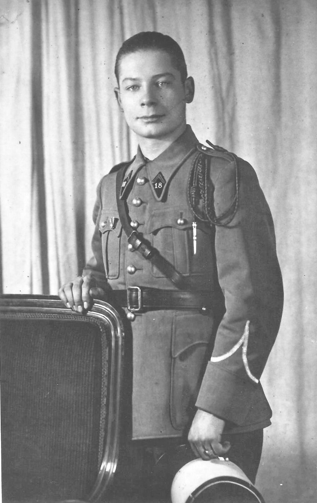

---
---  

<link rel="stylesheet" href="styles.css" type="text/css">

<style>
body {
text-align: justify; font-size:12pt}
</style>

<br>  


## Un sous-officier du 18e RCC        
#### Christian BALLAND  

<br>

---  


*À Maurice BALLAND et à tous ses camarades du 18e RCC*

<br>


Retraité, on le rencontrait en promenade en compagnie de ses chiens.

La pétanque, il n’en manquait pas une sur le seul vrai terrain que connaissent les anciens Deymois, celui de la Place Alex OUILLAC, lieu de rassemblement d’un village qui n’était alors qu’une grande famille. Et les commentaires allaient bon train: « Tire Maurice… Non, pointe, il faut placer ses boules… ».

Connu comme ancien fonctionnaire de police, habitant une modeste demeure place du Rodoul avec son épouse, après avoir habité sur la Place Alex OUILLAC, la maison toujours ouverte à qui voulait prendre place à sa table, jardinier pour la plaisir d’avoir « ses légumes » et « ses fruits », on n’en savait pas davantage de Maurice BALLAND.

<div style= "float:left;position: relative; width:42%; top: 14px;margin-right: 20px">

 

</div>

Il aura fallu l’intervention de monsieur DELUC, maire, profondément respectueux des Anciens Combattants, pour que, malgré sa présence chaque année à la cérémonie du 11 novembre, « Maurice » accepte de porter ses médailles. Plus tard, il fera la demande de la Médaille militaire. Pour sa remise, en réponse au choix de l’autorité, prévue à Toulouse le 14 juillet 1986, il privilégie Roger André DELUC (Ph. ci-dessus). Leur considération était sincère et réciproque. La remise a lieu le 11 novembre de cette même année. Après la cérémonie pendant le « Le verre de l’amitié » prévu au Foyer Communal », courait ce commentaire : »Mais l’on ne savait pas! ». Il s’était illustré pendant la Seconde Guerre Mondiale et sa modestie avait mis en berne de douloureux souvenirs.

<div style= "float:right;position: relative; width:25%; top: 14px;margin-left: 20px">

 

</div>

Monsieur le Maire a donné lecture des citations du sous-officier blessé à Sarrebruck le 5 octobre 1939 et volontaire à Saint-Florentin le 15 juin 1940:

*« A fourni un bel exemple de courage en se portant au secours de son capitaine et de camarades qui venaient de sauter sur une mine; a été blessé par l’explsion d’une seconde mine en contribuant à ramener les blessés et le corps de son capitaine. »* Attribution de la Croix de guerre avec étoile de bronze. Cité à l’ordre de la brigade. P.C.  
Le 20 octobre 1939. Signé ARLABOSSE

*« Jeune sous-officier, donnant l’exemple du courage et de la bonne humeur. Le 15 juin, faisant partie d’un détachement de volontaires constitué à Saint-Florentin pour forcer le passage tenu par l’ennemi, est volontairement resté sous le feu des mitrailleuses ennemies de façon à permettre l’écoulement de son escadron sur une distance de 2 kilomètres. »* Attribution de la Croix de guerre avec étoile de bronze. Cité à l’ordre du régiment.  
Roujan, le 8 juillet 1940. Signé PAGEZY  

<br>

Le 16 septembre 1992, le drapeau tricolore sous lequel il a brillamment servi le recouvrait…

<div style="text-align: right"> Deyme 13 novembre 2018</div>  
<br /> 

    
    
Faisant suite à l’article « Un sous-officier du 18e RCC », je réalise le voeu de mon père de voir publier les documents conservés précieusement par lui. Les officiers et camarades de son régiment, même les chevaux qu’il a tant aimés sont présents: Gamin, Gaspard et Girouette. Même « Totoche », le sanglier mascotte, avait bien voulu poser.  

<br>

Que ces hommes d’élite revivent, l’instant d’un regard et d’une pensée !… 

```{r, echo = F, out.width="30%"}
library(knitr)
myimages<-list.files("C:/Chris-Balland.github.io/images", pattern = ".jpg", full.names = TRUE)
include_graphics(myimages)
```


