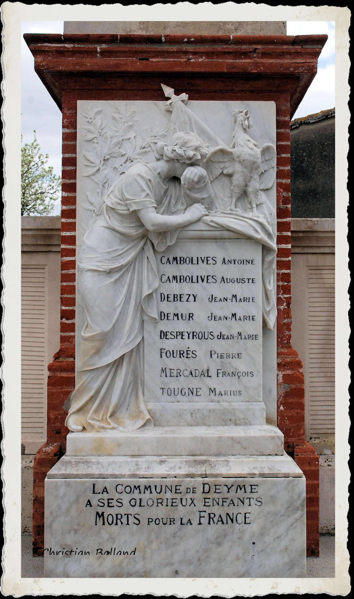
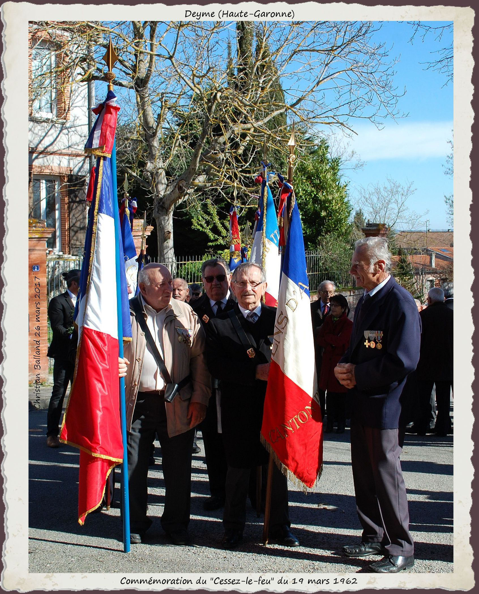
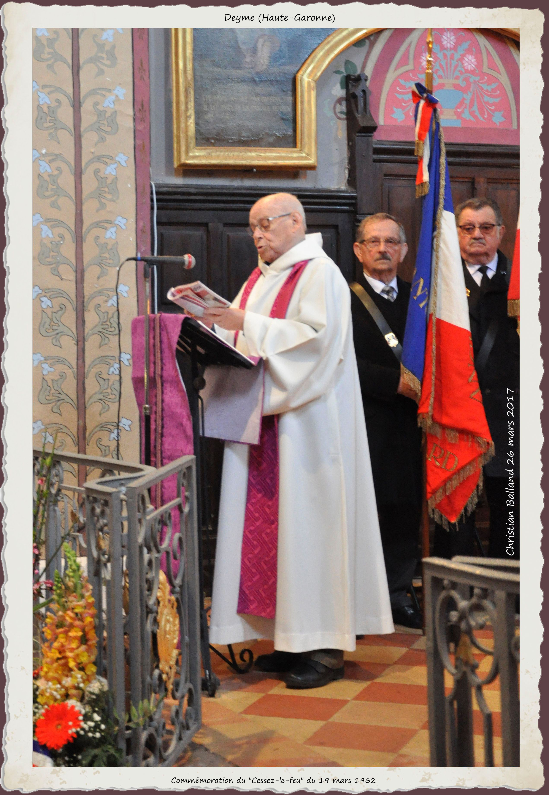
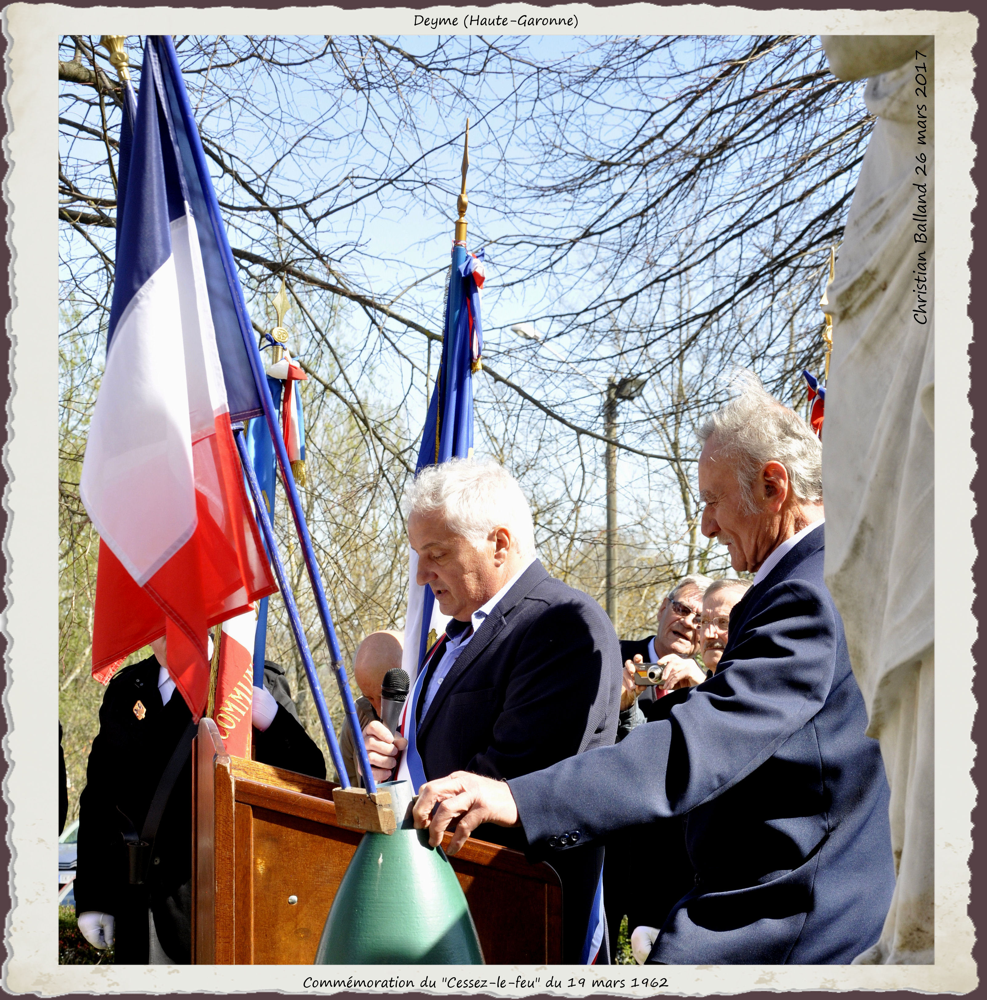
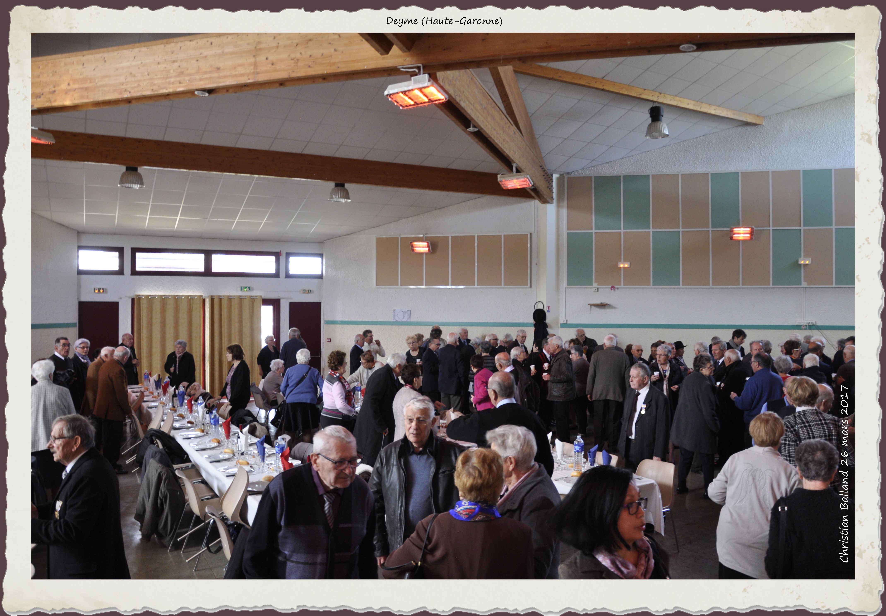

---
---  

<link rel="stylesheet" href="styles.css" type="text/css">

<style>
body {
text-align: justify; font-size:12pt}
</style>

<br>  


## Le Monument aux Morts

#### Christian BALLAND   

<br>

---  

Les disparus du village, victimes de la Grande Guerre, sont honorés par la population lors de la cérémonie commémorative du 11 novembre 1918, et ce depuis 1923. Cette année là, au soir du 3 janvier, le désir de la population d’ériger un monument « à la mémoire de ses enfant morts pour la Patrie », est à l’ordre du jour de la réunion du Conseil Municipal. Votée à l’unanimité, la construction est envisagée sur un terrain communal situé devant l’église, «…d’où une belle vue s’étend sur toute la plaine».


La réalisation est confiée au marbrier toulousain BARRAU, qui se rend alors sur les lieux dans les plus brefs délais à la demande de Mr Joseph VIALLET, maire, et propose d’intégrer au projet la statue oratoire de La Vierge à l’enfant qui s’y trouve dite Notre-Dame des champs. Son piédestal accueillera un haut relief en marbre blanc de Carrare, d’après l’estampe de Firmin BOUISSET (Voir ce nom) proposée aux Mairies par son éditeur Fernand NATHAN où « le coq gaulois, se dressant sur ses ergots, chante la victoire conquise par tant de sacrifices », auprès de la France pleurant ses enfants.

Jugés «dressés d’une manière satisfaisante», les plans et devis présentés sont acceptés au mois de mai. La dépense totale d’un montant de 10286 francs (marbrier, maçon, arbres, urnes, gravillon) sera couverte par les fonds libres de la commune (8018 fr), par la vente d’arbres (76 fr), et par la souscription de plus de soixante familles (2192 fr), autant dire par tout le village.

Clos par un portail en fer forgé, entouré d’une haie, abrité par tilleuls et sapins, le Monument est inauguré le 17 juin 1923. Un témoin relate la cérémonie:

<div style= "float:left;position: relative; width:30%; top: 16px;margin-right: 20px">

 
</div>

«*Bien avant l’heure fixée une foule énorme et recueillie remplissait la nef de notre église où successivement firent leur entrée la société des combattants, les enfants de l’école, les parents des soldats qui sont glorieusement tombés, et le conseil municipal, précédés de leurs drapeaux. Grâce au zèle et au dévouement de notre curé, Mr l’abbé SOUBES, notre église était décorée avec un art tout particulier, les murs étaient tapissés de tentures noires laurées d’argent, et au milieu de la nef s’élevait un superbe catafalque recouvert d’un beau drap aux couleurs nationales. Le curé de la paroisse, un mutilé, dans un discours d’une magnifique envolée, exalta la grandeur du sacrifice et fit passer un inoubliable frisson parmi tous les assistants. Après l’absoute, le cortège se rendait devant le monument au pied duquel de belles couronnes de fleurs avaient été déposées par les parents, les enfants de l’école et la municipalité. Le voile qui recouvre le monument est abaissé et fait apparaître dans toute sa beauté la France enveloppée dans un grand voile de deuil, pleurant sur ses enfants dont les noms sont gravés sur le marbre et surmontée du coq gaulois qui chante la victoire. Une courte allocution de notre curé fit vibrer à l’unisson la foule attentive et les chants alternant les discours, l’émouvante cérémonie de l’appel aux morts fut faite par le maire. A chaque nom répondait la foule émue par un glorieux:* “Mort pour la France!”»

**Figurent sur la plaque de marbre:**

CAMBOLIVES Antoine – CAMBOLIVES Auguste – DEBÉZY Jean-Marie – DEMUR Jean-Marie – DESPEYROUX Jean-Marie – FOURÈS Pierre – MERCADAL François – TOUGNE Marius.

Sous l’Arc de Triomphe (Paris), le 11 novembre de cette même année 1923 et pour la première fois, une flamme jaillit d’une rosace de bronze, symbole du sacrifice des soldats tombés pendant la Première Guerre Mondiale. Elle ne s’est jamais éteinte depuis, ravivée quotidiennement lors d’une cérémonie silencieuse…  

---

### Des soldats et de leurs familles  

<br>

**CAMBOLIVES Antoine –** Né à Corronsac (Haute-Garonne) le 19 septembre 1893. **†** 4 décembre 1914.  
Fils de Paul CAMBOLIVES et de Bernadette MONFRAIX. Caporal au 80ème Régiment d’Infanterie. Décédé au château de Lankof près d’Ypres (Belgique)

**CAMBOLIVES Auguste –** Né à Corronsac (Haute-Garonne) le 10 mars 1896. **†** 9 septembre 1916.  
Fils de Paul CAMBOLIVES et de Bernardette MONFRAIX. Décédé le 6 à Lihons (Somme). L’acte de décès le mentionne célibataire.

**DEBÉZY Jean-Marie –** Né à Deyme le 7 décembre 1891. **†** 1er mai 1917.  
Fils de Jean DEBÉZY et de Guillaumette PROM. Soldat au 167ème Régiment d’Infanterie, 9ème compagnie, immatriculé sous le numéro 79, demeurant à Deyme lieu-dit Lacroix.

**DEMUR Jean Marie –** Né à Baziège (Haute-Garonne) le 28 avril 1886. **†**15 août 1915.  
Fils de Jean DEMUR et de Marie MANNEVILLE domiciliés à Ayguevives (Haute-Garonne). Marié à Jeanne RATIER. Domicilié à Deyme, soldat au 96ème Régiment d’Infanterie immatriculé sous le n° 0721, décédé à Beauséjour (Marne). Mention: Mort pour la France.

**DESPEYROUS Jean Marie –** Né le 24 septembre 1897 à Donneville (Haute-Garonne). **†** 27 mai 1918.  
Fils de Jean DESPEYROUS et de Jeanne RAMONDOU. Domicilié à Deyme lors de son incorporation au 341ème Régiment d’Artillerie Coloniale.Décédé à Craonnelle (Aisne). Mention de l’acte de décès: célibataire.

**FOURÉS Pierre –** **†**  25 septembre 1914 âgé de 33 ans.

**MERCADAL Jean François –** Né à Ayguesvives (Haute-Garonne) le 17 septembre 1885. **†** 9 juin 1915.  
Fils de Guillaume MERCADAL et de Marguerite BLANC. Domicilié à Deyme et veuf de Marie RAMADE lors de son incorporation comme soldat de 2ème classe au 280éme Régiment d’Infanterie (Numéro matricule 019279). Décédé à Aix-Noulette (Canton de Lens, Pas-de-Calais).

---

### Autres guerres

En vertu de la loi du 2 juillet 1915, modifiée par la loi du 22 février 1922, est crée la mention « Mort pour la France », distinction relative à son inscription en marge de l’acte de naissance. Ce droit s’applique aux membres des forces armées tués au combat, morts des suites des maladies contractées ou d’accidents survenus en service commandé, étendu aux prisonniers de guerre décédés dans des circonstances analogues. Leur inscription sur les Monuments aux Morts, biens juridiquement de la responsabilité des municipalités, est consécutive au lieu de naissance ou au dernier domicile du disparu, l’un n’excluant pas l’autre.

Dans de nombreuses villes sont apposées des plaques commémoratives aux disparus d’autres guerres sur le Monument aux Morts de la Première Guerre Mondiale, une stèle, ou un monument élevé à cet effet. Deux natifs de Deyme, partis l’un pour une guerre de l’Empire, l’autre pour la guerre franco-prussienne, ne doivent pas rester des « Sacrifiés oubliés » comme le disait Ernest RENAN, mais voir leur nom côtoyer ceux de leurs camarades et les entendre appelés le « Jour du Souvenir ».  
C’est chose faite depuis le 13 juillet 2018 :  

**BOUSQUIÉ Bernard –** Né à Deyme. **†** 4 octobre 1809.  
Fusilier au 93ème Régiment d’Infanterie de Ligne, française, Cinquième Bataillon, Première Compagnie, décédé à l’hôpital militaire de Chioggia (Vénétie, Italie)(Campagne d’Allemagne et d’Autriche Avril 1809 – 14 octobre 1809). L’acte mortuaire est orthographié BOUSQUIER.

**RACAUD Jean –** Né à Deyme le 15 avril 1835. **†** 11 janvier 1871.  
Le 20 avril 1835, un enfant âgé de quelques jours est tenu sur les Fonds Baptismaux de l’église Sainte Marie Madeleine par Jean GIMBRÈDE, grand-père maternel et Marie RACAUD, grand-mère paternelle, parrain et marraine à cette occasion.  
Le 16 octobre 1882, la Mairie recevait un extrait mortuaire parvenu d’Allemagne par la voie du Ministère de la Guerre: « Le sieur RACAUD Jean, né à Deyme le 15 avril 1835, soldat au Premier Régiment de Zouaves, détenu en Allemagne comme prisonnier de la dernière guerre a été fusillé à Magdebourg (Allemagne) le 11 janvier 1871 à trois heures de l’après-midi. » (Guerre franco-prussienne 19 juillet 1870 – 29 janvier 1871).

---

### Marius TOUGNE

Son nom figure au bas du marbre. S’il mérite d’être honoré dans l’appel aux morts inscrits, il appartient à la Seconde Guerre Mondiale et non à la Première.  
Marius TOUGNE, né le 17 février 1922 à Balma (Haute-Garonne) de Jean TOUGNE et de Marie AUROUX.  
Célibataire, il est décédé le 6 mai 1945 à Glauchau (Allemagne). Proche était le camp de concentration d’Esterwegen, dissous en 1936, utilisé comme camp de prisonniers jusqu’en 1945.

Sources: Etat Civil du Ministère des Anciens Combattants et Victimes de Guerre 13 septembre 1946, transcription Etat Civil de Deyme 15 septembre 1946.

---

### FNACA 26 mars 2017 
  
<div style= "float:left;position: relative; width:42%; top: 16px;margin-right: 20px">
.jpg)   


 </div>
 
Un soleil vif et chaud éloigne prestement la fraîcheur matinale. Le rendez-vous est fixé à dix heures trente devant l’église, mais nombreux sont les Combattants, les familles, les amis, le Maire et son Conseil Municipal, les Maires des villages environnants et les personnalités, à être là bien avant. Cette année, en ce dimanche 26 mars 2017, la Fédération Nationale des Anciens Combattants Algérie, Tunisie, Maroc, du Canton de Montgiscard, commémore le « Cessez- le-feu » du 19 mars 1962 dans notre commune. Franches poignées de mains et sourires spontanés augurent de la chaleureuse ambiance de cette journée de cinquante-cinquième anniversaire. 

<div style= "float:right;position: relative; width:50%; top: 20px;margin-left: 20px">

 
  
  </div>

Dès leur arrivée, les porte-drapeau se regroupent autour de Robert TONON, maître de cérémonie. Deyme est représenté par Jean HÉBRARD. Les accompagnent les Maires de Deyme (Eric BORRA), d’Ayguesvives (Jacques OBERTI), de Baziège (Jean ROUSSEL), de Belberaud (Michèle GARRIGUES), de Donneville (Bernard DUQUESNOY), de Labastide Beauvoir (Georges RAVOIRE). Montgiscard est représenté par Dominique FATRAS, adjoint au Maire. Madame Emilienne POUMIROL, Conseillère Départementale et Monsieur Kader ARIF, Député de la circonscription, sont présents.

A l’appel de la cloche, les étendards pénètrent dans un ordre parfait dans l’église Sainte Marie Madeleine et s’installent de part et d’autre du choeur, accueillis par le Père Fernand SEMOND, lui-même ancien combattant. Dirigée par Louis SPINAZZI la chorale de la Section, venue tôt répéter, rythme par ses chants le déroulement de l’office. Crée il y a vingt-trois ans, elle compte quatorze membres, dix épouses d’anciens combattants et quatre hommes, anciens combattants. Simultanément, l’orchestre K.Dance, bien connu dans la région toulousaine, l’accompagnera tout au long.

<div style= "float:left;position: relative; width:22%; top: 18px;margin-right: 20px">

 

 </div>
 
 
 
L’officiant, dans son homélie, parle de « la paix qui, par les temps qui courent, est en danger… », de « l’acharnement qu’il faut avoir à la construire dans les choses de tous les jours…. ». A sa demande, dans un geste d’échange, la foule se congratule, les mains se tendent en direction des voisins alentour. Le Père prend dans la sienne celles des porte-drapeaux auquels il offre ensuite « le Corps du Christ ».

Toujours dans un ordre réglé, les Couleurs quittent l’église et se dirigent vers le Monument aux Morts où les dépôts de gerbes du Comité FNACA de Montgiscard, de la Mairie de Deyme et du député Kader ARIF, se font dans le plus grand recueillement.

S’ensuivent les discours d’Emilien AGASSE, président du Comité de la FNACA de Montgiscard, d’Eric BORRA, Maire de Deyme et de notre député.

<div style= "float:right;position: relative; width:25%; top: 10px;margin-left: 20px">

 

</div>

Monsieur BORRA honore nos soldats en soulignant « Leur leur sacrifice et leur sens du devoir» , rappelle ce moment d’Histoire où « Suite aux accords d’Evian du 18 mars 1962, au Référendum d’Autodétermination du 1er juillet 1962, naîtra la République d’Algérie Démocratique et Populaire le 25 septembre 1962.» et tourne ses pensées « appuyées » vers « Nos disparus et leur famille… »

Autres moments forts, les remerciements de Kader ARIF à tous ceux « qui respectent, font vivre et briller le triptique « Liberté, Egalité, Fraternité»» , et l’hymne national repris à l’unanimité par l’assistance après la minute de silence.

S’ensuit la remise des Médailles. Jean RUZZENNE (Détenteur de la Médaille militaire) procède à l’appel et agrafe les décorations sur la poitrine des récipiendaires:  

 + André SANTAELLA (Montlaur)  
 + Aristide ESCRIBE (Villenouvelle)  
 + Jean-Marie CASTELLE (Toulouse)  
 + Hervé GELIS (Montgiscard)  
 + Pierre PETERSCHMITT (Deyme)  
 + Georges ROCHE (Saint-Orens de Gameville)  
 + Jean René VIDAL (Ayguesvvives).

<div style= "float:right;position: relative; width:35%; top: 10px;margin-left: 20px">

 

</div>

L’invitation de monsieur le Maire de clore cette cérémonie par le traditionnel « Verre de l’amitié », offert par la Municipalité de Deyme dans la Salle des fêtes, est largement suivie. A l’écart, les tables dressées augurent des heures à venir. Adhérents et non adhérents inscrits devront bientôt se prononcer  sur la formule phare du traiteur « Le Picotin Gourmand »: « Nous vous promettons de vous étonner ainsi que vos invités par notre originalité» … Après avoir pris connaissance du menu, le doute n’est plus permis et c’est avec le souvenir de nombreux témoignages poignants que nous refermons la porte pour laisser les convives débattre du sujet … et de bien d’autres!


```{r, echo = F, out.width="35%"}
library(knitr)
myimages<-list.files("C:/Chris-Balland.github.io/Images monument mort", pattern = ".jpg", full.names = TRUE)
include_graphics(myimages)
```

